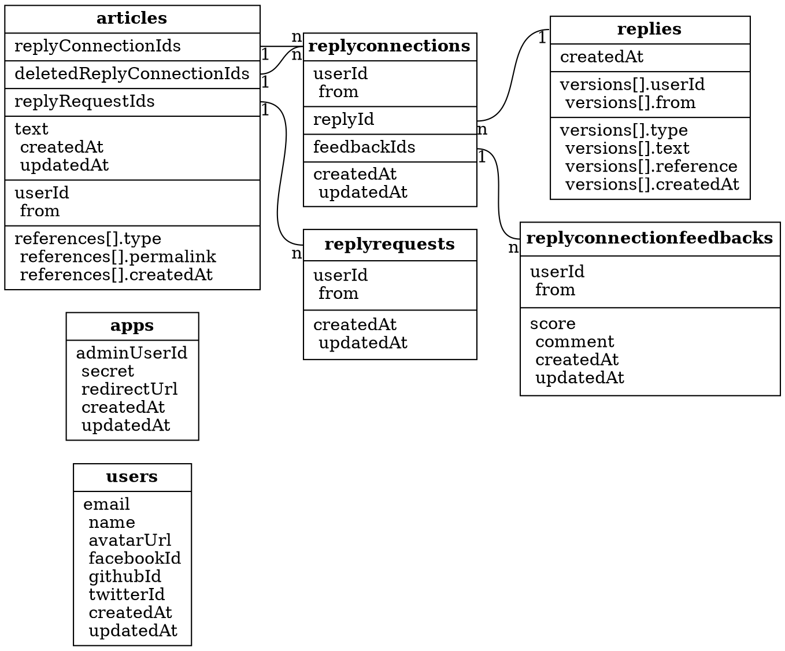
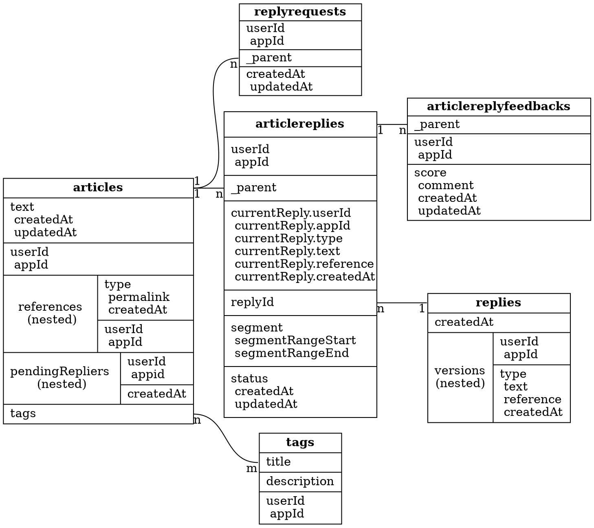

【真的假的】2017/4 Mapping refactor
=====

## Current structure

為求專注在元件邏輯本身，author 相關 mappings（`users`、`apps`）與相關欄位外鍵（`userId`、`from`）之間的線省略。

### Authentication mappings & fields

當使用者在使用 LINE bot 的時候，使用者並沒有來到 cofacts 網站進行登入。然而，LINE bot 卻能夠送出 `article` 以及 `replyrequest`。此時，`articles` 與 `replyrequests` 的作者相關欄位，應該要怎麼填寫呢？

LINE bot client 本身拿得到 LINE user ID，因此可以拿 LINE 本身的 user ID 來作為判斷使用者是否為一則 article 或 replyrequest 的 identifier。但是，各個 client （LINE、web、甚至是未來會支援的第三方 client）的 user ID 都不同，因此需要 `from` 欄位。

[`from` 欄位是由 `rumors-api` 填寫的](https://github.com/cofacts/rumors-api/blob/master/src/checkHeaders.js#L4)。Client app 會送 secret 與想要存入的 `userId` 到 `rumors-api`，`rumors-api` 比對 secret 正確之後，就會把 `userId` 以及相對應的 `from` 欄位值填入。未來開放第三方 client 之後，我們可以發放 app ID & secrets（也就是目前沒有作用的 `apps` index），而 `from` 欄位可以用拿來填寫 app ID。

當 client app 存取 `rumors-api` 的 users 相關欄位的時候，[`rumors-api` 會比對 app ID 以及 userId](https://github.com/cofacts/rumors-api/blob/master/src/graphql/models/User.js#L32)，如果是現在的使用者，才會回傳 users 相關欄位，避免個資外洩。

### Design choice

`articles` 對 `replyconnections` 的 1:n 關係中，`replyConnectionIds` 的外鍵之所以會存放在 `articles` 而非 `replyConnections`，主要是為了讓「列出文章時可以列出 reply 數」這個 query 可以只要查 `articles` 即可。

`replyconnections` - `replyconnectionfeedbacks`、`articles` - `replyrequests` 這兩個 1:n 關係會這樣設計也是同樣的理由，即使實際上採用了這種設計，其實無法保證 1:n 關係不會變成 m:n 關係（因為一個 replyrequests 的 ID 可以出現在複數個 articles 裡頭，所以其實不是完美的 1:n）。

### 問題：新 filter / sorting 需求

原本用來應付 [cofacts 網頁文章列表](http://cofacts.g0v.tw) 的 index mapping 機制，無法應付下面的這些花俏的 requests——但偏偏這些 requests 非常重要。

（From: https://github.com/cofacts/rumors-db/issues/7#issuecomment-293507662 ）

 * 我標記成「等等回應」的文章（ [#34](https://github.com/cofacts/rumors-api/issues/34) 
    >`articles` 需新增 field `pendingRepliers`
 * 沒人標記成「等等回應」的所有文章（ [#34](https://github.com/cofacts/rumors-api/issues/34) ）
 * 文章 tag ( [#32](https://github.com/cofacts/rumors-api/issues/32) ) 
   > `articles` 需新增 field `tags`
 * 我回應過的 article
   > 列出 `replies` 中 `userId` 相符、或 `replyconections` 中 `userId` 相符的 `articles`。或許需要按照回應時間排序？
 * 回應中有「含有真實資訊」or「含有不實資訊」or「非文章」
 	> 要查找 `replies` 中，最新 version 的 type，以此來往回找 article
 * 回應中不含有「含有真實資訊」or「含有不實資訊」or「非文章」
 * 我送出過 replyRequest 的 article （我想知道）（ Related: [cofacts/rumors-site#13](https://github.com/cofacts/rumors-site/issues/13) 
 	>列出 `replyrequest` 之後再找 `articles`
 * 所有人都認為現有 reply 沒用的 article / 照無用度 sort (「正向」+「負向」遞增排序)
 	> 按照 `replyconnectionfeedbacks` 的 score、group by `replyconnection` 之後抓 `articles`
 * 使用「各文章最近一次被回報的時間」排序
 	> 按照 `replyrequest` 的 `createdAt` 欄位排序

上述 filter / sort 希望可以 aggregate 在一起，例如：找出「沒人標記為『等等回應』」的文章中，回應同時有「含有真實資訊」又有「含有不實資訊」的醫療相關文章。

最後，我們也希望能在新的 schema 中放入 [segment 的設計](http://beta.hackfoldr.org/cofacts/https%253A%252F%252Fhackmd.io%252Fs%252FrJQaJ9wwl)，用處是在顯示文章列表時，可以給小編更細緻的、針對個別段落的 reply 連結建議。

## Proposed structure

### Design choice

* 針對 children 多、或很需要 `has_child` query 的 `replyrequest`、`replyconnectionfeedbacks` 使用 [parent/child](https://www.elastic.co/guide/en/elasticsearch/guide/current/parent-child.html) 儲存；其餘盡量使用 nested object [以求效率](https://www.elastic.co/guide/en/elasticsearch/guide/current/parent-child-performance.html)。
* `from` 欄位正名為 `appId`。author 相關 mappings（`users`、`apps`）省略，僅列出相關欄位外鍵（`userId`、`appId`）。
* `replies` 會把 cached field（`currentReply`） 塞進其所有的`replyConnection` 中，以利 aggregation 查詢。
* segments 併入 `replyconnecitons`：`replyconnecitons` 是 `articles`—`replies`  n:m 關係的 join table，也就是 `articles`—`replies` 的「邊」。"segments" 是使用者圈選的字串或位置，理論上每當 `reply` 與 `article` 建立新關係時，segment 就會不同（至少字串在 `article` 上的位置會不一樣），feedbacks 也應該要重算。因此，我們選擇將 `segments` 直接實做在 `replyconnection` 上。
* 增加 `pendingReplers` （「等等回應」 [#34](https://github.com/cofacts/rumors-api/issues/34) ）
* 增加 `tags` index 擺放 tag 的 metadata（例如說解釋某 tag 之類的，或是之後做 alias / redirection 消歧義之類的功能）。ID 為 `sha1(title)` 以對 tag title 做 unique constraint。 ([#32](https://github.com/cofacts/rumors-api/issues/32))，而 `artices` 增加 `tags` 欄位擺放 tags 本體。

#### 需求確認
* 沒人回應過的文章、有人回應過的文章
  > 計算 child 數量，可以 ~~[針對 `has_child` query 的 constant score 做 aggregation sum](https://discuss.elastic.co/t/counting-the-number-of-children-when-returning-a-parent/9861/5)~~  用[`has_child` query + `min_children` 參數](https://www.elastic.co/guide/en/elasticsearch/guide/current/has-child.html)；使用數量做 filter 可以參考[這篇](http://stackoverflow.com/questions/34600137/elasticsearch-filtering-parents-by-filtered-child-document-count)。

* 我標記成「等等回應」的文章（ [#34](https://github.com/cofacts/rumors-api/issues/34) ）
  > `articles.pendingRepliers` `nested` query
* 沒人標記成「等等回應」的所有文章（ [#34](https://github.com/cofacts/rumors-api/issues/34) ）
  > `articles.pendingReplies` 數量為 0
* 文章 tag ( [#32](https://github.com/cofacts/rumors-api/issues/32) ) 
  > 直接從 article.tags 找
* 我回應過的 article
  > `articles` index `has_child` 特定 `currentReply.userId`
* 回應中有「含有真實資訊」or「含有不實資訊」or「非文章」
  > `articles` index `has_child` 特定 `currentReply.type`
* 回應中不含有「含有真實資訊」or「含有不實資訊」or「非文章」
  > not (`articles` index `has_child` 特定 `currentReply.type`)
* 我送出過 replyRequest 的 article （我想知道）（ Related: [cofacts/rumors-site#13](https://github.com/cofacts/rumors-site/issues/13) 
  > `articles` index `has_child` 特定 `replyRequest.userId`
* 照 reply 的無用度排序 (「正向」+「負向」遞增排序)
  > aggregate `articles/connections/replyconnectionfeedbacks` 的 `score` sum 作為排序基礎。 (https://www.elastic.co/guide/en/elasticsearch/reference/5.0/query-dsl-has-child-query.html#_scoring_capabilities)
* 使用「各文章最近一次被回報的時間」排序
  > 以 `/articles/replyrequest` 的 `createdAt` max 作為排序基礎 (https://www.elastic.co/guide/en/elasticsearch/reference/5.0/query-dsl-has-child-query.html#_scoring_capabilities)
