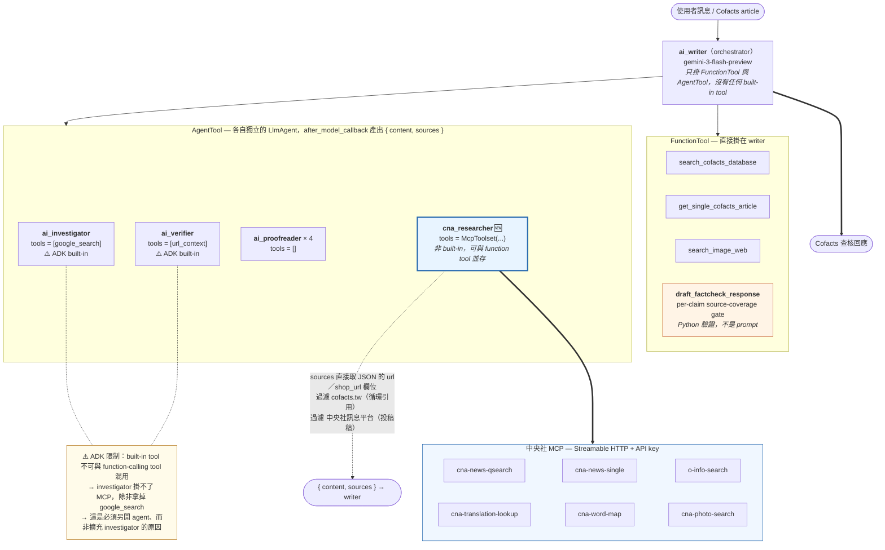
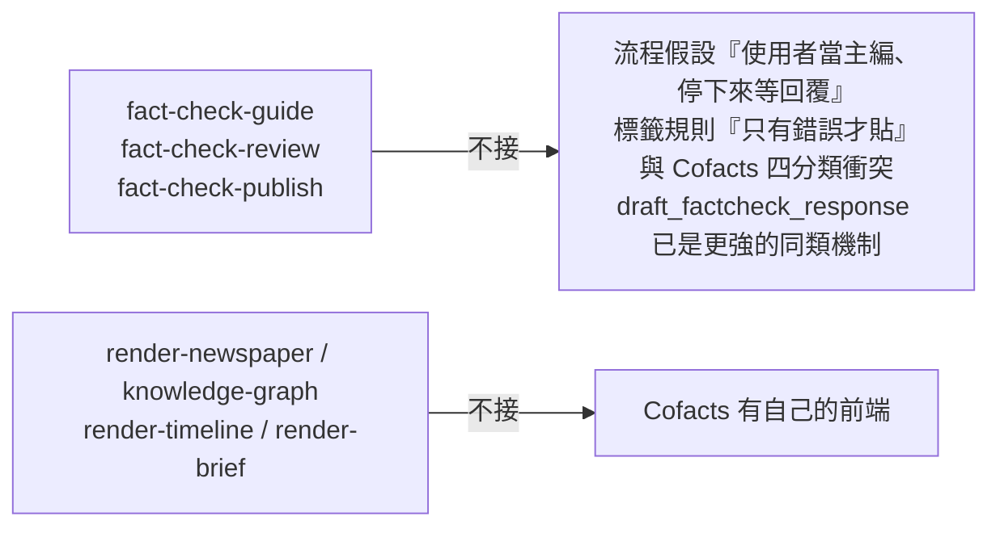

# 中央社（CNA）MCP：能力觀察與 cofacts.ai 整合評估

> **Part 1** 整理中央社 CNA MCP 的實作方式與工具設計，作為 Cofacts 實作自己 MCP 時的參考。
> **Part 2** 拿 cofacts.ai 過往的真實查核任務去打這些工具，評估值不值得整合、該接哪些工具、接在哪一層。
>
> **結論先講**：值得整合，但**不要用中央社的查核鏈工具**（`fact-check-guide` / `review` / `publish`），只用**基礎查詢工具**；也**不要掛在 writer 或 investigator 上**，而是做成獨立的 `cna_researcher` AgentTool。整合的主要理由不是「查得到更多資料」，而是「**查得到的出處真的存在**」——Langfuse 負評中 62% 是出處類問題，單項第一名是「提供不存在的出處」。

---

# Part 1 — 中央社 MCP 的能力

內容分為「已實際呼叫測試確認」與「僅從文件描述得知、未實測」兩類，並在文中標明。

## 1. 加入 MCP 的方式

- **文件對象是 AI，不是開發者**：每個工具的 description 本身就寫得像一份給呼叫端 LLM 看的操作手冊——什麼情境下該呼叫我、我會回傳什麼、有什麼常見誤用陷阱——而不是傳統面向人類開發者的 API 文件（參數表 + 範例 curl）。文字風格也偏口語、條列，長度控制得很克制，不會像一般 REST API 文件那樣長篇大論。
- **認證機制簡單，不走 OAuth**：沒有實作完整的 OAuth 授權流程，而是採用「endpoint + Authorization header + 使用者自行申請並填入 API key」的模式。對第三方 MCP client 來說，串接門檻明顯比實作 OAuth 低很多。
- **Claude 端的整合方式**：直接在 Anthropic 官方的 connector directory / marketplace 上架，使用者可以直接搜尋、一鍵連接，不需要 Anthropic 額外為中央社客製整合邏輯。

## 2. 實作功能的整體觀察

- **全部 15 個能力都用「tools」暴露**，完全沒有用到 MCP 規格中的 `resources` 或 `prompts` capability。
- 但深入實測後發現，`fact-check-guide` 與 `fact-check-review` 這兩個工具，**功能上其實更接近「prompt」而非「tool」**：它們不做任何查詢或運算，只回傳固定的文字模板／指引，要求呼叫端（LLM 自己）依照這份說明去執行後續動作。合理推測，這是因為目前不少 MCP client（尤其較舊或陽春的實作）不一定支援 `prompts` capability，中央社因此選擇把這類「純指令」內容包裝成 `tool` 介面——這樣任何支援 tool-calling 的 client 都能用，相容性最大化。這點在下面工具列表會具體說明測試證據。

## 3. 工具列表（15 個）

### 3.1 新聞搜尋／讀取

**`cna-news-qsearch`** — 新聞搜尋的預設工具

- description：關鍵字採嚴格 AND，可設語言與起訖日期，整合中央社新聞、年鑑、影像空間、淨零專題等多個資料庫，回傳前 10 筆摘要。
- input：`query`（必填）、`query_org`（必填，語意重排用）、`lang`（可選，zh/en/id/ja）、`start_date`/`end_date`（可選，YYYY-MM-DD）
- output：前 10 筆結果（cid、pid、標題、摘要、日期、url），外加 `_meta` 區塊（`total_hits`、`query_echo`、0 筆時的 `hint`）
- **實測發現**：
  - `_meta.query_echo` 只回顯 `query`、`start_date`、`end_date`，**不會回顯 `query_org`**——暗示 `query_org` 不是拿去疊加搜尋條件，而是單純餵給後端做語意重排（rerank）。
  - 實際比較「`query_org` 填完整原文脈絡」vs「`query_org` 填空字串」，兩次呼叫的 `query`、`total_hits` 完全相同，但**回傳的前 10 筆結果組成與排序明顯不同**——有些筆只在其中一次出現。證實這個參數確實會影響排序，不是裝飾性欄位、也不會因為留空就報錯。
  - **合查的四個庫證據力不同**：中央社新聞有 `url`，可直接引用；**中央社年鑑**是結構化的年度回顧條目（見 Part 2 §7.1 的強冠案例），`date` 是**出版版次年而非事件年**；**影像空間**在 qsearch 的結果裡**沒有 `url` 欄位**，只有 cid／title／date／summary，要圖片網址必須改走 `cna-photo-search`。

**`cna-news-single`** — 用 `pid` 或完整標題取單篇新聞全文

- **實測發現**：回傳的是發稿單位資料庫裡的原文，且**日期已正規化**（原文的「今天」會被改寫成「今天（2024年02月21日）」）。`url` 是資料庫欄位而非模型輸出。對查核來說這是關鍵差異：文字不是爬來的，是發稿方給的。

**`cna-news-latest-newslist`** — 看中央社編輯選的「今日焦點／重點新聞」，不需參數。*(未實測)*

**`cna-news-latest-category`** — 看某分類的最新新聞，分類為 enum 值（政治、國際、社會、產經、科技等）。*(未實測)*

### 3.2 事實查核三站（fact-check pipeline）

**`fact-check-guide`** — 查核鏈第 1 站

- input：無參數
- output：固定的方法論指引全文（已完整取得並驗證）
- **實測發現**：這是最典型的「prompt 偽裝成 tool」案例——呼叫後**不做任何查詢動作**，只回傳一份操作說明，內容包含：
  - 意圖確認是條件式的（問法夠明確就不用多問）
  - 查核點提取後要「列給使用者看，但不停下來等回應」，直接接著搜證
  - 搜證原則是「全部搜完才下結論」，不能邊搜邊判定
  - 內部草稿不直接顯示給使用者，使用者第一次看到的是審查後的版本
  - 「證據不足」有明確的 4 項判準（符合任一即成立）；「錯誤」標籤只在真正判定錯誤時才貼，避免濫用標籤
  - 有具體的陷阱提醒，例如 `o-info-search` 的 `agency` 參數若填署級機關或簡稱，會**靜默回 0 筆**（這點後面在 `o-info-search` 也驗證到了）

**`fact-check-review`** — 查核鏈第 2 站

- input：`check_points`（必填，字串陣列）、`draft`（必填，字串，規定逐字貼入完整草稿）
- output：四軸審查框架（覆蓋率、解釋力、證據力、誤判防線）+ 交付格式指示
- **實測發現（關鍵）**：分別用「真實的木耳查核草稿」與「完全無關的測試內容（`check_points: ["雞是紅色的嗎？"]`、`draft: "雞是紅色的。"`）」呼叫兩次，**兩次回傳的文字逐字相同、連標點都一樣**。後續再用一份真實的「26 中配選里長」查核草稿第三次呼叫，回傳內容依然相同。這證實這個工具**不會真的讀取或分析你傳入的內容**，只回傳一份固定的審查說明書，把實際的「審查」動作外包給呼叫端 LLM 自己執行。兩個必填參數的作用比較像「流程關卡」——強迫呼叫端在產出成品前，必須先完成查核點提取與草稿撰寫這兩個步驟，而不是真的把內容送進某個後端模型去打分。

**`fact-check-publish`** — 查核鏈第 3 站

- input：`format`（必填，enum：`checkpoint-report` / `social-post` / `card-copy` / `press-release`）
- output：對應格式的完整排版規格書
- **實測發現**：四種 format 各自回傳完全不同、非常詳細的規格文件，包含：
  - 精確的字數配額（依查核點數分級，例如 checkpoint-report 是 3 點以內 200 字、4-5 點 400 字）
  - **明確的降級順序**（塞不下時：先壓縮措辭 → 才合併查核點 → **絕不允許整點捨棄**），優先順序寫得很清楚，不是模糊的「請自行斟酌」
  - 兩種「稿尾標記」並存但用途不同、容易搞混：`press-release` 的「本文為 AI 生成草稿」提示**必須留在稿件本文內**（因為要跟著稿子被轉發、複製）；另一個「以上內容為 AI 參考中央社報導重新詮釋生成」警語則屬於**對話回覆**，規定不能排進成品稿版面裡
  - `checkpoint-report` 的規格書裡直接寫出「222 法則」這個詞。追查後發現，這個詞的原始出處其實是 2025 年 8 月民進黨秘書長徐國勇提出的**輿情公關守則**（文字≤200字、圖卡≤2張、影片≤2分鐘），跟事實查核方法論本身無關。工具設計者顯然是借用了這個當時很紅的公關術語當代稱，但只留了「字數上限」這一項精神（改造成依查核點數分級的 200/400 字），沒有照搬圖卡數與影片長度的限制。
  - 每份規格書結尾都會提到「使用者若還需要一份可分享的整理版面，可用 `render-brief` 把結論與佐證排版成懶人包」——顯示工具之間有刻意設計的交叉引用／串接關係。

### 3.3 輔助查詢

**`cna-translation-lookup`** — 查中央社慣用的外國人名／地名／組織譯名

- **實測發現**：輸入 `Marco Rubio` 回傳「盧比歐」1,100 次、「魯比歐」7 次、「盧比奧」**1 次**。這個 count 就是中央社的用字慣例，直接採最高的即可。實務重要性見 Part 2 §7.2。

**`cna-photo-search`** — 搜中央社影像空間圖片

- **實測發現**：回傳 `image_url`（可直連的 JPG）、`shop_url`（商品頁）、`description`（圖說，含**攝影記者姓名與拍攝日期**）、`description_all`（圖說 + 關鍵詞）。`_meta` 附帶 `usage_notice`：「使用中央社照片需注意照片授權，**MCP 僅提供瀏覽**。」

**`cna-word-map`** — 單一關鍵字延展工具，用於搜尋 0 筆時校正或延伸查詢詞。*(未實測)*

**`o-info-search`** — 查外部（非中央社自產）資料，政府公開資料／事實查核中心／中央社訊息平台三庫合查，回傳前 5 筆全文

- input：`query`（必填，嚴格 AND，最多 3 詞，建議用具體名詞實體而非包裝詞）、`query_org`（必填，使用者原始提問逐字傳入，不可修改／翻譯／摘要，供語意重排用）、`agency`（選填，**僅作用於政府公開資料庫**，須填部會層級全名，簡稱或署級機關會**靜默回 0 筆**）、`start_date`/`end_date`（選填）
- **實測發現**：
  - 實際查核時成功命中並直接引用了台灣事實查核中心針對米酵菌酸／木耳謠言的查核報告，以及農業部／農業試驗所的官方澄清新聞稿，證實三庫合查確實有效。
  - 部分結果（例如農業部那筆新聞稿）**沒有附 URL 欄位**，只有標題／日期／機關名——使用時要特別注意，不能因為想要引用完整就自行編造 URL。
  - 若結果帶 `tag` 欄位（如「錯誤」「部分錯誤」「正確」「事實釐清」「證據不足」「易誤解」「假知識」），代表是事實查核中心專家審核過的結論，可以直接引用；沒有 `tag` 欄位則代表該筆沒有明確結論值，不能自己腦補。
  - **「事實查核中心」這個 bucket 其實是混合來源**：實測回傳過 tfc-taiwan.org.tw 的報告、mygopen.com 的報告，**以及 Cofacts 自己的回應**（見 Part 2 §7.3 的循環引用風險）。
  - **「中央社訊息平台」是投稿／付費稿，不是中央社新聞**：實測在「蜂蜜 金屬」查詢裡回傳了「鶯歌光點美學館冬祭慶典」、在「中配 里長」查詢裡回傳了「嘉義市長施政 6 周年」、在「紙容器 塑膠淋膜」查詢裡回傳了紙業公司的產品發表新聞稿。這類結果與查詢主題只有字面關聯，證據力極低。

### 3.4 視覺化呈現（第三方 MCP App，需經 client 端同意才可呼叫，以下均未實測）

- `render-newspaper` — 把新聞整理成報紙頭版樣式
- `render-knowledge-graph` — 人物／組織關係的互動知識圖譜
- `render-timeline` — 事件演變的互動垂直時間軸
- `render-brief` — 積木式整理卡（懶人包），前述三個 fact-check-publish 格式都會在結尾建議「選配」使用這個

## 4. 給 Cofacts 的幾個可參考的設計模式（觀察歸納，非中央社官方說法）

1. **「指令當工具」是個務實的相容性做法**：如果 Cofacts 的 MCP 也想輸出固定的查核方法論、審查標準之類的內容，不一定要等 client 都支援 `prompts` capability，可以參考中央社把這類內容包裝成無副作用、回傳固定文字的 `tool`。
2. **把「結構化查詢」與「原始語意」分開傳遞**（`query` vs `query_org`）是個值得參考的介面設計，能讓後端做語意重排，又保留關鍵字比對的精確度。
3. **明確寫出參數的失敗模式**（例如 `agency` 打錯格式會靜默回 0 筆）比只寫「這是選填參數」有用得多——這類「陷阱提醒」直接寫在 `fact-check-guide` 這種指引文件裡，能大幅降低呼叫端（不管是 Claude 還是別的 LLM）誤用的機率。
4. **輸出格式規格書把「降級順序」講清楚**（字數塞不下時先壓縮措辭、再合併、絕不整點捨棄），比單純給字數上限更能確保不同 LLM 呼叫時的輸出品質一致。
5. **多個成品格式互相交叉引用**（例如都會提到可選配 `render-brief`）讓工具之間形成一個有機的工作流，而不是各自獨立、需要使用者自己想到還有哪些工具可以串。
6. **0 筆時回傳「重試階梯」**：`cna-news-qsearch` 查無結果時，`_meta.hint` 會給一份有順序的補救步驟（先移除日期 → 再減詞 → 再換書面語 → 最後查譯名）。這比只回 `results: []` 有用得多，值得 Cofacts 的 MCP 照抄。

---

# Part 2 — 整合進 cofacts.ai 的評估

## 5. 研究緣起與方法

[專業能力 Subagent：台灣專業資料庫串接可行性研究](./專業能力%20Subagent：台灣專業資料庫串接可行性研究.md)提出以獨立 `domain_specialist` AgentTool 串接台灣專業資料庫，並建議「現階段不上 MCP」。但那個判斷的理由是「多一層 server 維運」——中央社 MCP 是**已經存在、已經可用**的外部服務，這個理由在本案不成立，因此值得單獨評估。

本研究（2026-09-17）要回答的是：**把中央社 MCP 做成一個專業 ADK subagent，可行嗎？必要嗎？**

**過往查核任務**取自 Langfuse（`langfuse.cofacts.tw`，production 環境）：

| 資料 | 數量 | 區間 |
| :---- | :---- | :---- |
| `invocation [cofacts_ai]` traces | 1,162 | 2026-02-24 ~ 2026-09-16 |
| 對話 session | 630（其中 456 個單輪） | 同上 |
| `draft_factcheck_response` 工具呼叫 | 612 次 | 同上 |
| `investigator` 工具呼叫 | 885 次 | 同上 |
| `user-thumbs` 評分 | 276（👍146 / 👎124 / 中立 6） | 同上 |

**中央社 MCP** 則是實際呼叫測試：本研究共發出 19 次工具呼叫，涵蓋 `fact-check-guide`、`fact-check-review`、`cna-news-qsearch`（11 次）、`cna-news-single`、`cna-photo-search`、`cna-translation-lookup`、`o-info-search`（5 次），**查詢內容全部取自上述 Langfuse 真實查核任務**。

> **限制**：`cna-news-latest-newslist`、`cna-news-latest-category`、`cna-word-map` 與四個 `render-*` 未實測。
>
> 「相異查核」沒有精確數字：資料裡沒有 message ID，只能推估。以回覆前 100 字機械去重得 **534 則**；以語意分群（同一則謠言在不同日被不同使用者送出視為不同查核、連續重試視為同一則）人工推估得 **約 360 則（±10%）**。本文一律採用 534 這個較保守（分母較大）的數字，因此所有百分比都是**低估**。題型分布為關鍵字啟發式分類，僅供量級參考。

## 6. 過往查核任務的樣貌

### 6.1 題型分布（534 則相異查核）

| 題型 | 佔比 | 中央社可用性 |
| :---- | :---- | :---- |
| 政治／政策／法規 | 27% | **高**——官方說法、首長發言、政策公告有逐日報導 |
| 健康／醫療／食安 | 26% | **中**——機制類無解，但食安事件、研究報導、政府澄清有 |
| 詐騙／投資 | 11% | **低**——需要 165 清單類結構化資料，新聞只有個案 |
| 國際／外交 | 8% | **高**——但**譯名是硬門檻**，見 §7.2 |
| 人物言論／生平 | 5% | **高**——發言有逐日紀錄；生平細節不一定 |
| 歷史／文史 | 2%* | **低**——中央社新聞僅回溯至 1990 年 |
| 生活常識／交通 | 2% | **低**——長尾在地資訊不是新聞題材 |
| 社會／災害／治安 | 1%* | **高**——官方傷亡數字與應變時序完整 |
| 其他／未分類 | 12% | — |

\* 關鍵字優先序會把同時命中多類的題目歸到排序較前的類別，因此**災害類（實際約 5%）與歷史文史類（實際約 9%）被明顯低估**，政治類則被高估。以語意分群人工推估的另一份分類得到：健康 25%、政治 19%、生活交通 12%、歷史 9%、詐騙 8%、國際 8%、名人 6%、災害 5%。兩份分類在「哪幾類佔大宗」上一致，細部佔比請以量級看待。

### 6.2 出處分布（這是關鍵）

534 則查核平均引用 **3.8 個網域**。其中：

- **42% 引用了 `.gov.tw` 政府網站**
- **14% 引用了 TFC 或 MyGoPen**
- **10% 引用了 `cna.com.tw` 或 `focustaiwan.tw`**（`cna.com.tw` 以 73 次呼叫計為全站第 4 大來源，僅次於維基百科、自由時報、英文維基）

換句話說，**中央社已經是 cofacts.ai 事實上的主要來源之一，只是目前透過 Google Search 間接取得**。而 `o-info-search` 的三個資料庫正好覆蓋前兩項——**cofacts.ai 最常引用的兩類出處，中央社 MCP 都有結構化的直接管道**。

逐案檢視引用了中央社的那些查核，會發現它們**幾乎全部集中在政治／政策（中聯油脂食安究責、ALTIUS 無人機軍購、城鎮韌性演習、光復節修法、AI 新十大建設）、國際（川普台海訪談，經 focustaiwan.tw）與名人（李昌鈺逝世）**，而健康偏方、詐騙腳本、歷史詮釋這三類**幾乎是零**。這是行為證據，不是預測——6.1 那張表的可用性評級，實際引用行為已經先驗證過一輪了。

另一個角度：以「有沒有任何權威出處（政府／學術／查核機構／主流媒體）」來看，**74 則（14%）完全沒有**，只靠部落格、內容農場、維基或單一社群平台。這是出處品質確實有缺口的證據；但逐案看，**中央社只能修好其中一部分**——例如「長榮巴黎酒店旗幟爭議、陸委會回應」只引用了 `voacantonese.com`，中央社必定有逐日報導；反之「數字 4 忌諱起源」（5 次重複出現，只有 wiki 與利基部落格）、二二八死亡人數、RT 烏克蘭認知作戰系列，中央社大多幫不上忙。

### 6.3 使用者負評的真正痛點

276 則 `user-thumbs` 的勾選理由（可複選）：

| 負評理由 | 次數 | | 好評理由 | 次數 |
| :---- | ---: | :--- | :---- | ---: |
| **提供不存在的出處** | 18 | | 出處精準 | 43 |
| 沒抓到重點 | 16 | | 具有說服力 | 43 |
| **出處摘要錯誤** | 15 | | 語氣適合 | 37 |
| **回應文字與出處不符** | 15 | | 篇幅適中 | 21 |
| 資訊錯誤或過時 | 10 | | | |
| **出處不足** | 9 | | | |
| 篇幅過長 | 7 | | | |

**出處類負評合計 57 次，佔全部負評勾選（91 次）的 62%**；好評第一名也是「出處精準」。出處品質是使用者滿意度的主軸。

而且這些不是「查不到」的問題，是**網址被模型改寫、以及對真實來源的內容作出不實摘要**。`draft_factcheck_response` 既有的 per-claim source-coverage gate 擋得住「claim 沒有對應 URL」，但擋不住「URL 本身是編的」或「URL 存在但內容不是那樣」。

## 7. 實測：拿真實查核任務打中央社

### 7.1 `cna-news-qsearch` 的命中狀況

| 測試（取自真實查核任務） | 結果 |
| :---- | :---- |
| `蘇丹紅 蝦味先` | **命中**（49 筆）。摘要已含食藥署逐日下架公斤數、涉案公司名、邊境查驗批數 |
| `強冠 葉文祥` | **命中**（134 筆）。**年鑑**回傳一審 20 年→二審 22 年→最高法院定讞的完整結構化時序 |
| `花蓮 堰塞湖 罹難`（2025-09~11） | **命中**（95 筆）。14 死 52 傷 31 失聯、林保署 9/22 紅色警戒、內政部通報時序 |
| `中聯油脂 裁罰` | **命中**（17 筆）。7/7 裁罰最高 1 億 6520 萬、7/10 總經理聲押、8/2 與 8/5 台糖／南僑差別的部長說明、8/6 復工駁回 |
| `青鳥行動 立法院` | **命中**（126 筆）。2024/5/24 十萬人、5/28 三讀七萬人、6/21 覆議案，主辦單位與地點齊全 |
| `國民黨 疫苗 開放`（2021 全年） | **命中**（159 筆）。2021 疫苗荒期間藍營主張的逐日紀錄與影像空間記者會照 |
| `賴清德 萬里` | **部分命中**（473 筆）。老家爭議完整，但沒直接回答「出生年份是否為 1959」 |
| `牛奶 骨折` | **命中但危險**（93 筆）。第一筆就是 2014 年 BMJ 瑞典研究報導——**很可能就是該謠言的源頭**，同時也有 1996/1997 年鼓勵喝牛奶的舊稿 |
| `待機電力 家電` | **弱**（8 筆）。只有 2005–2018 年的泛論節電新聞，沒有逐項瓦數 |
| `國道 測速 取締` | **落空**（49 筆但全部不相關）。無法回答「某公里處是否有測速照相」 |
| `黑松沙士 黃樟素` | **0 筆**。事件在 1984-85 年，早於中央社資料庫的 1990 年起點 |

### 7.2 陷阱一：譯名（最容易踩、最無聲）

查 `盧比奧 國務卿` 只回 **5 筆**；改查中央社慣用的 `盧比歐 國務卿` 回 **1,719 筆**。`cna-translation-lookup` 顯示中央社用「盧比歐」1,100 次、「盧比奧」1 次。

關鍵字是嚴格 AND，一字之差就是 **344 倍**的召回率差距，而且**不會報錯，只會安靜地少給資料**。任何要用這組工具的 agent 都必須先查譯名——這也是後面主張做成專屬 subagent 的主要理由之一。

### 7.3 陷阱二：`o-info-search` 的兩類雜訊

1. **循環引用**：「事實查核中心」bucket **包含 Cofacts 自己的回應**。查 `中配 里長` 回了 `https://cofacts.tw/article/qzCHe6ABEY7yIwhpkleZ`（署名「老鶴 認為 含有錯誤訊息」），查 `微波爐 致癌` 回了 `https://cofacts.tw/article/u8s3jr9rx6zk`（署名「Lin」）。cofacts.ai 若引用這些，等於引用自己的平台當外部佐證。**必須過濾 `cofacts.tw` 網域。**
2. **中央社訊息平台是投稿稿**：查 `蜂蜜 金屬` 回了「鶯歌光點美學館冬祭慶典」、查 `紙容器 塑膠淋膜` 回了紙業公司的產品發表稿。這是付費／投稿內容，**不可當成中央社報導引用**。

### 7.4 陷阱三：時效

`牛奶 骨折` 的第一筆命中，很可能就是該謠言的源頭報導（2014 年 BMJ 瑞典研究的外電）。天真檢索會讓 agent 引用一篇 2014 年的外電當作現況——這正是「資訊錯誤或過時」這類負評（10 次）的來源。

### 7.5 圖片：有網址，但授權是紅線

`cna-photo-search` 查 `光復 淤泥` 得到 72 筆災區現場照，每筆都有攝影記者、拍攝日期與地點。但 `_meta.usage_notice` 明寫「MCP 僅提供瀏覽」。

Cofacts 的查核回應是 CC 授權公開內容，直接嵌入 phototaiwan.com 的圖會有授權問題。**建議只用圖說文字當佐證、以 `shop_url` 當出處連結，不要 hotlink `image_url`。** 圖說本身其實相當有價值——有攝影記者、日期、地點，是判斷「這張照片是不是被挪用」的權威依據。

## 8. 實際 use case：如果當時有中央社 MCP

以下每一則都是 Langfuse 上的真實 session，附 session id 與使用者當時留下的負評原文。

### 8.1 蜂蜜與金屬湯匙 — 直接修掉一則負評

- **session** `fcbe502f-2346-4059-ac4b-546760ef2878`（2026-06-13）
- **查核對象** `https://cofacts.tw/article/20nfxnm4kwg9f`
- **當時出了什麼事**：同一個 session 收到兩則負評，都是「提供不存在的出處」。使用者寫道：
  > 「Verifier 被輸入四個錯的網址（都點不進去），結果 verifier 幻覺說支持。……最奇怪的是 mygopen 連結原本是正確的 `https://www.mygopen.com/2023/06/honey.html` 在這裡變成壞的 `https://www.mygopen.com/2023/06/honey-metal.html`」

  另一則指出 `scitechvista.nat.gov.tw/...` 與 `pansci.asia/archives/149818` 兩個出處根本不存在。
- **中央社 MCP 實測**：`o-info-search(query="蜂蜜 金屬")` 回傳 5 筆，第 2 筆就是 **`https://www.mygopen.com/2023/06/honey.html`**（`tag: 錯誤`）——**正是被竄改掉的那個正確網址**，而且附全文；第 1 筆是更新的 2026-08-06 TFC 報告《一般情況下蜂蜜保存期限約 2 年，金屬湯匙不會殺死蜂蜜酵素》（`tag: 錯誤`），含宜蘭大學陳裕文教授與營養師黃淑惠的具名說法、CNS 1305 的 HMF 40ppm 標準。
- **效益**：URL 來自資料庫欄位，模型沒有機會改寫它；而且回傳的是**全文**，writer 不需要再叫 verifier 去抓一次網頁——那正是幻覺發生的地方。這一則負評可以直接消失。

### 8.2 發芽馬鈴薯與台美 ART 協議 — 一次修掉兩類錯誤

- **sessions** `889941dc-9ac8-41d0-96fc-b41788e5dea6`、`1faefa9e-fb1a-45d8-ba54-7cb998029cd9`、`a447f089-029c-44a1-92f9-f46610ea6bfb`、`169a6a88-c19e-419e-9d46-11ecf50c88f0`、`68cc60a2-c605-49ae-81f1-89c11e7618d9`（2026-05-13 ~ 05-15，同一題被反覆查了五個 session）
- **查核對象** `https://cofacts.tw/article/U0L7nZ0BYNn_1SiYV2i7`、`https://cofacts.tw/article/22b3bxx6o8ldo`
- **當時出了什麼事**：三種不同的失敗
  1. 出處摘要錯誤——「`https://heho.com.tw/archives/378892` 醫學專業網站：龍葵鹼中毒症狀與處理建議」，使用者實查後回報「裡面沒有中毒症狀」
  2. 時效性幻覺——agent 把新的「台美 ART 貿易協議」當成錯的，硬要改成舊的「台美 21 世紀貿易倡議」。使用者：「hallucination：把新的『台美ART貿易協議』以為是錯的，台美21世紀貿易倡議是舊的」
  3. 沒讀原文就下判斷——「傳言中『2023年後才放寬』這是 TFC 報告裡的傳言，他沒有 get cofacts article 就亂講」
- **中央社 MCP 實測**：`o-info-search(query="馬鈴薯 發芽")` 回傳 4 筆全部相關：
  - 嘉義市政府衛生局 2026-04-24 公告（開頭第一句就是「因應臺美於 2026 年 2 月簽署『臺美對等貿易協定（ART）』」——**直接證實 ART 是真的、是新的**）
  - TFC 2026-04-29《馬鈴薯的龍葵鹼不具傳染性，不會污染其他馬鈴薯》（`tag: 錯誤`），含長庚顏宗海、嘉義大學侯金日、北榮楊振昌的具名說法
  - MyGoPen 2026-04-20（`tag: 錯誤`）與 TFC 2026-05-06《發芽超過 0.5 公分的進口馬鈴薯須「區隔、棄置」》，含農業部防檢署副組長黃國修的逐字說明與 200ppm 限量
- **效益**：同一次呼叫同時解決 (1) 出處內容真的講了什麼 (2) ART 協議的時效性。這是最能說明「結構化查核資料庫 vs 開放網路搜尋」差別的案例——這些報告 Google 搜得到，但 agent 得自己拼、還會拼錯。

### 8.3 盧比奧／盧比歐 — 一個字的譯名差距

- **session** `ed000677-b1de-4b52-9074-f1edb043a85f`（2026-05-10）
- **查核對象** `https://cofacts.tw/article/2a22gocx4j5v6`
- **當時出了什麼事**：負評同時勾了「回應文字與出處不符」「提供不存在的出處」「出處摘要錯誤」，並寫道：
  > 「盧比奧是『參議員』，不是『國務卿』**大爆炸耶**，與事實不符」
- **中央社 MCP 實測**：`cna-translation-lookup("Marco Rubio")` → 中央社慣用「盧比歐」（1,100 次）。改用正確譯名查 `盧比歐 國務卿` 得 **1,719 筆**，包括 2024-11-13 川普宣布提名、2025-01-21《川普就職日人事案闖關　盧比歐獲參院通過出任國務卿》（參議院 99 票通過），以及 2026-05-13 隨川普訪北京的最新動態。
- **效益**：這類「某人現在的職稱是什麼」的時效性錯誤，最適合用逐日新聞線來修。但**前提是譯名要對**——用使用者原文的「盧比奧」只查得到 5 筆，等於白查。這一則同時證明了整合的價值與必須配套的查詢手藝。

### 8.4 青鳥行動影片 — verifier 看不到影片時的替代路徑

- **sessions** `b5d83023-b9ce-42c3-95a3-c96ddd011e99`、`da1c2dce-dc9d-45f4-a73b-1d4febadeefb`（2026-05-23、05-27）
- **查核對象** `https://cofacts.tw/article/niauakwb6ly3`（使用者問：「Youtube 短片內容的活動是什麼時候的活動，主辦單位是誰？」）
- **當時出了什麼事**：三則負評，核心都是 verifier 讀不到 YouTube Shorts
  > 「verifier 沒看到 youtube short 內容，100% 完全錯誤」
  > 「兩個影片明顯是同時拍攝，卻錯誤回報說兩則影片是 2024 年的，完全誤導 AI writer」
  > 「叫 investigator 去看影片上傳日，但 investigator 沒有 url context tool」
- **中央社 MCP 實測**：`cna-news-qsearch(query="青鳥行動 立法院")` 回 126 筆，給出**同一地點多場集會的逐日候選清單**：2024-05-24（十萬人）、2024-05-28（職權修法三讀，七萬人，主辦為經濟民主連合、台灣公民陣線等 50 多個公民團體）、2024-06-21（覆議案，青鳥對藍鷹，北市 500 警力）、**2025-07-25（罷免團體守夜晚會，報導明寫「回到 2024 年『青鳥行動』的起點」）**。另有影像空間的現場照（中央社記者王飛華攝，113 年 5 月 28 日）。
- **效益**：這一題中央社**不能**直接告訴你影片是哪一天拍的——那要靠影片本身。但它能把「同一地點、外觀高度相似的多場集會」攤開成一份有日期、有主辦單位、有人數、有現場照的候選清單，讓 writer 有辦法**辨別**而不是猜。2025-07-25 那筆尤其關鍵：它證明同一地點在 2025 年還有一場高度相似的集會，光看畫面就斷定是 2024 年青鳥行動是會出錯的。

### 8.5 中聯油脂毒油事件 — 政策題的逐日官方紀錄

- **sessions** `0e5aece5-d403-403f-8f28-a69819ca145e`、`c03f579f-adee-4a2e-8962-677d04d67d0e`（2026-07-20）
- **查核對象** `https://cofacts.tw/article/9xlug8waqrl1`
- **當時出了什麼事**：使用者要求解釋「20% 下架政策的轉折」與「2013 與 2026 在犯罪行為 vs 技術異常上的差異」，但回應沒交代出來：
  > 「但我沒看到？」
- **中央社 MCP 實測**：`cna-news-qsearch(query="中聯油脂 裁罰")` 回 17 筆，幾乎是一份現成的事件時序：7/4 食藥署限 7/6 前擴大下架兩類產品（257 家業者）、7/7 各地衛生局裁罰最高 1 億 6520 萬元、7/8 全面稽查中聯／福懋／福壽／泰山四廠（波及 360 家）、7/10 台中地檢聲押中聯余姓總經理、7/16 中聯公告停工致歉、**8/2 與 8/5 石崇良兩度說明「台糖拒收屬原料無通報義務，與南僑違規性質不同」**、8/6 復工申請駁回。
- **效益**：使用者抱怨的正是「解釋力」——為什麼南僑被罰而台糖沒事、政策為什麼轉向。8/2 與 8/5 那兩篇**就是官方對這個問題的正面回答**，而且是逐字的部長說明。這類「政策轉折的官方說法」是中央社最強的地方，也對應 6.2 觀察到的「政治／政策類已經在引用中央社」。

### 8.6 疫苗採購語錄圖卡 — 補上失效的政黨部落格連結

- **session** `edcc0c71-b85f-48e2-8de6-124ce3b78e7d`（2026-08-30）
- **查核對象** `https://cofacts.tw/article/1mecpqbu3ki9v`
- **當時出了什麼事**：
  > 「佐證資料失效：`https://kmt.org.tw/2021/06/blog-post_23.html` 國民黨官方部落格：針對 2021 年疫苗採購立場之澄清聲明。」

  另一則負評：「原回應內容與原佐證資料不一致。連結失效。」
- **中央社 MCP 實測**：`cna-news-qsearch(query="國民黨 疫苗 開放", 2021 全年)` 回 **159 筆**當年的逐日報導，包括馬辦提議開放打疫苗小三通（6/18）、國民黨民調記者會（6/16，附影像空間照片）、江啟臣「開大門、納善意」（6/4）、朝野對中國疫苗的攻防（5/24）。
- **效益**：政黨自家部落格會改版、會刪文，新聞通訊社的稿件不會。查核這類「某黨當年是不是講過這句話」的題目，用新聞線當出處遠比用政黨網站穩定。
  > **誠實標註**：這次測試沒有在前 10 筆裡直接命中圖卡上的每一句原話（例如馬英九「應考慮中國疫苗」的逐字出處）；要驗證單一語錄仍需要更窄的查詢。這裡能確定的是**語料存在且有逐日日期**，不是「一查就有逐句對照」。

### 8.7 反例：中央社幫不上忙的那些

誠實列出來，避免高估這個提案：

| session | 查核對象 | 為什麼中央社無解 |
| :---- | :---- | :---- |
| `30c968c2-0d8f-4a75-a4d4-6be3a7fb3df2`（2026-09-04） | 國道測速照相位置謠言（`dev.cofacts.tw/article/1aao9z4fg7s0k`） | 實測 `國道 測速 取締` 回 49 筆全是泛論執法新聞。「198 公里處有沒有測速桿」是長尾在地資訊，要的是公路局／警政署的設備清單，不是新聞 |
| `9d23432c-063c-4623-9240-cf5c2c1db876`、`1ae58e74-3849-4457-a8d7-4ff6fe42ea29`（2026-06 ~ 07） | 「數字 4 的禁忌源自日本文化入侵」 | 民俗與語言史考據。使用者抓到 verifier 幻造了香港立法會會議紀錄引文、investigator 幻造了《Things Chinese》的內容——但中央社也沒有這類史料 |
| （多則） | 二二八死亡人數、1949 遷台 | 事件遠早於中央社資料庫的 1990 年起點；權威在 228 紀念基金會、國史館、中研院 |
| `8da4121ec93ac774…`（2026-09-05） | 假投資詐騙 LINE 帳號 | 詐騙腳本在警方破獲前沒有新聞事件可查。這正是[專業能力 Subagent 研究](./專業能力%20Subagent：台灣專業資料庫串接可行性研究.md)要接的 165 涉詐網站清單的守備範圍 |

**這張表的意義**：中央社 MCP **不能取代**專業資料庫研究的規劃，兩者互補。詐騙投資、生活常識交通、歷史文史這三類仍然需要 165 清單與全國法規資料庫。

## 9. 架構：接在哪裡

### 9.1 三個選項

**選項 A：掛在 writer 上。** 技術上可行——writer 目前只有 FunctionTool 與 AgentTool，沒有 ADK built-in tool，因此不受「built-in 不可與 function calling 混用」的限制（`agent.py:764-772`）。但：

- writer 已有 10 個工具與一段很長的 instruction，再加 6 個 MCP 工具會稀釋注意力；
- §7.2 顯示這組工具**需要專門的查詢手藝**（先查譯名、2–3 個名詞實體、日期參數、0 筆時的減詞階梯）。把這些規則塞進 writer 的 prompt，等於要 writer 同時當 orchestrator 和中央社檢索專家；
- writer 每次呼叫都會帶上完整工具定義，成本上升而多數查核用不到。

**選項 B：掛在 investigator 上。** **不可行。** investigator 的唯一工具是 built-in `google_search`（`agent.py:323`），依 ADK 限制無法再掛 function-calling 類工具。要掛就得拿掉 `google_search`，等於廢掉 investigator。

**選項 C：獨立 `cna_researcher` AgentTool。建議採用。**

### 9.2 結構圖

**不接的部分：**

### 9.3 為什麼是 C

1. **查詢手藝需要專屬 prompt**。譯名陷阱（5 筆 vs 1,719 筆）、嚴格 AND、年鑑日期語意（`date` 是出版版次年不是事件年）、0 筆重試階梯——這些是一整套領域知識，寫進一個小 agent 的 instruction 剛好，寫進 writer 就是噪音。
2. **正好複製既有模式**。investigator（google_search）與 verifier（url_context）已經是「一個 agent 專責一個檢索通道，AgentTool 掛回 writer，`after_model_callback` 產出 `{content, sources}`」。`cna_researcher` 是第三個同型 agent，架構上沒有新概念。
3. **`sources` 可以是真的**。investigator 的 `append_grounding_sources` 要從 grounding chunks 解 vertexaisearch 轉址（`resolve_vertex_redirect`）；`cna_researcher` 的 callback 可以**直接從 MCP 回傳的 JSON `url` / `shop_url` 欄位組 sources**，不經過模型輸出。這是整個提案在工程上最實質的收穫——出處從「模型寫出來的字串」變成「資料庫欄位」，而這正是 §6.3 那 62% 負評的成因。
4. **可以只在需要時啟動**。writer 依題型決定要不要呼叫，健康機制類、長尾詐騙類就不叫。

### 9.4 與 verifier 的關係

建議讓 `cna_researcher` 回傳的 claim **直接標記為可信**，繞過 verifier 的 `url_context` 二次抓取：文字是中央社／查核中心資料庫的原文，再抓一次網頁只會多一次幻覺機會（§8.1、§8.4 的負評正是 verifier 造成的）。但這牽涉 `draft_factcheck_response` 的 `verifier_confirmed` 契約（`tools.py:542`），屬於 [agent source integrity contract](https://github.com/cofacts/ai/blob/main/docs/decisions/20260515-agent-source-integrity-contract.md) 的變更，**必須另立 ADR**。

保守作法是第一版仍走 verifier，觀察 Langfuse 上 CNA 來源的 verifier 否決率；若接近 0，再提案放行。

## 10. 必要性評估：值不值得

**值得，但理由要說對。**

要排除的誤解：

- ❌ 「Google Search 查不到中央社」——查得到，中央社已是第 4 大引用來源。
- ⚠️ 「涵蓋率會提升」——**部分成立但不是主要理由**。確實有 14% 的查核完全沒有權威出處，但逐案檢視，其中多數（民俗傳說、二二八、俄烏認知作戰長文、匿名詐騙腳本）中央社也補不上；能補的是「有台灣新聞點卻只引用了外媒或部落格」那一小類（§8.6）。

真正的理由：

1. **出處完整性**（最強）。62% 的負評是出處問題，第一名是幻覺網址。MCP 回傳的是資料庫欄位，不是模型輸出。§8.1 已證實可以直接修掉一則實際負評。
2. **`o-info-search` 打中最常用的兩類出處**。42% 的查核引用政府網站、14% 引用 TFC/MyGoPen，這個工具用一支 API 同時覆蓋，而且帶專家結論標籤（`tag`）。
3. **年鑑是真正的差異化資產**。強冠案的年鑑條目是一份寫好的、有時序的案件回顧，開放網路檢索得自己拼。這類「事件全貌」需求在政治與食安題型很常見。
4. **抗 RAG 毒化**。呼應[境外敵對勢力研究](./境外敵對勢力與公民查核平台之防禦機制.md)的「可信資訊白名單」：這是一條繞過搜尋排序、不會被內容農場污染的通道。
5. **成本低**。`mcp` 1.26.0 已經在 `adk/uv.lock` 裡（google-adk 1.26.0 的相依），`McpToolset` 不需要新套件；認證是 endpoint + API key，不必實作 OAuth。

## 11. 建議實作路徑

1. **先做一個 30 分鐘的 spike**：確認 ADK 1.26 的 `McpToolset`（Streamable HTTP）掛上去之後，MCP 工具是否確實被當成 function-calling 工具處理（預期是，但 `agent.py:764-772` 的限制註解只針對 Google built-in，**沒有實測過 MCP，不應假設**）。
2. **建 `cna_researcher` LlmAgent**（gemini flash 級即可），工具只掛 §9.2 圖中那 6 個。
3. **instruction 必寫的四條**：(a) 遇外文專名先 `cna-translation-lookup`；(b) 關鍵字 2–3 個名詞實體、時間走 `start_date`/`end_date`；(c) 0 筆時依 `_meta.hint` 的減詞階梯重試，不可直接回報查無；(d) 引用前檢查報導日期，舊稿要標註時間並確認有無後續發展（§7.4）。
4. **`after_model_callback` 從 MCP JSON 欄位組 `{content, sources}`**，並在此層過濾 `cofacts.tw` 與 `中央社訊息平台`（§7.3）。
5. **圖片只給 `shop_url` 與圖說文字**，不 hotlink `image_url`（§7.5）。
6. **接上既有機制**：`agent_names.py` 加常數、writer `tools=[]` 加 `AgentTool`、`_EMPTY_RETRY_HINTS`、`_normalized_response`、`writer_citations.py` 的 `_CITING_TOOL_NAMES`、前端 `src/lib/adk.ts` 的 `AllTools`。
7. **Langfuse 觀察指標**：`cna_researcher` 呼叫率、其 sources 被 `draft_factcheck_response` 採用的比率、以及「提供不存在的出處」負評是否下降——這是驗收這個提案的唯一標準。

**需要 ADR**：新增 subagent 屬於 `cofacts/ai` `CLAUDE.md` 明列的「改變 agent contract 或 orchestration」；首次引入 MCP 也是新架構模式；若後續要讓 CNA 來源繞過 verifier，那是第二份 ADR。

## 12. 出處

- **中央社 MCP 實測**：Part 1 的工具觀察來自先前對話中的實際呼叫；Part 2 為 2026-09-17 的 19 次呼叫，查詢內容全部取自下述 Langfuse 任務。未標明「已實測」的項目均為文件描述，未經呼叫驗證。
- **Langfuse**（`langfuse.cofacts.tw`，production）：traces / observations / scores API，2026-02-24 ~ 2026-09-16，1,162 traces、612 次 `draft_factcheck_response`、885 次 `investigator`、276 則 `user-thumbs`。§8 各案例的 session id 均可於此回溯。
- **cofacts/ai**：[`adk/cofacts_ai/agent.py`](https://github.com/cofacts/ai/blob/main/adk/cofacts_ai/agent.py)（AgentTool 模式、built-in tool 限制註解 764-772、`append_grounding_sources` 94-153）、[`tools.py`](https://github.com/cofacts/ai/blob/main/adk/cofacts_ai/tools.py)（`draft_factcheck_response` 428-587 的 per-claim gate）、[`writer_citations.py`](https://github.com/cofacts/ai/blob/main/adk/cofacts_ai/writer_citations.py)、[ADR 20260515 agent source integrity contract](https://github.com/cofacts/ai/blob/main/docs/decisions/20260515-agent-source-integrity-contract.md)、`adk/uv.lock`（google-adk 1.26.0、mcp 1.26.0）。
- **本 KB 先行研究**：[專業能力 Subagent：台灣專業資料庫串接可行性研究](./專業能力%20Subagent：台灣專業資料庫串接可行性研究.md)、[境外敵對勢力與公民查核平台之防禦機制](./境外敵對勢力與公民查核平台之防禦機制.md)。
