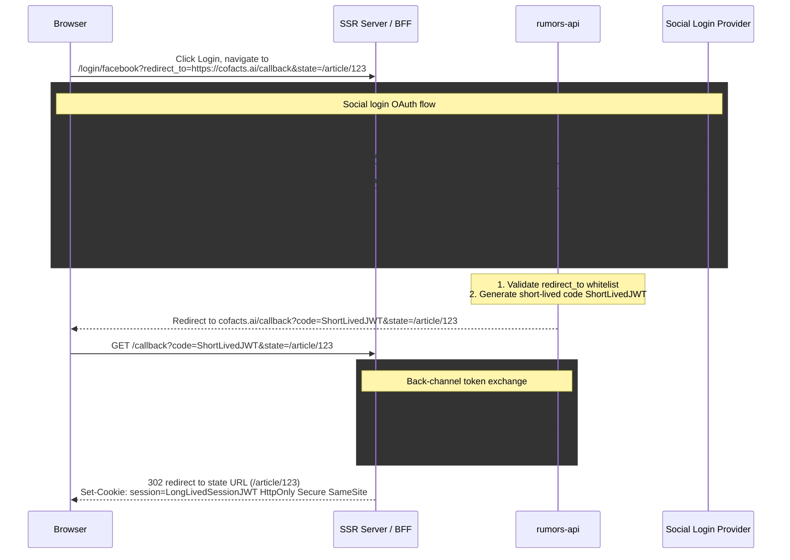
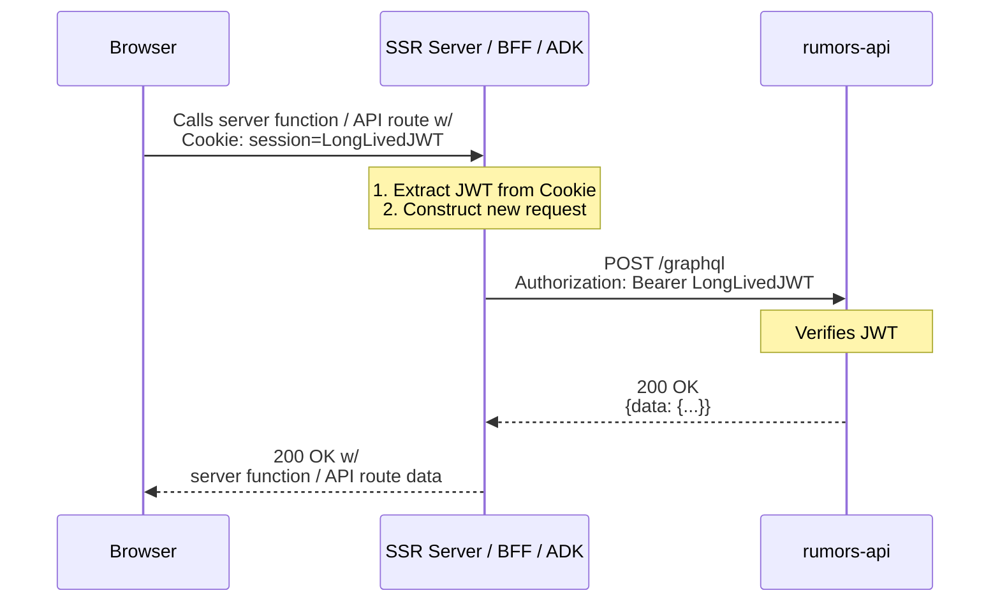
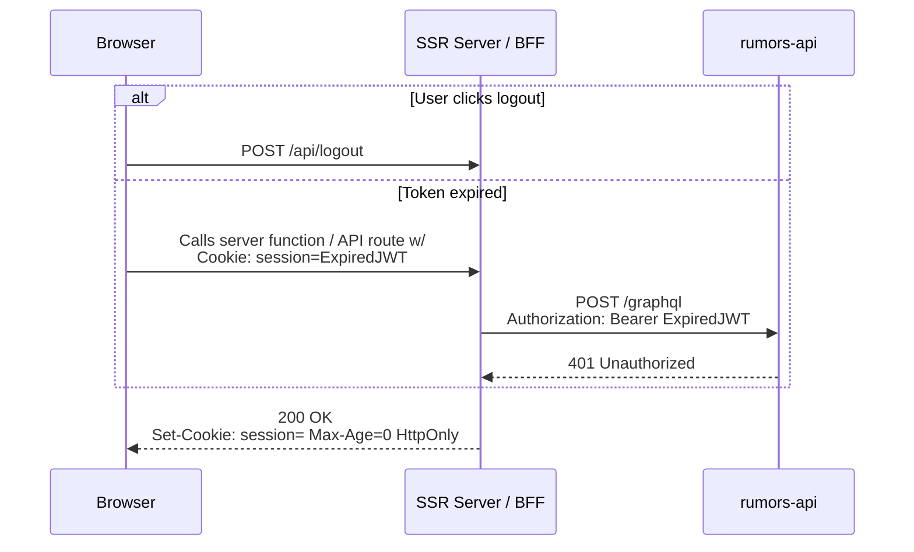

# **Authentication Architecture Design: Custom Authorization Code Flow via BFF**

[Authentication Architecture Design: Custom Authorization Code Flow via BFF](#heading=)

[1\. Overview](#heading=)

[2\. Key Decisions](#heading=)

[3\. Required Changes in rumors-api](#heading=)

[4\. Sequence Diagrams](#heading=)

[4.1 Login Flow](#heading=)

[4.2 API Request Flow](#heading=)

[4.3 Logout Flow (Client Initiated or Token Expiry)](#heading=)

[5\. Backward Compatibility](#heading=)

## **1\. Overview**

This document outlines the architectural changes required to support a secure Server-Side Rendering (SSR) authentication flow between cofacts.ai (Tanstack Start SSR Server acting as a BFF) and rumors-api.  
To overcome the limitations of the current cookie-based session and ensure maximum security, we are adopting a custom Authorization Code Flow. This involves using a short-lived JWT as an authorization code, which the SSR server will exchange for a long-lived JWT. The long-lived JWT will be stored securely in an HttpOnly cookie managed by the BFF, preventing any access from client-side JavaScript.

## **2\. Key Decisions**

1. **Short-Lived JWT as Auth Code**: Instead of managing a stateful code in a database or Redis, rumors-api will issue a 30-second short-lived JWT acting as the authorization code.  
2. **No OAuth App Registry**: Since this is a first-party application, we will skip complex OAuth client registrations. Redirect URIs will be validated against a whitelist configured via environment variables (`ALLOWED_CALLBACK_URLS`).  
3. **BFF Proxy Architecture**: The SSR Server will act as a Backend-For-Frontend (BFF) proxy. The frontend UI will only communicate with the BFF, which automatically attaches the HttpOnly cookie. The BFF extracts the JWT and proxies the request to rumors-api using the `Authorization: Bearer <token>` header.  
4. **No Refresh Tokens**: The long-lived JWT will mirror the existing `COOKIE_MAXAGE` (default 14 days). Once it expires, the user will be logged out natively, mimicking the current system behavior without the overhead of maintaining a refresh token infrastructure.

## **3\. Required Changes in rumors-api**

* **Update src/auth.js**:  
  * Validate the `redirect_to` parameter against the `ALLOWED_CALLBACK_URLS` environment variable.  
  * Accept and pass through an optional `state` query parameter to support redirecting users back to their original page after login.  
  * Upon successful login via the Social Provider, generate a short-lived (e.g., 30s) JWT containing the `userId`.  
  * Append this short-lived JWT, and the original `state` (if provided), to the redirect URL as query parameters (e.g., `?code=<short_lived_jwt>&state=<original_path>`).  
* **Add `/token` Endpoint**:  
  * Create a new POST endpoint (e.g., `/auth/token`).  
  * Accept the short-lived JWT (`code`).  
  * Verify the short-lived JWT.  
  * Issue and return a long-lived JWT (e.g., 14 days, matching `COOKIE_MAXAGE`) containing the user's identity.  
* **Update src/contextFactory.ts**:  
  * Modify the context creation logic to also look for an `Authorization: Bearer <token>` header.  
  * Verify the JWT and extract the user identity to populate `ctx.state.user` for GraphQL resolvers.

## **4\. Sequence Diagrams**

### **4.1 Login Flow**

This diagram illustrates the process of a user logging in from a specific page (assume `/article/123`), the issuance of the short-lived code, the token exchange by the SSR server, and the setting of the secure `HttpOnly` cookie, finally returning the user to their original page.

Once the user grants permission, the authentication process involves *two back-channel token exchanges*:

1. **Social Login Provider to rumors-api:** The existing `rumors-api` logic, utilizing [Passport.js](http://passport.js), handles this. The Social Login Provider redirects the browser to send a code to `rumors-api`. The `rumors-api` then exchanges this code for an access token, which is used to retrieve the User Profile and subsequently establish **the login session on rumors-api**.  
2. **rumors-api to the BFF:**   
   * The main purpose of this is to establish a login session on the BFF, in the form of a long-lived session JWT.  
   * To ensure the browser's JavaScript cannot directly access the long-lived JWT, `rumors-api` passes it to the BFF via a server-to-server token exchange.  
   * Since `rumors-api` cannot initiate this back-channel communication directly, it first generates a short-lived code and redirects the browser with this code. The BFF then uses this code in its `/callback` endpoint handler to start the back-channel token exchange with the new `/auth/token` endpoint on `rumors-api`.

Ultimately, the BFF utilizes an **HttpOnly and SameSite session cookie** to store the login session. This method is designed to mitigate both **Cross-Site Scripting (XSS)** and **Cross-Site Request Forgery (CSRF)** risks.

### **4.2 API Request Flow**

This diagram details how the frontend fetches data. The browser sends the HttpOnly cookie to the BFF, which then proxies the request to rumors-api using the Authorization header.

If the Server-Side Rendering (SSR) server communicates with the ADK, and ADK tools also communicate with the rumors-api, the SSR Server will simply relay the `LongLivedJWT` to the ADK.

The opaqueness of the `LongLivedJWT` session token is context-dependent:

1. For the browser UI, it is opaque and inaccessible via client-side JavaScript since it's an HttpOnly cookie.  
2. For the SSR server or BFF, one can consider extracting the user ID or other identifiers in the token to use as an ID (which is helpful when calling ADK APIs that require a user ID), provided they verify the signature of the JWT.

### **4.3 Logout Flow (Client Initiated or Token Expiry)**

This diagram shows how logout is handled, ensuring the HttpOnly cookie is cleared from the browser.

As the cookie is removed, the user is logged out.

## **5\. Backward Compatibility**

The introduction of this custom Authorization Code Flow is fully backward compatible with the existing cofacts.tw frontend.  
During the OAuth login process, rumors-api will continue to set the traditional koa-session cookie just as it always has. When rumors-api redirects the user back to the frontend with the newly added query parameter (?code=\<ShortLivedJWT\>), the legacy cofacts.tw application will simply ignore this unknown code parameter. It will continue to authenticate successfully using the standard session cookie already present in the browser, ensuring zero disruption to current operations.
