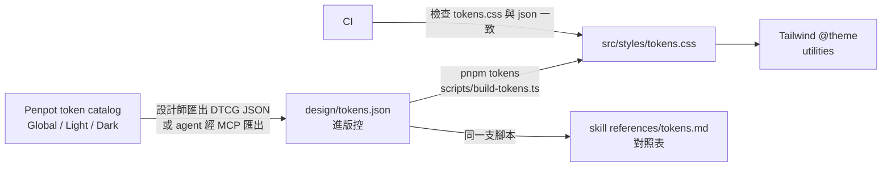
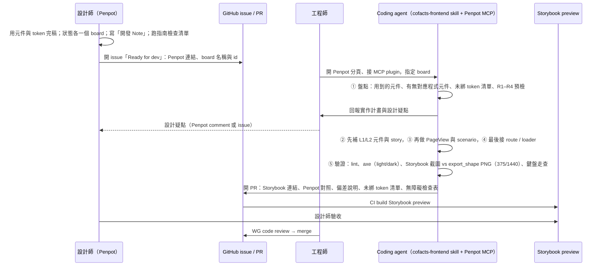

# Cofacts.ai Phase 3：網站遷移與前端架構

> [!NOTE]
> **狀態：討論稿（Draft for discussion）**。給 Cofacts WG、2 位 contractor 工程師與陪伴設計師一起討論用。
> 每節最後的 **❓待討論** 是需要大家拍板的地方；§9 統整所有待決事項。

- 上位規劃：[Cofacts.ai 技術實現路徑報告](../../research/cofacts.ai/Cofacts.ai%20website.md) 的 Phase 3「功能擴充與遷移」
- Phase 2 登入機制：[Authentication](Authentication.md)（已在 [cofacts/ai](https://github.com/cofacts/ai) 實作）
- 設計稿：Penpot 檔案「Cofacts-2026 (26-08-25)」（Penpot MCP 可存取）
- 無障礙指南：設計師提供的「Cofacts 無障礙指南 設計系統 v2（2026.08.27）」，對應 Penpot 檔 Cofacts-2026
- 本文盤點基準：`cofacts/ai@d00e6be`、`cofacts/rumors-site@4d10bbc`、Penpot 檔 2026-09-28 狀態

---

## 0. 摘要

**終局**：`cofacts/ai`（TanStack Start + BFF）完全取代 `cofacts/rumors-site`（Next.js 9 + MUI v4 JSS），部署在 `cofacts.tw`，cofacts.ai 的 AI 查核協作功能移到 `cofacts.tw/ai`。

本文提出：

1. **網址（§2）**：URL 總表依分工區塊分組。rumors-site 既有 path 全部沿用；AI 功能收進 `/ai/*`；列表頁的 search param 改成小寫、可讀、有白名單的新格式，舊格式照收並 redirect 到新格式。語系用 lingui，依 host 切換。
2. **元件（§3）**：分四層，由下而上是 shadcn（Base UI）primitives、Cofacts 領域元件、feature 元件、route。**Penpot 元件路徑 = 程式元件 = Storybook title**，三邊名字一致。
3. **Storybook（§4）**：元件層每個 Penpot variant 一個 story，頁面層每個 Penpot board（含狀態板）一個 scenario。light/dark × 375/1440 全跑 axe。
4. **Penpot ↔ Tailwind（§5）**：規則是「**Penpot token 去掉角色前綴就是 Tailwind class**」，例如 `surface-raised` → `bg-raised`、`text-secondary` → `text-secondary`、`border-control` → `border-control`、`spacing-16` → `p-16`、`RADIUS-5` → `rounded-5`、font size `16` → `text-16`。Tailwind 預設色盤整個關掉，原始色不做成 utility，所以 `text-gray-400`、`text-accent`（品牌黃當字）、`text-15` 這類 class **根本編譯不出來**。已用 Tailwind 4.2.0 實測。
5. **無障礙（§6）**：指南四條規則中，R2（品牌黃不當字）與 R3（只用語意名）靠 token 設計在建構時就擋掉，R1（狀態要有文字）靠元件擋，R4（底色與前景配套）靠 dark 主題的 axe 測試抓。這些規則寫成 `cofacts/ai` 的 repo-level skill `cofacts-frontend`，做前端時自動載入。
6. **分工（§8）**：0（WG 基礎）＋ 1 列表、2 單一訊息與回應、3 回報、4 Infographics、5 AI chat，另加 6 上線切換。§8 談規模與人力建議。**切換前必須讓 Cloudflare 的 HTML cache rule 排除 session cookie**（§2.6）。

---

## 1. 背景與範圍

### 1.1 現況

| | rumors-site（cofacts.tw） | cofacts/ai（cofacts.ai） |
|---|---|---|
| Framework | Next.js 9.5 Pages Router，React 16 | TanStack Start 1.161（React 19，Vite 7，Nitro） |
| 樣式 | MUI v4 `makeStyles`（約 109 檔）/ `withStyles`（約 18 檔），JSS | Tailwind v4（CSS-first，無 config 檔），shadcn `base-maia` style（`@base-ui/react`，非 Radix） |
| 資料 | Apollo Client 2 直連 `api.cofacts.tw/graphql`，colocated fragments | BFF server functions → `cofactsExec`（fetch + GraphQL codegen）；瀏覽器不直連 API |
| 登入 | api.cofacts.tw cookie session | Authorization Code Flow → BFF 的 HttpOnly `cofacts_session` cookie（Phase 2 完成） |
| i18n | ttag + `.po`，build-time 決定 locale（zh_TW / en_US / ja 三個 image；en/ja 只在 staging） | 無，UI 直接寫死繁中 |
| Storybook | v6 + storyshots，build 在 `/storybook` | 尚未合併（[cofacts/ai#126](https://github.com/cofacts/ai/pull/126)：Storybook 10 react-vite） |
| 部署 | GCE + pm2 + cloudflared | Cloud Run 多容器（ingress / ADK backend / cloudsql-proxy），每個 PR 一個 preview revision |

cofacts/ai 目前的前端狀況（Phase 3 要一併處理）：

- `src/styles.css` 的 token 是 shadcn 預設加上手調的 hex（`--primary: #ffb600`、`--foreground: #333333`…），**跟 Penpot 設計系統 v2 沒有對應**。
- 自訂元件大量直接用 Tailwind 原始色盤（`text-gray-400` ×22、`bg-white` ×15、`bg-gray-100` ×12…），dark mode 定義了但沒人用。
- 16 個 shadcn primitives 只有 6 個被 app 用到。icon 同時用 Material Symbols webfont 與 lucide 兩套。
- 無障礙技術債：多個只有 icon 的按鈕沒有 accessible name（漢堡選單、送出、附件…）；backdrop 是有 `onClick` 的 `div`；Material Symbols ligature 沒有 `aria-hidden`。
- 進行中的 PR：[cofacts/ai#138](https://github.com/cofacts/ai/pull/138)（`/report` 回報表單，含 decision record）、[cofacts/ai#139](https://github.com/cofacts/ai/pull/139)（PWA share target）、[cofacts/ai#126](https://github.com/cofacts/ai/pull/126)（Storybook）。

### 1.2 目標

- 新架構完全取代 rumors-site；`cofacts.tw` 是唯一入口，cofacts.ai 的 AI 功能在 `cofacts.tw/ai`。
- 所有頁面依 Penpot 設計系統 v2 重做，同時符合無障礙指南。
- 建立「設計師 Penpot 完稿 → 工程師帶著接了 Penpot MCP 的 coding agent 實作」的可重複流程。

### 1.3 非目標（Phase 3 不做）

- ADK agent 行為調整（`adk/`）。唯一例外是 AI 頁面 URL 搬家可能要改的地方（目前評估不需要）。
- rumors-api schema 的大改動。個別頁面需要的小欄位另開 PR。
- en / ja 的翻譯內容本身。Phase 3 只把 i18n 機制建好、把文案抽成 key（§2.5）。

---

## 2. 網站資訊架構（URL）

### 2.1 原則

1. **既有 path 一律沿用**。外部連結、LINE bot 回覆、搜尋引擎索引都指向這些網址，這批網址不能壞。
2. **path 放「資源」，query 放「檢視狀態」**：path 表示「這是哪一則訊息、哪個人」；篩選、排序、分頁籤放 query。
3. **新網址用英文小寫 kebab-case**；列表用複數（`/articles`），單筆用單數加 id（`/article/:id`），跟既有慣例一致。
4. **query 值要可讀、有白名單**：未知的 param 忽略，不合法的值退回預設，**任何輸入都不能讓頁面 crash**（rumors-site 的 `/search?type=messages` 沒帶 `q`、`/tutorial?tab=xxx` 都會 crash）。
5. **預設值不寫進 URL**，空值不留（rumors-site 會留下 `?filters=&types=`）。
6. **舊網址、舊 param 照收**，再轉到新格式：path 層級用 HTTP 301/308（SSR 做得到）；只有 query 格式不同時，由 route 的 `beforeLoad` 丟出 `redirect({ search, replace: true })`。
7. **不加 locale 前綴**，語系由 host 決定（§2.5）。
8. 預留的頂層 namespace：`/ai`、`/api`、`/report`、`/storybook`（若要自架）。

### 2.2 URL 總表（依分工區塊）

圖例：
- 狀態：🟢 沿用；🔵 新增；🟠 沿用 path 但 query 改版；🔴 退場或 redirect。
- **❌ 無稿**：Penpot 沒有這頁的設計。**工程師以 Penpot `Guide` 頁為範例**（它示範了既有頁面怎麼套上新元件與新 token），用新元件自行拼湊，不等新稿。

各塊的規模觀察與人力建議見 §8。

#### 塊 0　基礎（WG）：全站共用與系統路由

| URL | 頁面 / 用途 | Penpot | 狀態 | 備註 |
|---|---|---|---|---|
| （全站） | App shell：`Layout/Nav`（Default / login / search / AI 四種）、mobile 選單、`Layout/Footer`、登入 modal、header 搜尋 | ✅ UI system | 🔵 | 各塊都依賴它 |
| （全站） | 語系判定（§2.5） | — | 🔵 | server 依 host 決定 locale |
| `/api/auth/callback?code&state` | OAuth callback（Phase 2） | — | 🟢 | |
| `/api/run-sse` | ADK 串流 proxy | — | 🟢 | |
| 404 / 500 | 錯誤頁（rumors-site 沒有自訂頁） | ❌ 無稿 | 🔵 | |

#### 塊 1　列表：列表、篩選與 URL params

| URL | 頁面 | Penpot | 狀態 | 備註 |
|---|---|---|---|---|
| `/articles` | 可疑訊息列表 | ✅ `Doubious Message-1440` / `-Mobile` | 🟠 | param 見 §2.3 |
| `/replies` | 最新查核 | ✅ `Latest replies` / `/ Mobile`、「選單展開示意」「篩選器手機版」 | 🟠 | |
| `/hoax-for-you` | 等你來答 | ❌ 無稿（套 `Doubious Message` 版型） | 🟠 | 只收 `topic` 與時間參數 |
| `/search?q=…&type=messages\|replies` | 搜尋 | ❌ 無稿 | 🟠 | `type` 沿用；沒有 `q` 時顯示空狀態，不 crash |
| `/user/:slug` | 個人頁 | ❌ 無稿 | 🟢 | `tab=replies\|comments`。改用 SSR 301 canonicalize，不用 client `router.replace`（現行會吃掉 `?tab=`） |
| `/user?id=:userId` | 個人頁（沒有 slug 的使用者） | ❌ 無稿 | 🟢 | 使用者有 slug 時 301 到 `/user/:slug`，並保留其他 query |

- 個人頁**不**新增「送過的訊息」tab。使用者送過的訊息改由列表的「我送出的」篩選呈現（`status=reported-by-me`，§2.3）。

#### 塊 2　單一訊息與回應

| URL | 頁面 | Penpot | 狀態 | 備註 |
|---|---|---|---|---|
| `/article/:id` | 單一訊息 | ✅ `MessagePage-1440` / `MessagePage-原始訊息`（mobile） | 🟢 + 🔵 hash | 區塊錨點見 §2.4 |
| `/article/:id/reply/new` | 撰寫新回應（全頁編輯器） | ✅ `Message-editor-Write Response…` ×6 | 🔵 | 編輯器裡的 3 個分頁（撰寫回應 / 原始訊息 / 不同意見出處）是表單內狀態，不進 URL |
| `/article/:id/reply/existing` | 使用既有回應 | ✅ `Message-editor-Use Existing Response` ×2 | 🔵 | |
| `/reply/:id` | 單一回應 | ❌ 無稿 | 🟢 | |

#### 塊 3　回報可疑訊息（只收網址）

| URL | 頁面 | Penpot | 狀態 | 備註 |
|---|---|---|---|---|
| `/report?url=&text=&title=` | 回報可疑訊息 | ✅ `AI` 頁的「回報可疑訊息流程」6 個狀態板 | 🔵（[cofacts/ai#138](https://github.com/cofacts/ai/pull/138)） | 參數沿用 Web Share Target 的形狀，維持寬鬆解析；[cofacts/ai#139](https://github.com/cofacts/ai/pull/139) 讓 Android 分享選單可直達 |

#### 塊 4　Infographics（靜態頁）

| URL | 頁面 | Penpot | 狀態 | 備註 |
|---|---|---|---|---|
| `/` | 首頁（landing） | ❌ 無稿 | 🟢 | 移植現有設計；JSS 改寫成 Tailwind / CSS Modules（§3.6） |
| `/tutorial?tab=bust-hoaxes\|check-rumors` | 使用教學 | ✅ `Guide how-1440` | 🟢 | 不合法的 `tab` 退回預設；修掉站內的錯字連結 `/tutorial?bust-hoaxes` |
| `/about` | Cofacts 是什麼 | ✅ `Guide what-1440` | 🟢 | 設計師註記：「目前僅針對主要樣式套上新的設計系統，原本的教學內容無更動」 |
| `/impact` | 社會影響力報告 | ❌ 無稿 | 🟢 | rumors-site 的版本沒有 header / footer；新版建議納入全站 shell |
| `/terms` | 使用者條款 | ❌ 無稿 | 🟢 | 由 `LEGAL.md` 轉換（build-time 即可） |
| `/instant` | 已退役的 stub | — | 🔴 | 302 到 community builder |

#### 塊 5　AI chat

| URL | 頁面 | Penpot | 狀態 | 備註 |
|---|---|---|---|---|
| `/ai` | 新查核任務 | ✅ `AI-open page-1440` / `-Mobile` | 🔵（原 cofacts.ai 的 `/`） | 新增 `?article=:articleId`：從訊息頁的「我要查核闢謠」「引用 AI 查核」帶入文章開新 session |
| `/ai/session/:sessionId` | 查核對話 | ✅ `AI-main page` / `-Mobile` / `-Mobile-Draft` | 🔵 | 預留 `/ai/settings` 等子頁 |
| `/ai/session/:sessionId/tool/:toolCallId` | 對話加右側工具抽屜 | 同上 | 🔵 | 保留「抽屜狀態在 URL 裡」的現行設計 |

#### 塊 6　上線切換：redirect、相容與 infra（WG）

| URL | 用途 | 狀態 | 備註 |
|---|---|---|---|
| `cofacts.ai/*` | 舊網域 | 🔴 301 → `cofacts.tw/ai/*` | 在 Cloudflare 處理 |
| `/session/*` | cofacts.ai 舊路徑 | 🔴 301 → `/ai/session/*` | |
| 各列表的舊 query（`filters=`、`types=`…） | 舊 bookmark | 🟠 | `normalizeLegacySearch()` 轉成新格式（§2.3） |
| `/api/articles/:feed?json=…&source=…` | RSS / Atom / JSON feed | 🟢 **原樣保留** | `json` 是 LZMA 壓縮的 GraphQL variables；功能照舊移植，不改版 |
| `en.cofacts.tw`、`ja.cofacts.tw` | 語系 host | 🟢 | 同一個 app 依 host 切語系（§2.5） |
| `/robots.txt`、`/sitemap.xml` | SEO（rumors-site 從來沒有） | 🔵 建議 | |
| `/analytics`、`/hack` | 由 Cloudflare 規則處理 | 🟢 | 沿用 |

### 2.3 列表頁 search param 改版提案

rumors-site 的問題：

- 值是大寫 snake（`NO_REPLY`），時間是 Elasticsearch date math（`now-1w/d`）。
- `types` 和 `articleTypes` 命名不一致；`orderBy` 沒驗證，直接塞進 GraphQL。
- 同名 param 在不同頁意義不同（`start/end` 在 `/articles` 是 `createdAt`，在 `/replies` 是 `repliedAt`）。
- 分頁 cursor 不在 URL。**定案：維持不進 URL**；按上一頁時靠 TanStack Query cache 與 scroll restoration 還原。

URL 不需要跟 Penpot 的 token 名稱綁定，改名只為了**好讀、不容易被誤解**。

#### 查核回應分類（原 `types`）：不互斥、「含有」的語意

Cofacts 的四種分類是**對「一則查核回應」的標記**，不是對訊息真偽的判決：

- 一則訊息可能有多則回應、分屬不同分類。篩「含有錯誤訊息」加「含有正確訊息」是指「有任一則回應屬於其中之一」（any-of），兩者並不互斥。
- 「含有正確訊息」（`NOT_RUMOR`）不等於「這則訊息是真的」，只表示查核者認為其中含有正確資訊。

rumors-site 的問題是 param 名 `types` 看不出是「回應的」分類，值 `NOT_RUMOR` 又容易被人或 AI 望文生義讀成「查證為真」。提案：

| | 提案 |
|---|---|
| param 名 | **`replyType`**：寫明是「回應」的分類 |
| 值 | **沿用 API enum，改小寫 kebab**：`rumor`、`not-rumor`、`opinionated`、`not-article`。與 rumors-api、open data、LINE bot 同一套詞，研究者與 agent 都查得到定義 |
| 防誤解 | ① zod schema 的 `.describe()` 寫明「任一回應被標記為…（any-of，可多選，不代表訊息真偽）」並附中文標籤；② `cofacts-frontend` skill 與 `docs/` 收錄同一段定義；③ UI 標籤一律用「含有錯誤訊息」「含有正確訊息」「含有個人意見」「不在查證範圍」，不用「正確／錯誤」 |

替代方案：值改用標籤語意（`has-misinfo`、`has-facts`、`has-opinion`、`out-of-scope`）。好處是字面就帶出「含有」；壞處是 URL 值與 API enum 不一致，每層都要做對照。目前建議沿用 enum。

#### 完整對照

| 新 param | 舊 param | 值（逗號分隔多選） | 說明 |
|---|---|---|---|
| `status` | `filters` | `asked-once`, `asked-many`, `no-reply`, `replied-many`, `no-useful-reply`, `has-useful-reply`, `replied-by-me`, `not-replied-by-me`, 🔵 `reported-by-me` | 互斥組合在 schema 層處理；`*-by-me` 未登入時忽略，**只忽略它自己**（現行用 `break`，會丟掉之後所有條件）。`reported-by-me` 即「我送出的」，見下方註 |
| `replyType` | `types` | `rumor`, `not-rumor`, `opinionated`, `not-article` | 見上節 |
| `media` | `articleTypes` | `text`, `image`, `video`, `audio` | |
| `topic` | `categoryIds` | 分類 ID | Penpot 篩選器的標題是「主題」 |
| `period` | `start=now-1d/d` 等預設區間 | `1d`, `7d`, `30d` | 「時間不限」即不帶此參數 |
| `from`, `to` | `start`, `end`（自訂區間） | `YYYY-MM-DD` | 每頁在 schema 註明篩的是哪個時間欄位 |
| `sort` | `orderBy` | `last-requested`, `most-requested`, `last-replied`, `my-reply`（個人頁） | 每頁有自己的白名單 |
| `tab` | `tab` | 個人頁 `replies` / `comments`；教學頁 `bust-hoaxes` / `check-rumors` | 沿用 |
| `q`, `type` | `q`, `type` | `/search` | 沿用 |

> [!NOTE]
> **「我送出的」需要確認 API 語意**：rumors-api 的 `ListArticleFilter.selfOnly` 只會列出「由目前使用者**建立**」的訊息（第一個回報者）。沒有「我曾回報過（含對既有訊息 +1）」的 filter（2026-09-28 查 `api.cofacts.tw` schema）。若「我送出的」要包含 +1 過的訊息，需要在 rumors-api 補一個依 reply request 的 `userId` 篩選的 filter。

- 實作方式：每個列表 route 用 `validateSearch` + zod schema，放在 `src/features/list/searchParams.ts`。同一份 schema 產生三樣東西：GraphQL filter、篩選 UI 的狀態、canonical URL。
- 舊 param 由 `normalizeLegacySearch()` 轉換（`filters=NO_REPLY` → `status=no-reply`、`types=NOT_RUMOR` → `replyType=not-rumor`、`start=now-1w/d` → `period=7d`…），轉完用 `replace` redirect。

範例：

```
舊 /articles?filters=NO_REPLY,ASKED_MANY_TIMES&types=RUMOR&start=now-1w/d&orderBy=replyRequestCount
新 /articles?status=no-reply,asked-many&replyType=rumor&period=7d&sort=most-requested
```


### 2.4 訊息頁的區塊錨點

設計師註記：「手機版為橫式選單，可左右滑動。互動如桌機，點擊前往該區塊」（`Layout/ActionPanel`「快速索引」）。提案的 hash：

| hash | 區塊 |
|---|---|
| `#replies` | 查核回應 (n) |
| `#reply-:replyId` | 單一則查核回應（🔵 新增，rumors-site 沒有單則回應的深連結） |
| `#ai-analysis` | AI 自動分析（「若無查核回應就會顯示 AI 自動分析」） |
| `#similar` | 相似可疑訊息與組合 |
| `#original` | 原始訊息 |

### 2.5 語系（i18n）

- **採用 `@lingui/react`**：以英文原文作為翻譯 key，抽出成 gettext `.po` 檔（沿用 rumors-site 的翻譯流程與既有 `.po`）。runtime 載入編譯後的 message catalog 切換語系，不必像 ttag 那樣每個語系 build 一個 image。
- **語系由 host 決定**，沿用現有的三個 host。URL 不加 locale 前綴，既有網址不變。

  | host | locale |
  |---|---|
  | `cofacts.tw` | `zh-TW`（預設） |
  | `en.cofacts.tw` | `en` |
  | `ja.cofacts.tw` | `ja` |

  - root route 的 `beforeLoad` 呼叫 server function，讀 `Host` header（Cloudflare 之後讀 `X-Forwarded-Host`）決定 locale，SSR 時就載入對應 catalog，並輸出 `<html lang>`。
  - 各語系頁面互相輸出 `hreflang` alternate link。
  - 使用者手動切換語系時，導到對應 host 並保留 path 與 query。
  - 不同 host 的 CDN cache key 本來就分開，不會混到語系。
- **只翻 UI 文案**：訊息、回應等使用者內容維持原文。
- 影響工作量的地方：
  - cofacts/ai 現有的繁中寫死文案要改寫成英文 key（第 0 塊處理 shell 與 L1；其他塊各自處理）。
  - `cofacts-frontend` skill 規定所有 UI 字串都要經過 `t` / `<Trans>`。
  - 日期格式一律依當前 locale，不能寫死 `zh-TW`。

### 2.6 切換策略（Strangler Fig）

1. **並存期**：新 app 部署在 Cloud Run，Cloudflare 依 path 把「已遷移的路徑」導到新 app，其餘仍到 GCE 上的 rumors-site。可以一頁一頁切。
2. **登入並存**：舊站用 api.cofacts.tw 的 session，新站用 BFF cookie。使用者在舊站已登入時，新站的 login redirect 到 api 會直接回來，體感是一鍵登入。**兩邊的登出不會同步**，這點要接受或另外處理。
3. **Cloudflare cache（⚠️ 必做）**：
   - 現況：依 `cofacts/devops` 的 `Cloudflare.md`「Cache Rules (As of 2026-06-11)」，SSR HTML 有 **60s Edge TTL override**。範圍是 `cofacts.tw` 的 `/`、`/articles`、`/search`、`/replies`，以及 en/ja/zh 全站規則；只排除 `/_next/`、含 `.` 的路徑、`/user`，以及帶 `isUserBlocked=1` cookie 的請求。
   - 風險：override 模式會**忽略 origin 的 `Cache-Control`**。新站在 SSR 直接渲染登入後畫面（§3.5）後，A 使用者的登入畫面可能在 60 秒內被快取並回給其他人。
   - 切換前要做：
     - ① 所有 cache rule 加上排除 `cofacts_session` cookie 的條件（與現行排除 `isUserBlocked=1` 同理）；
     - ② 新 app 對帶 session 的回應一律送 `Cache-Control: private, no-store`，作為第二道防線；
     - ③ 規則裡 rumors-site 專屬的排除條件（`/_next/`）改成新 app 對應的路徑（Vite 產生的 asset 路徑）。
4. **全面切換**：`cofacts.tw/*` 全部導到新 app，`cofacts.ai/*` 301 到 `cofacts.tw/ai/*`，rumors-site 退場。

> [!NOTE]
> 本文件即為上述決策（AI 搬到 `/ai`、routing 整合、token 命名規則）的設計紀錄。cofacts/ai 的 `docs/` 直接超連結到本文即可；只有實作過程中出現本文未涵蓋的取捨時，才另外寫 ADR。

---


## 3. 元件架構

### 3.1 技術原則

- **Tailwind v4 為主**；只有 Tailwind 表達不好的時候才用 **CSS Modules**（`Foo.module.css`）：複雜 keyframes、`::before` 裝飾、捲動動畫、第三方 DOM（ProseMirror）。**禁止任何 CSS-in-JS**。
- **shadcn（`base-maia` style，建在 `@base-ui/react` 上）** 作為 primitives。shadcn 的程式碼是 repo 自己擁有的，我們直接改成 Cofacts token（§5.4），不保留 shadcn 那層語意變數（`--primary`、`--muted`…）。
- **變體**用 `class-variance-authority`（cva）；合併 class 用既有的 `cn()`。
- **Icon 統一一套**：Penpot 的 `Base/Icon` 41 個 icon 名字就是 Material Symbols 名稱（`Open-In-New`、`Thumb Up`、`Format List Bulleted`…），另外有 Cofacts 自訂的 status 與品牌 icon（`status-correct`、`status-false`、`line`、`fb`…）。
  - 建議做一個 `<Icon name>` 元件，改成 **SVG import**（例如 `@material-symbols/svg-400` 按需引入），取代 webfont ligature。webfont 會被螢幕閱讀器念出 ligature 文字，也會有 FOUT。
  - shadcn primitives 裡的 lucide 也一併換掉。
- **元件不碰資料取得**：元件只吃 typed props（由 GraphQL codegen 的 fragment type 產生）。資料由 route loader 呼叫 BFF server function 取得。這樣 Storybook 不需要 mock Apollo 或網路，fixture 餵 props 就能跑（§4）。
- **一個響應式元件取代 Penpot 的 desktop / mobile 兩個元件**：Penpot 有 `FactCheckCard` 與 `FactCheckCard-Original-Mobile`、`Footer` 與 `Footer-Mobile` 這類成對元件，程式裡合成一個，用斷點切換。

### 3.2 分層

| 層 | 目錄 | 內容 | 誰維護 |
|---|---|---|---|
| L0 tokens | `src/styles/tokens.css`（產生檔） | Penpot token 轉成的 CSS 變數與 `@theme` | 腳本產生，不手改 |
| L1 primitives | `src/components/ui/` | shadcn / Base UI：Button、Input、Select、Checkbox、Switch、Toggle、Dialog、Popover、Menu、Tabs… | WG（第 0 塊） |
| L2 Cofacts 領域元件 | `src/components/cofacts/`、`src/components/layout/` | 對應 Penpot `Content/*`、`Feedback/*`、`Layout/*`：FactCheckReply、ReplyTypeLabel、Nav、Footer… | 首次用到的那一塊負責，其他塊共用（§8.3） |
| L3 feature 元件 | `src/features/<feature>/` | 只在某頁用的組合：篩選面板、訊息頁側欄、編輯器、AI 對話… | 各塊 |
| L4 route | `src/routes/` | loader、`validateSearch`、`head()`、組 layout，**盡量薄** | 各塊 |

### 3.3 Penpot 元件 → 程式元件對照

Penpot 本地元件庫共 **46 個元件**，其中 29 個有 variants（Button 17、Input 14、Icon 41…）。Penpot 的 variant 屬性名大多還是預設的 `Property 1` / `Value 2`，且把多個維度擠在一個字串裡，例如 `normal-2icon-default`。**請設計師把它們拆成具名的多屬性**（Size / Style / Icon / State）。拆完之後，variant 屬性可以直接對應到 cva 的 prop，agent 也讀得懂。

| Penpot 元件 | Penpot variants（現況） | 程式元件 | 層 | 主要使用頁 |
|---|---|---|---|---|
| `Base/Button` | 17：size（small/normal/large/icon）× style（default/outline/Secondary/LINE）× icon（front/back/2icon） | `ui/button`：`variant: primary\|outline\|secondary\|line\|ghost`、`size: sm\|md\|lg\|icon`、`iconStart` / `iconEnd` | L1 | 全站 |
| `Button AI` | thinking / highlight / default | `cofacts/AiButton` | L2 | 訊息頁、AI |
| `Base/Input` | 14：Basic / Field / Textarea / icon × default / active / disable / Invalid、AI | `ui/input`、`ui/textarea`、`ui/input-group`、`ui/field`；AI 版是 `ai-chat/ChatInput` | L1 / L3 | 表單、搜尋、AI |
| `Base/FieldDescription` | — | `ui/field` 的 description | L1 | 表單 |
| `Base/Select` | default / open / small | `ui/select` | L1 | 篩選、排序 |
| `Base/Checkbox`、`Base/RadioGroup`、`Base/Switch` | default / disable / Description | `ui/checkbox`、`ui/radio-group`、`ui/switch` | L1 | 篩選、編輯器 |
| `Base/Toggle` | default / hover / active / outline-* | `ui/toggle`、`ui/toggle-group`（篩選 chip） | L1 | 列表篩選 |
| `Base/Badge` | icon-default / icon-active / normal / normal-active / disable / fix（例：「還未有效查核」） | `ui/badge` → `cofacts/ArticleStatusBadge` | L1 / L2 | 列表 |
| `Base/Flag`、`Flag-Mobile` | —（例：「從零開始的魔法旋轉花花 \| Lv. 11」） | `cofacts/UserFlag`（作者名 + 等級） | L2 | 回應、留言 |
| `Base/Avatar` | default / no-level / Certification / Certification-level | `cofacts/UserAvatar`（整併現有 `UserAvatar` + `OpenPeepsAvatar`；Certification 對應 [Badge System](../badge-system.md)） | L2 | 全站 |
| `Base/Icon` | 41 icon | `ui/icon` | L1 | 全站 |
| `Layout/Nav` | Default / AI / login / search | `layout/SiteNav`（`mode="site"\|"ai"`） | L2 | 全站 |
| `Layout/NavItem` | hover / default / alert / mobile / mobile-active / mobile-alert | `layout/NavItem`（alert = 「等你來答」未解數 badge，例如 99+） | L2 | 全站 |
| `Layout/Nav-Mobile`、`Nav-MobileExpanded` | open / default / second-menu / search | 合進 `layout/SiteNav` 的 mobile 狀態 | L2 | 全站 |
| `Layout/Footer`、`Footer-Mobile` | — | `layout/SiteFooter`（**底色 `surface-dark`，前景只能用 `-on-dark`**，見 R4 案例） | L2 | 全站 |
| `Layout/Logo` | symbol / horizontal / AI / icon | `layout/Logo` | L2 | 全站 |
| `Layout/ActionPanel` | MessagePage-submenu（快速索引）/ -mobile | `features/article/ArticleQuickNav` | L3 | 訊息頁 |
| `Layout/ExitEditor` | desktop / mobile | `features/editor/EditorExitBar` | L3 | 編輯器 |
| `Content/FactCheckCard`、`FactCheckCard-Original-Mobile` | — | `cofacts/ArticleCard`（列表中的一則訊息 + 回應摘要） | L2 | `/replies`、`/articles`、首頁 |
| `Content/FactCheckReply`、`ReplyCard-Mobile` | default / with-link | `cofacts/FactCheckReply`（回應本文 + 出處 + 作者 + 回饋） | L2 | 列表、訊息頁、回應頁 |
| `Content/FactCheckReply-Title` | 4 種判定 × desktop / mobile | `cofacts/ReplyTypeLabel`（**R1 的唯一實作點**，§6） | L2 | 全站 |
| `Content/AIFactCheckCard` | 4 種判定 × default / active | `features/ai-chat/VerdictPicker`（AI 草稿選分類） | L3 | AI |
| `Content/AIMessageCard` | default / hover / active / active-hover | `features/ai-chat/SessionListItem` | L3 | AI 側欄 |
| `Content/AIAnalysisPanel` | — | `features/article/AiAnalysisPanel` | L3 | 訊息頁 |
| `Content/DisputedMessage`、`-Mobile` | default / read | `cofacts/ArticleListItem`（可疑訊息列表的一則） | L2 | `/articles`、`/hoax-for-you`、搜尋 |
| `Content/MessageListItem` | — | `cofacts/ReplyRequestItem`（網友回報補充） | L2 | 訊息頁、個人頁留言 tab |
| `Content/LinkCard` | — | `cofacts/HyperlinkPreview` | L2 | 訊息頁、回應 |
| `Content/Transcript` | — | `features/article/Transcript`（協作逐字稿，見 §8 第 2 塊的風險） | L3 | 訊息頁 |
| `Content/FactCheckResultCard` | ExistingResponses / -mobile | `features/editor/ExistingReplyCard`（「直接用此回應」）；回報流程 B-1 也會用到 | L2 | 編輯器、`/report` |
| `Content/ReplyEditor-Tabs` | desktop / mobile | `features/editor/EditorTabs`（基於 `ui/tabs`） | L3 | 編輯器 |
| `Content/QACard`、`QACard-Answer` | — | `features/tutorial/QaCard` | L3 | 教學 |
| `Feedback/ReactionGroup` | 2 | `cofacts/ReplyFeedback`（有幫助 / 沒幫助 + 理由） | L2 | 回應 |
| `Feedback/VoteCounter` | count / time | `cofacts/VoteCounter` | L2 | 回報理由、分類 |
| `Feedback/ReportStatus` | default / Mobile（回應 0 · 回報 23） | `cofacts/ArticleStats` | L2 | 列表 |
| `Feedback/Category` | —（# 分類 · 分類建議） | `cofacts/ArticleCategories` | L2 | 訊息頁 |
| `Feedback/ViewChart`、`Chart-Mobile` | — | `features/article/ViewChart`（近 30 日瀏覽；資料本身不綁語意 token，見指南 07） | L3 | 訊息頁 |

各頁實際用到的元件（由 Penpot 實例統計）：

| 頁面 board | 用到的元件 |
|---|---|
| `Latest replies` | Nav, NavItem, Footer, Select, Toggle, Badge, Button, Avatar, FactCheckCard, FactCheckReply, FactCheckReply-Title, ReactionGroup |
| `Doubious Message-1440` | Nav, Footer, Select, Badge, Button, DisputedMessage, ReportStatus |
| `MessagePage-1440` | Nav, Footer, ActionPanel, Flag, Avatar, Button, Toggle, Input, Select, Badge, Category, ViewChart, LinkCard, Transcript, MessageListItem, FactCheckReply, FactCheckReply-Title, ReactionGroup, AIAnalysisPanel |
| `AI-main page` | Nav, Footer, Select, Button, Button AI, Input, AIMessageCard, AIFactCheckCard |
| `Guide how-1440` | Nav, Footer, Flag, QACard, QACard-Answer, Button |

### 3.4 前端目錄結構提案

```
src/
├── routes/                          # L4：只放 loader / validateSearch / head / 組版面
│   ├── __root.tsx
│   ├── _site.tsx                    # 公開站 layout：SiteNav(site) + SiteFooter
│   ├── _site/
│   │   ├── index.tsx                # /
│   │   ├── articles.tsx             # /articles
│   │   ├── replies.tsx              # /replies
│   │   ├── hoax-for-you.tsx
│   │   ├── search.tsx
│   │   ├── article.$id.tsx          # /article/:id
│   │   ├── article.$id.reply.new.tsx
│   │   ├── article.$id.reply.existing.tsx
│   │   ├── reply.$id.tsx
│   │   ├── user.tsx                 # /user?id=
│   │   ├── user.$slug.tsx
│   │   ├── tutorial.tsx  about.tsx  impact.tsx  terms.tsx
│   │   └── report.tsx               # /report（#138 移入）
│   ├── ai.tsx                       # AI layout：SiteNav(ai) + Sidebar
│   ├── ai/
│   │   ├── index.tsx                # /ai
│   │   ├── session.$sessionId.tsx
│   │   └── session.$sessionId.tool.$toolCallId.tsx
│   ├── session.$.tsx                # 舊 cofacts.ai 網址 → 301 /ai/session/*
│   ├── api/
│   │   ├── run-sse.ts  auth/callback.ts
│   │   └── articles.$feed.ts        # RSS 相容
│   ├── robots[.]txt.ts  sitemap[.]xml.ts
├── components/
│   ├── ui/                          # L1 shadcn/Base UI（已改寫成 Cofacts token）
│   ├── cofacts/                     # L2 領域元件（ReplyTypeLabel、FactCheckReply、ArticleCard…）
│   └── layout/                      # L2 SiteNav、SiteFooter、Logo
├── features/                        # L3，每個 feature 自成一包
│   ├── list/                        # 篩選器、排序、時間、LoadMore、searchParams.ts（zod）
│   ├── article/                     # 訊息頁各區塊、article.functions.ts、article.queries.ts
│   ├── editor/                      # 撰寫 / 使用既有回應
│   ├── reply/  profile/  report/
│   ├── ai-chat/                     # 現有 ChatArea、AgentMessage、RightDrawer（拆檔）…
│   └── landing/  impact/  tutorial/ # 靜態頁，可含 *.module.css 與 images/
├── server/                          # BFF 共用：api-base、jwt、cofactsExec、gql codegen 產物
├── lib/  hooks/
├── fixtures/                        # Storybook 與測試共用的 typed 假資料
└── styles/
    ├── app.css                      # 入口：@import tailwindcss、tokens、base、focus
    ├── tokens.css                   # ⚙️ 由 design/tokens.json 產生
    ├── typography.css  focus.css
design/
└── tokens.json                      # Penpot 匯出的 token（DTCG JSON），token 的來源
docs/design/
└── accessibility-guide.html         # 設計師的無障礙指南原檔（版本化）
```

每個元件的檔案 colocate：`Foo.tsx`、`Foo.stories.tsx`、`Foo.module.css`（需要時）、`Foo.test.tsx`（有邏輯時）。

`features/<x>/` 裡的 `*.functions.ts` 是 server functions；`*.queries.ts` 是 GraphQL document（server-only），codegen 的 `documents` 要擴到 `src/features/**`。這跟現有 `src/server/*.functions.ts` 以及 #138 的 `report.queries.ts` 是同一個模式。

### 3.5 GraphQL 與資料

- 延續 cofacts/ai 現行做法：BFF 的 `cofactsExec` 搭配 codegen client preset（`fragmentMasking: false`）。
- rumors-site 的「colocated fragment 掛在 `Component.fragments`」概念保留：fragment 定義在 feature 的 `*.queries.ts`，元件的 props type 用 fragment 產生的 type。
- SSR 預設是**登入後**的畫面（rumors-site 的 SSR 一律是未登入畫面，登入資訊之後才在 client 補）：BFF 能讀 cookie，loader 直接帶 user context 查。CDN cache 的必要調整見 §2.6。

### 3.6 首頁、教學、影響力報告、條款（靜態頁）

這些頁會用到的共用元件很少（最多用到 Nav、Footer、Button），重點是把 JSS 改寫掉：

| rumors-site 寫法 | 改寫成 |
|---|---|
| `makeStyles` 的一般樣式 | Tailwind utility，色彩一律用語意 token |
| `theme.palette.*`、`theme.spacing()` | 對應的語意 token 與 spacing token（§5） |
| JSS `@keyframes`（floating、breath、flashing） | CSS Modules 的 `@keyframes`，或 `@theme` 裡的 `--animate-*` |
| react-spring 捲動動畫 | CSS scroll-driven animation / IntersectionObserver，**一律包 `@media (prefers-reduced-motion: no-preference)`** |
| `LOCALE` 分支（landing 圖片、新聞列表、YouTube ID） | 改讀 lingui 的當前 locale（§2.5） |
| 圖片（首頁 888 KB、教學 1.2 MB、影響力 1.1 MB） | Vite asset import，順便轉 WebP 或 AVIF |

- **教學與 `/about` 有 Penpot 新稿**（`Guide how` / `Guide what`），內容不變、換樣式。
- **首頁、`/impact`、`/terms` 沒有新稿**：以 Guide 為範例，在保留原有內容與版面結構的前提下改用新元件與 token（§9.1 Q6）。
- 文字壓在圖片或漸層上的對比，指南寫明「要另外量」。首頁 hero 與 impact banner 是高風險區。

---

## 4. Storybook

以 [cofacts/ai#126](https://github.com/cofacts/ai/pull/126)（Storybook 10、`@storybook/react-vite`）為基礎，再補上下列設定。

### 4.1 命名與組織

- **Story title = Penpot 元件路徑**：`Base/Button`、`Content/FactCheckReply`、`Layout/Nav`。設計師在 Penpot 看到什麼，就能在 Storybook 用同一個名字找到。
- 頁面層級一律放 `Pages/<Penpot 頁名>/<board 名>`，例如 `Pages/Article Detail/MessagePage`。
- 每個 story 的 `parameters.penpot = { page, board, componentId }` 記錄對應的 Penpot 物件。skill 與 agent 可以由此雙向查找；§6.3 的元件 registry 也從這裡產生，不必手動維護。

### 4.2 全域設定

| 項目 | 設定 |
|---|---|
| 主題 | toolbar global `theme: light \| dark`，decorator 設定 `<html data-theme>`；**a11y 測試兩個主題都跑**（R4 靠這個抓，§6.1） |
| Viewport | `mobile 375`、`desktop 1440`（與 Penpot board 寬度一致） |
| Router | decorator 包一個 TanStack Router memory history，讓 `<Link>` 在 story 裡可用 |
| 字型 | preview 載入 Noto Sans TC，確保截圖和 Penpot 一致 |
| 互動狀態 | `storybook-addon-pseudo-states` 展示 hover、focus-visible、active，不必為每個狀態另寫元件變體（呼應指南：「焦點是一條全域規則，不是每個元件各做一個」） |
| 無障礙 | `@storybook/addon-a11y`，設定 `parameters.a11y.test = 'error'` |
| 測試 | `@storybook/addon-vitest`：每個 story 就是一個測試，CI 裡跑 axe（light + dark） |
| 部署 | 每個 PR build 一份 Storybook（放 GCS 或 Cloudflare Pages），PR 裡附連結給設計師 review |

### 4.3 元件層 story

- **每個 Penpot variant 一個 story**，再加一個 `AllVariants` 矩陣 story 方便和 Penpot 的元件板並排比對。
- 邊界情況：超長標題、空值、沒有頭像、數字 99+、`disabled`。

### 4.4 頁面層 scenario（page-level stories）

頁面拆成「`XxxPageView`（純 props）＋ route（loader）」，story 只渲染 `XxxPageView`，用 `src/fixtures/` 的資料。**Penpot 裡每個狀態板都應該有對應的 scenario**：

| 頁面 | Scenarios |
|---|---|
| `/replies` | 預設、套用篩選、篩選器展開（mobile「篩選器手機版」）、空結果、載入中、載入更多 |
| `/articles`、`/hoax-for-you` | 預設、已讀狀態（`DisputedMessage/read`）、多媒體訊息（圖片、影片）、空結果 |
| `/search` | 搜訊息、搜回應、沒有 `q`、無結果、帶篩選 |
| `/article/:id` | 無回應（顯示 AI 自動分析）、有 5 則回應、多種判定並存、圖片訊息加逐字稿、未登入、已登入且自己回應過、被封鎖的訊息（未登入 / 已登入）、mobile 快速索引 |
| 編輯器 | 撰寫回應（3 個分頁各一）、使用既有回應、驗證錯誤、送出中 |
| `/reply/:id` | 單一文章、多篇文章共用同一回應 |
| `/user` | 有 slug、無 slug、留言 tab、沒有任何貢獻 |
| `/report` | 直接對應 Penpot 板：未登入、輸入、A Loading、B-1 有文章且有查核回應、B-2 有文章但無回應、C 查無此訊息準備新增 |
| `/ai` | 新任務、串流中（呼叫工具）、草稿完成（`AI-main page-Mobile-Draft`）、工具抽屜開啟、錯誤、登入過期 |
| 靜態頁 | 各一，另加 reduced-motion 版 |

---

## 5. Penpot ↔ TailwindCSS 對齊

### 5.1 Penpot MCP 拿得到什麼（實測）

| 資料 | 怎麼取 | 可用程度 |
|---|---|---|
| Token catalog | `penpot.library.local.tokens`：3 個 set（`Global` 64 個、`Light` 40 個、`Dark` 40 個）；2 個 theme（`Color scheme / Light` = Light + Global，`Color scheme / Dark` = Dark + Global） | ✅ 對齊的主要來源 |
| 每個 shape 綁了哪些 token | `shape.tokens` → `{ fill: "surface-accent", paddingLeft: "spacing-16", fontSize: "16", borderRadiusTopLeft: "RADIUS-5" }` | ✅ **最重要**。實作時優先讀這裡 |
| 元件庫 | `library.local.components`（46 個，含 `path`、variants） | ✅ |
| Typography styles | 9 個：H1–H5、P1–P3、Annotation | ⚠️ 與指南不一致（見下） |
| `penpot.generateStyle()` | 產出 CSS | ⚠️ **只能參考**：色值是 raw hex（`#ffb600FF`）、定位是 `position:absolute; left:170px`，**token 名稱全部遺失** |
| `export_shape` | 匯出 PNG / SVG | ✅ 用來做視覺比對 |
| 開發 Note | 名為「備註」的 board 裡的文字（「開發 Note」「頁面層級標記」） | ✅ 是規格，要讀，**不是畫面，不要實作成 UI** |

設計稿的 token 綁定率（主要頁面 board 的所有子孫節點）：

| board | fill 綁 token | 文字色綁 token | 字級綁 token | flex 間距綁 token |
|---|---|---|---|---|
| MessagePage-1440 | 340/344 | 126/126 | 122/126 | 118/144 |
| Latest replies | 229/231 | 82/82 | 82/82 | 82/114 |
| AI-main page | 181/183 | 47/48 | 45/48 | 52/74 |
| Guide how-1440 | 193/195 | 50/50 | **35/50** | 49/71 |
| Doubious Message-1440 | 192/194 | 74/74 | 74/74 | 69/93 |

沒綁 token 的 fill 幾乎都是 logo（`#c60000`、`#1f1f1f`，屬於指南的豁免項）。**間距約有 25–30% 沒綁 token**，所以 §5.5 需要「沒綁 token 時」的處理規則。

實測時踩到的坑（寫進 skill）：

1. **沒啟用的 set（Dark）的 `resolvedValue` 會用目前啟用的主題去解析**，所以讀出來會是 Light 的色值。要讀 `value`（例如 `{neutral-100}`），再自己到 Global 查原始色。
2. **Typography styles 與無障礙指南不一致**：
   - library 裡 P2 是 `16/1.75`、H1 是 `36/1.2 w600`；指南規定行高只有三個值（12/14/16 → 1.8、18 → 1.5、24/28/36 → 1.3），字重 H1 900、H2–H4 700。
   - library 另外多了指南沒有的 H5（16/600）。
   - **以指南為準**，請設計師更新 library typography（附錄 C）。
3. `fontFamilies` token 是 `Noto Sans`，文字實際用的是 `Noto Sans TC`，以 `Noto Sans TC` 為準。
4. 瀏覽器分頁在背景時 Penpot plugin 會被暫停（MCP 回報「no heartbeat」），**做實作時 Penpot 分頁要保持在前景**。
5. `generateStyle` 對 text 會產生 `font-size: 0` 的外層加內層 span，不要照抄。

### 5.2 對齊規則：「去掉角色前綴就是 class」

Tailwind v4 的 color utility 會先找「專屬 namespace」，找不到才退回 `--color-*`：`bg-*` 找 `--background-color-*`，`text-*` 找 `--text-color-*`，`border-*` 找 `--border-color-*`。利用這點：

| Penpot token 前綴 | CSS 變數（主題會翻轉） | Tailwind namespace | class 規則 | 例 |
|---|---|---|---|---|
| `surface-*` | `--surface-*` | `--background-color-*` | `bg-{去掉 surface-}` | `surface-raised` → `bg-raised` |
| `text-*` | `--text-*` | `--text-color-*` | `text-{去掉 text-}` | `text-secondary` → `text-secondary` |
| `border-*` | `--border-*` | `--border-color-*` | `border-{去掉 border-}` | `border-control` → `border-control` |
| `icon-*` | `--icon-*` | `--text-color-icon-*`、`--fill-icon-*` | `text-icon-{…}`（icon 用 currentColor） | `icon-muted` → `text-icon-muted` |
| `status-*` | `--status-*` | `--text-color-status-*` | `text-status-{…}`（**只在 `ReplyTypeLabel` 裡用**） | `status-incorrect` → `text-status-incorrect` |
| `spacing-N` | — | `--spacing: 0.0625rem`（1 單位 = 1px） | `p-N`、`gap-N`、`m-N`… | `spacing-16` → `p-16`、`gap-16` |
| `RADIUS-N` | — | `--radius-N` | `rounded-N`；`RADIUS-100` → `rounded-full` | `RADIUS-5` → `rounded-5` |
| fontSizes `N` | — | `--text-N` + `--text-N--line-height` | `text-N`（**行高自動帶入**） | `16` → `text-16`（16px / 1.8） |
| Typography `H1`…`Annotation` | — | `--text-h1` + `--line-height` + `--font-weight` | `text-h1`、`text-p2`、`text-annotation` | `H1` → `text-h1`（36 / 1.3 / 900） |
| borderWidth `N` | — | Tailwind 內建 | `border`（1）、`border-2`、`border-3`、`border-4`、`border-[0.5px]` | |
| shadow `btn-shadow` | — | `--shadow-btn` | `shadow-btn` | |
| fontFamilies `noto` | — | `--font-sans` | `font-sans`（預設） | |

**已驗證（Tailwind 4.2.0，與 cofacts/ai 同版）**：在上述 `@theme` 下，`bg-base`、`bg-accent`、`text-primary`、`text-on-accent`、`text-status-incorrect`、`border-control`、`text-16`（含行高）、`text-h1`（含行高與字重）、`p-16`、`gap-8`、`w-343`、`rounded-5`、`shadow-btn` 都能正確產生。另外 **`text-gray-400`、`bg-white`、`text-accent`、`bg-primary`、`text-15`、`fill-primary` 全部不會產生任何 CSS**。

這樣的好處：

- **設計師看到什麼，工程師就寫什麼**：Penpot 選到一個 fill 綁 `surface-accent` 的 board，class 就是 `bg-accent`；上面的字綁 `text-on-accent`，class 就是 `text-on-accent`。名字不需要翻譯。
- **R4 可以用肉眼檢查**：`bg-dark` 必須搭配 `text-on-dark`，`bg-inverse` 必須搭配 `text-inverse`。class 名字對不上，就是錯的。
- **R2 由建構擋住**：Penpot 沒有 `text-accent` 這個 token，所以 Tailwind 也沒有 `text-accent`，品牌黃沒辦法拿來當字色。
- **R3 由建構擋住**：原始色（`neutral-900`、`brand-500-main`…）只做成一般 CSS 變數，不註冊進 `@theme`，所以沒有對應的 utility。

**間距採用 1px 單位（`--spacing: 0.0625rem`，已定案）的取捨**：

- 好處：Penpot 的 px 數值（間距、寬高）直接等於 class 數字（`spacing-16` → `p-16`、寬 343 → `w-343`）；用 rem 表示，瀏覽器調整字級時仍會跟著縮放。
- 代價：Tailwind 社群與 shadcn 範例的 `p-4`（=16px）語意會變成 4px，外部程式碼不能直接貼，必須改寫。L1 primitives 反正要整批改寫（§5.4），影響有限。
- 沒採用的方案：維持 Tailwind 預設 4px 單位，對應規則會變成「`spacing-16` → `p-4`（px ÷ 4）」，比較不直覺。

### 5.3 Mapping 總表

| Penpot token 類型 | 數量 | 對應到 | Tailwind class 例 |
|---|---|---|---|
| 語意色 `surface-*` | 10 | `--background-color-*` | `bg-base` `bg-raised` `bg-selected` `bg-inverse` `bg-accent` `bg-accent-subtle` `bg-dark` `bg-info` `bg-info-strong` `bg-line` |
| 語意色 `text-*` | 11 | `--text-color-*` | `text-primary` `text-secondary` `text-tertiary` `text-disabled` `text-inverse` `text-link` `text-on-accent` `text-on-dark` `text-on-dark-muted` `text-on-info` `text-on-line` |
| 語意色 `border-*` | 8 | `--border-color-*`（`focus` / `focus-outer` 只給全域 focus 規則用） | `border-subtle` `border-control` `border-strong` `border-accent` `border-inverse` `border-on-dark` |
| 語意色 `icon-*` | 7 | `--text-color-icon-*` | `text-icon-default` `text-icon-muted` `text-icon-inverse` `text-icon-brand` `text-icon-on-accent` `text-icon-on-dark` `text-icon-on-line` |
| 語意色 `status-*` | 4 | `--text-color-status-*` | `text-status-incorrect` `text-status-correct` `text-status-opinion` `text-status-outofscope` |
| **語意色小計** | **40** | Light / Dark 兩組值，以 `[data-theme]` 切換 | |
| 原始色（Global） | 35 | 只做成 `--neutral-900` 這類 CSS 變數，**不產生 utility** | —（僅 `tokens.css` 內部引用；資料視覺化例外，見指南 07） |
| fontSizes | 7（36/28/24/18/16/14/12） | `--text-N` + 行高 | `text-36` … `text-12` |
| Typography styles | 8（依指南：H1–H4、P1–P3、Annotation；H5 待定） | `--text-{name}` + 行高 + 字重 | `text-h1` `text-h4` `text-p1` `text-annotation` |
| spacing | 11（2/4/8/12/16/20/24/32/48/64/120） | `--spacing` 1px 單位 | `p-16` `gap-24` `mt-48` `px-120` |
| borderRadius | 4（2/5/10/100） | `--radius-*` | `rounded-2` `rounded-5` `rounded-10` `rounded-full` |
| borderWidth | 5（0.5/1/2/3/4） | 內建 | `border` `border-2` `border-[0.5px]` |
| shadow | 1 | `--shadow-btn` | `shadow-btn` |
| fontFamilies | 1 | `--font-sans` | `font-sans` |

40 個語意色的完整對照（class 欄位是元件裡該寫的 class）：

| 群組 | Penpot token | Tailwind class | Light | Dark |
|---|---|---|---|---|
| 文字 | `text-primary` | `text-primary` | neutral-900 | neutral-100 |
| | `text-secondary` | `text-secondary` | neutral-700 | neutral-300 |
| | `text-tertiary` | `text-tertiary` | neutral-500 | neutral-400 |
| | `text-disabled` | `text-disabled` | neutral-400 | neutral-600 |
| | `text-inverse` | `text-inverse` | white | neutral-900 |
| | `text-link` | `text-link` | blue-600 | blue-300 |
| 底色 | `surface-base` | `bg-base` | white | neutral-900 |
| | `surface-raised` | `bg-raised` | neutral-100 | neutral-800 |
| | `surface-selected` | `bg-selected` | neutral-200 | neutral-700 |
| | `surface-inverse` | `bg-inverse` | neutral-800 | neutral-100 |
| | `surface-accent` | `bg-accent` | brand-500-main | brand-500-main |
| | `surface-accent-subtle` | `bg-accent-subtle` | brand-200 | brand-600 |
| 邊框 | `border-subtle` | `border-subtle` | neutral-300 | neutral-700 |
| | `border-control` | `border-control` | neutral-500 | neutral-400 |
| | `border-focus` | （全域 focus 規則） | neutral-900 | neutral-100 |
| | `border-focus-outer` | （全域 focus 規則） | brand-500-main | brand-500-main |
| | `border-accent` | `border-accent` | brand-500-main | brand-500-main |
| | `border-inverse` | `border-inverse` | white | neutral-900 |
| | `border-strong` | `border-strong` | neutral-900 | neutral-100 |
| 圖示 | `icon-default` | `text-icon-default` | neutral-900 | neutral-100 |
| | `icon-muted` | `text-icon-muted` | neutral-500 | neutral-400 |
| | `icon-inverse` | `text-icon-inverse` | white | neutral-900 |
| | `icon-brand` | `text-icon-brand` | brand-500-main | brand-500-main |
| 狀態 | `status-incorrect` | `text-status-incorrect` | red-700 | red-300 |
| | `status-correct` | `text-status-correct` | green-700 | green-300 |
| | `status-opinion` | `text-status-opinion` | blue-600 | blue-300 |
| | `status-outofscope` | `text-status-outofscope` | purple-600 | purple-300 |
| 固定色（兩主題相同） | `surface-dark` | `bg-dark` | neutral-900 | 同左 |
| | `text-on-dark` | `text-on-dark` | neutral-100 | 同左 |
| | `text-on-dark-muted` | `text-on-dark-muted` | neutral-400 | 同左 |
| | `icon-on-dark` | `text-icon-on-dark` | neutral-100 | 同左 |
| | `border-on-dark` | `border-on-dark` | neutral-700 | 同左 |
| | `text-on-accent` | `text-on-accent` | neutral-900 | 同左 |
| | `icon-on-accent` | `text-icon-on-accent` | neutral-900 | 同左 |
| | `surface-info` | `bg-info` | blue-500 | 同左 |
| | `surface-info-strong` | `bg-info-strong` | blue-600 | 同左 |
| | `text-on-info` | `text-on-info` | neutral-900 | 同左 |
| | `surface-line` | `bg-line` | brand-line | 同左 |
| | `text-on-line` | `text-on-line`（**已知未達標**：LINE 規範要求白字，對比 2.26） | white | 同左 |
| | `icon-on-line` | `text-icon-on-line`（LINE 標誌，豁免） | white | 同左 |

### 5.4 Token 流水線與 `tokens.css`



- **`design/tokens.json` 是唯一的 token 來源**，進版控。有了它就不必每次都開 Penpot MCP 才能 build，token 的變更也會出現在 PR diff 裡，看得到、能 review。
- 產生的 `tokens.css` 範例（節錄）：

```css
/* ⚙️ Generated from design/tokens.json — do not edit */
:root {
  /* 原始色：只給本檔引用，不註冊成 utility */
  --neutral-900: #111827; --neutral-100: #f3f4f6; --white: #ffffff;
  --brand-500-main: #ffb600; --red-700: #df3324; /* … 35 個 */
}
:root, [data-theme='light'] {
  --surface-base: var(--white);
  --surface-accent: var(--brand-500-main);
  --text-primary: var(--neutral-900);
  --text-on-accent: var(--neutral-900);
  --status-incorrect: var(--red-700);
  /* … 40 個 */
}
[data-theme='dark'] {
  --surface-base: var(--neutral-900);
  --text-primary: var(--neutral-100);
  --status-incorrect: var(--red-300);
  /* … 固定色與 light 相同 */
}
@media (prefers-color-scheme: dark) {
  :root:not([data-theme='light']) { /* 同 dark */ }
}

@theme {
  --color-*: initial;          /* 關掉 Tailwind 預設色盤（R3） */
  --text-*: initial;           /* 只留 7 階字級 */
  --radius-*: initial;
  --shadow-*: initial;
  --spacing: 0.0625rem;        /* 1 單位 = 1px */

  --background-color-base: var(--surface-base);
  --background-color-accent: var(--surface-accent);
  --text-color-primary: var(--text-primary);
  --text-color-on-accent: var(--text-on-accent);
  --text-color-status-incorrect: var(--status-incorrect);
  --border-color-control: var(--border-control);
  /* … */

  --text-16: 1rem;      --text-16--line-height: 1.8;
  --text-18: 1.125rem;  --text-18--line-height: 1.5;
  --text-36: 2.25rem;   --text-36--line-height: 1.3;
  --text-h1: 2.25rem;   --text-h1--line-height: 1.3; --text-h1--font-weight: 900;
  --radius-5: 5px;      --radius-full: 9999px;
  --shadow-btn: 2px 2px 6px rgb(0 0 0 / 0.15);
  --font-sans: 'Noto Sans TC', system-ui, sans-serif;
}
```

- **Dark mode**：元件完全不寫 `dark:` variant，換主題時 token 會自己翻轉。**`dark:` 在元件中列為禁用**，由 lint 擋。Phase 3 先跟隨 `prefers-color-scheme`；之後要加切換開關，只要由 JS 設定 `<html data-theme="light|dark">`，並存進 cookie 讓 SSR 輸出同樣的屬性，避免切換時閃一下。
- **shadcn primitives 的改寫**：L1 的 16 個檔一次改完，不留 shadcn 那層語意變數做橋接。原因是**名字會打架**：shadcn 的 `bg-accent` 是淡灰 hover，Cofacts 的 `bg-accent` 是品牌黃；shadcn 的 `text-primary` 是品牌色字，Cofacts 的 `text-primary` 是主要文字色。

  | shadcn class | 改成 |
  |---|---|
  | `bg-primary` / `text-primary-foreground` | `bg-accent` / `text-on-accent` |
  | `bg-background` / `text-foreground` | `bg-base` / `text-primary` |
  | `bg-muted` / `text-muted-foreground` | `bg-raised` / `text-tertiary` |
  | `bg-accent`（hover） | `bg-selected` |
  | `bg-popover`、`bg-card` | `bg-base` + `border-subtle` |
  | `border-border` / `border-input` | `border-subtle` / `border-control` |
  | `ring-ring`、`focus-visible:ring-*`、`outline-ring/50` | 刪除，改用全域 focus 規則（§6.1） |
  | `text-destructive` / `bg-destructive` | 依情境改 `text-status-incorrect`，或等設計師定 danger token（附錄 C #6） |
  | `rounded-4xl` 等 | `rounded-5`、`rounded-10`、`rounded-full`（依 Penpot） |
  | `h-9 px-3 gap-2`（4px 單位） | `min-h-36 px-16 gap-8`（1px 單位，依 Penpot） |

### 5.5 MCP 資料 → Tailwind 的實作規則（給 agent）

依優先序：

1. **元件實例優先**：
   - 遇到 `shape.isComponentInstance()`，由 `shape.component()` 的 `path/name` 查 registry（§6.3），直接用程式元件，variant 屬性轉成 props。**不要把元件的內部重新實作一遍**。
   - registry 查不到：先看是不是應該新增 L2 元件，而不是寫在頁面裡。
2. **有綁 token 就照 token**：讀 `shape.tokens`：

   | `shape.tokens` 的 property | shape 類型 | class |
   |---|---|---|
   | `fill` | board / rect | `bg-{去 surface-}` |
   | `fill` | text | `text-{去 text-}`，或 `text-status-*` |
   | `fill` | path / svg（icon） | `text-icon-*` |
   | `strokeColor` | 任何 | `border-{去 border-}` |
   | `strokeWidth` | 任何 | `border` / `border-N` |
   | `paddingTop/Right/Bottom/Left` | flex / grid board | `pt-N` …；四邊相同合併成 `p-N`，兩兩相同合併成 `px-N` / `py-N` |
   | `rowGap` / `columnGap` | flex board | `dir=column` 時 `gap-{rowGap}`，`dir=row` 時 `gap-{columnGap}`；grid 用 `gap-x-N` / `gap-y-N` |
   | `borderRadius*` | 任何 | 四角相同合併成 `rounded-N`，否則 `rounded-tl-N` … |
   | `fontSize` | text | `text-N` |
   | `typography` | text | `text-h1` … |
   | `shadow` | 任何 | `shadow-btn` |

3. **沒綁 token（raw value）**：
   - 色值：hex → 反查原始色 → 找「目前主題下指向該原始色、且角色相符」的語意 token（例如文字就找 `text-*`）。**唯一解才採用**，並列入 PR 的「未綁定 token 清單」請設計師補綁。0 個或多個候選時**停下來問**，絕不寫 `bg-[#xxxxxx]`。
   - 間距：等於某個 spacing token 就用；不在 11 階內，則四捨五入到最近的一階，並列入清單。
   - 字級：不在 7 階內 → 列入清單（指南：「不要用階外的尺寸」）。
4. **Layout**：
   - flex board → `flex`，`dir` → `flex-row` / `flex-col`，`justifyContent` / `alignItems` → `justify-*` / `items-*`。
   - `layoutChild.horizontalSizing = fill` → `flex-1` 或 `w-full`；`auto` → 不設寬（hug）；`fix` 只在真的固定尺寸（icon、avatar）時才寫 `w-N`。
   - 最外層 board 的 1440 / 375 是 viewport，不是容器寬。內容寬請看內層（例如卡片 1040）。
   - **忽略 `generateStyle` 的 `position:absolute` 與 `left/top`**。
5. **文字**：
   - `characters` 多是示意文案，實際內容來自資料或既有文案。
   - 行高**不讀 shape 的 lineHeight**，由字級決定（指南 04）。
   - 字重對應 `font-normal` / `font-medium` / `font-semibold` / `font-bold` / `font-black`。
6. **Desktop / Mobile 成對**：
   - 找同名的 `-1440` / `-Mobile` board，或 `X` / `X-Mobile` 元件，合成一個響應式元件。
   - mobile-first：mobile 的值寫在基本 class，desktop 的值加斷點前綴（兩級斷點，切換寬度見附錄 C #11）。
7. **Icon**：`Base/Icon` 的 `icon` 屬性值轉成 snake_case 餵給 `<Icon name>`（`Open-In-New` → `open_in_new`）；`status-*`、`fb`、`line` 用自訂 SVG。
8. **狀態板**（`A-…`、`B-1-…`、`回報可疑訊息-未登入`）：每個對應一個 story scenario，不要只做預設狀態。
9. **備註 board**：「開發 Note」是需求，要逐條落實或在 PR 說明為何不做；「頁面層級標記」是頁面 / route 的名稱。

### 5.6 實作工作流程：設計師完稿 → agent 接手



- 「設計預檢」可以在實作前就抓到 R4 錯誤。Penpot 裡如果 `surface-dark` 的 board 下面有綁 `text-inverse` 的文字，光看 token 名稱就能判斷是錯的。agent 回報給設計師修，不必等程式寫完才發現。
- Penpot API 有 `CommentThread`，之後可以研究讓 agent 直接在 Penpot 對應 board 留 comment。

需要設計師處理的差異見附錄 C。

---

## 6. 無障礙與 repo-level skill

### 6.1 指南規則 → 在程式裡怎麼擋

| 指南規則 | 擋在哪一層 | 做法 |
|---|---|---|
| **R1** 狀態要有文字，不能只用顏色 | 元件 | `ReplyTypeLabel` 是唯一可以用 `text-status-*` 的元件，必定輸出「符號 + 文字」（✕ 含有錯誤訊息 / ✓ 含有正確訊息 / ＝ 含有個人意見 / ？ 不在查證範圍）。lint 禁止其他檔案使用 `text-status-*` |
| **R2** 品牌黃只當底色 | 建構 | 不存在 `text-accent` 這個 utility；品牌黃前景只剩裝飾邊框 `border-accent` 與 logo 用的 `text-icon-brand`（皆為指南豁免項）；`bg-accent` 上面只能放 `text-on-accent` |
| **R3** 只用語意名 | 建構 + lint | `--color-*: initial`，原始色不產生 utility；`eslint-plugin-better-tailwindcss` 開啟 `no-unregistered-classes`（不存在的 class 會被**靜默忽略**，必須靠 lint 抓）以及禁止 arbitrary color（`[#…]`、`[rgb(…)]`） |
| **R4** 會翻轉的配會翻轉的，固定的配固定的 | 命名 + 測試 | class 名稱對得上才對（`bg-dark` 配 `text-on-dark`）；Storybook **dark 主題的 axe 對比測試**會把「footer 文字消失（對比 1.00）」這類錯誤抓出來 |
| 字級七階、行高三值 | 建構 | `--text-*: initial` 之後只定義 7 階，行高內建在 `text-N` 裡；`text-15`、`leading-[1.2]` 由 lint 擋 |
| 狀態文字用 700 階紅綠 | token | `status-incorrect` / `status-correct` 已指向 red-700 / green-700 |
| 焦點樣式是**一條全域規則** | `styles/focus.css` | 見下方程式碼；刪除 primitives 裡所有 `focus-visible:ring-*` |
| 輸入框底色為白，作用中用邊框表示 | `ui/input` | `bg-base border-control`，focus-within 時 `border-strong`；placeholder 用 `text-tertiary` |
| 不用 placeholder 當說明（[20260910 會議](../../meetings/2026/20260910.md)） | `ui/field` | 表單一律有 `<label>` 與 description；placeholder 只放範例 |
| 可點區域 36px（理想 44px） | 元件 | `ui/button` 最小 `min-h-36`；手機版主要動作用 44 |
| 品牌 logo 與 LINE 綠 | 豁免 | `text-on-line` 為**已知未達標**，照指南記錄在案 |

```css
/* styles/focus.css — 依指南 05 的示範 CSS */
:focus-visible {
  outline: 2px solid var(--border-focus);
  outline-offset: 2px;
  box-shadow: 0 0 0 6px var(--border-focus-outer);
}
```

> 指南文字寫「外圈品牌黃 4px」，但示範 CSS 是 `box-shadow: 0 0 0 6px`（扣掉 2px 間隔與 2px 內圈後，外露的黃色只有 2px），另外「圓角 = 元件圓角 + 4」也要確認是否要逐元件處理。實作先以示範 CSS 為準，並請設計師確認（附錄 C #5）。

**指南管不到、要在寫程式時確認的**（指南 07）：

- **Tab 順序**：訊息頁的「快速索引」、AI 右側抽屜、mobile bottom sheet 的焦點管理（開啟時焦點移進去，關閉時回到觸發按鈕）。
- **螢幕閱讀器**：只有 icon 的按鈕一律要有 `aria-label`（cofacts/ai 現有的漢堡選單、送出、附件、通知按鈕都缺）；裝飾用 icon 加 `aria-hidden`；可點的 backdrop 改用 `<button>` 或 Base UI 的 Dialog。
- **狀態變動通知**：AI 串流用 `aria-live="polite"`，但只宣告「開始 / 完成 / 錯誤」，不逐字念；回報、送出成功的結果畫面要把焦點移到標題。
- **減少動態效果**：landing 動畫、view transition 抽屜、typing indicator 都要支援 `prefers-reduced-motion`。
- **文字壓在圖片或漸層上**：首頁 hero、impact banner 要實際量對比。

### 6.2 各層防線

| 層 | 誰 / 什麼 | 抓得到什麼 |
|---|---|---|
| 設計 | 設計師跑指南 06 檢查清單；agent 做設計預檢（token 名稱配對） | R1、R4、字級、行高 |
| 建構 | `tokens.css` 的 `@theme` 設計 | R2、R3、字級（根本寫不出來） |
| Lint | `better-tailwindcss`、自訂規則（`text-status-*` 白名單、禁 `dark:`、禁 arbitrary color） | 手寫的違規 |
| 測試 | Storybook + addon-a11y + addon-vitest，light 與 dark 都跑 | 對比、名稱、role、R4 |
| Agent | `cofacts-frontend` skill 的完成條件 | 流程遺漏、指南 07 的項目 |
| 人 | PR 模板的無障礙檢查表、設計師在 Storybook 驗收 | 其餘項目 |

### 6.3 `cofacts-frontend` skill 設計

依 cofacts/ai 現有慣例（`.agents/skills/langfuse-usage-check/`，再從 `.claude/skills/` symlink），讓 Claude Code 以外的 agent（repo 也有 Gemini workflow）一樣能用：

```
.agents/skills/cofacts-frontend/
├── SKILL.md                    # 觸發條件、工作流程、硬規則摘要、完成條件
├── references/
│   ├── tokens.md               # ⚙️ 由 design/tokens.json 產生：§5.3 的對照表
│   ├── penpot-mcp.md           # MCP 食譜：列 board 的 token 綁定、元件盤點、未綁值稽核、匯出 PNG；§5.1 的坑
│   ├── components.md           # ⚙️ 由 stories 的 parameters.penpot 產生：Penpot 元件 → 程式元件 registry
│   ├── mapping-rules.md        # §5.5 的規則
│   └── a11y.md                 # 指南 R1–R4、字級、焦點、06 檢查清單、07 程式階段清單，轉成可逐條勾選的形式
└── scripts/
    ├── audit-board.js          # 給 Penpot execute_code 用：一次輸出某 board 的元件、token 綁定、未綁值、R4 預檢
    └── compare-screenshot.ts   # Storybook 截圖與 Penpot 匯出圖並排（可選）
.claude/skills/cofacts-frontend -> ../../.agents/skills/cofacts-frontend
docs/design/accessibility-guide.html   # 指南原檔，a11y.md 註明對應版本（2026.08.27）
```

**SKILL.md 草稿要點**：

```markdown
---
name: cofacts-frontend
description: >
  Cofacts.ai frontend work — any change to src/**/*.tsx, src/**/*.css, *.stories.tsx,
  Tailwind tokens, or implementing a screen from the Penpot file "Cofacts-2026".
  Use it whenever building or restyling UI, porting a rumors-site page, or reviewing
  a UI PR, so the result matches Penpot and the Cofacts accessibility guide.
---

## Workflow
1. Intake: 找到 Penpot board（名稱或 id），跑 scripts/audit-board.js，
   列出：元件實例與 registry 對應、未綁 token 清單、R4 預檢結果、開發 Note。先回報計畫。
2. Reuse: 先查 references/components.md。缺的 L1/L2 元件先做並補 story。
3. Build: 依 references/mapping-rules.md 把 token 轉成 class。不得使用 arbitrary color、
   dark: variant、階外字級。status 色只能透過 ReplyTypeLabel。
4. Stories: 每個 Penpot 狀態板一個 scenario。
5. Verify（完成條件，全部要過）:
   - pnpm lint && pnpm test（含 storybook a11y，light + dark）
   - 375 與 1440 的 Storybook 截圖對照 export_shape
   - references/a11y.md 的「程式階段」項目逐條確認
6. PR: 附 Penpot 連結、Storybook 連結、偏差說明、未綁 token 清單、a11y 檢查表。
```

另外在 cofacts/ai 的 `AGENTS.md` 加一行：「前端工作請使用 `cofacts-frontend` skill」。skill 靠 description 觸發，但寫在 AGENTS.md，其他 agent 也看得到。

---

## 7. 品質與 CI

- 目前 CI 只跑 lint、prettier、`tsc`，**沒跑 vitest**。Phase 3 要加上：vitest、Storybook test（a11y）、`tokens.css` 是否與 json 一致、build-storybook。
- PR 模板新增「設計對照」與「無障礙檢查」兩段。
- 視覺回歸（Chromatic 或 Playwright 截圖）列為加分項，先靠設計師在 Storybook preview 驗收。

---

## 8. 分工：規模觀察與建議

各塊涵蓋哪些 URL 見 §2.2。

### 8.1 各塊規模與注意事項

| 塊 | 規模 | 觀察與建議 |
|---|---|---|
| **0 基礎** | 中 | 除了 tokens、Storybook、skill，**App shell 也放這裡**。其他塊都依賴 Nav、Footer、登入 modal、header 搜尋；不先做好，A、B 會各做一個 header。i18n（lingui）的 setup 與 host 判定也在這塊。依 [20260901 會議](../../meetings/2026/20260901.md)的待辦，skill 與 Storybook 由 MrOrz 打底，之後交給 yutin |
| **1 列表** | 大 | 5 頁共用一套 URL param 與篩選系統，交給同一人才不會做出兩套。有 3 頁**無稿**（`/search`、`/hoax-for-you`、個人頁），要以 Guide 為範例自行拼湊。個人頁除了兩個列表 tab，還有 header（名字、簡介、等級、徽章）、編輯個人資料與頭像的 dialog、貢獻 heatmap，建議排在最後。「我送出的」篩選可能需要 rumors-api 補 filter（§2.3） |
| **2 單一訊息與回應** | **最大** | 訊息頁用到近 20 種 Penpot 元件，外加全新的全頁編輯器。其中兩個特別重：**協作逐字稿**（ProseMirror + yjs + Hocuspocus，713 LOC，要接 WebSocket 服務）與 d3 瀏覽趨勢圖。**建議把逐字稿拆成 2b**，第一階段先唯讀顯示 |
| **2b 協作逐字稿** | 中 | 可以晚一點做，或另外排人 |
| **3 回報** | **最小** | [cofacts/ai#138](https://github.com/cofacts/ai/pull/138)、[#139](https://github.com/cofacts/ai/pull/139) 已完成主要功能，剩下套用設計系統、對齊 6 個狀態板，以及和訊息頁、AI 的銜接。它和塊 5 在 Penpot 同一頁，回報的結束畫面也導向 AI，**建議兩塊交給同一人** |
| **4 Infographics** | 中（體力活） | JSS 行數最多（landing 2,458、impact 2,132、tutorial 1,175），但只有教學與 about 有新稿，其他頁照舊移植、換 token。依賴很少（只需 Nav / Footer），**適合在 A、B 空檔插隊**。動畫要支援 reduced-motion，首頁 hero 的文字壓圖要量對比 |
| **5 AI chat** | 小至中 | 主要是換皮加搬家：從 `/` 搬到 `/ai`、依 `AI-main page` / `AI-open page` 重新套設計、拆 `RightDrawer.tsx`（856 行）、補無障礙債。SSE 與 session 邏輯不動。建議由最熟這份程式的 WG 來做，或當作 contractor 的熱身 |
| **6 上線切換** | 中 | 不屬於任何一頁，但少一件就不能切換：Cloudflare 分流與 **cache rule 排除 session cookie**（§2.6）、各種 redirect、`ALLOWED_CALLBACK_URLS`、`COFACTS_SITE_URL`、RSS 原樣移植、GTM dataLayer 與 `data-ga` 事件、Rollbar 與 request log、SEO（meta、OG、robots、sitemap，可順便加 ClaimReview JSON-LD）、rumors-site 退場。由 WG 負責 |

### 8.2 建議的人力與順序

| 塊 | 建議負責 | 依賴 |
|---|---|---|
| 0 基礎 | WG | — |
| 1 列表 | Contractor A | 0 |
| 2 單一訊息與回應 | Contractor B | 0；沿用 1 的 `FactCheckReply` |
| 2b 協作逐字稿 | B 或 WG | 2 |
| 3 回報 + 5 AI chat | WG，或先完成的 contractor | 0 |
| 4 Infographics | A、B 空檔插隊，或設計師陪同 | 0（只需 Nav / Footer） |
| 6 上線切換 | WG | 1–5 |

順序：**0 → (1 ∥ 2) → 3、5 → 4 穿插 → 6**。

### 8.3 跨塊協作約定

- **L2 元件由「第一個用到的塊」負責**：做好後放進 Storybook 並登錄到 registry（`parameters.penpot`）；其他塊只能透過 PR 擴充 props，不 fork。`ReplyTypeLabel`、`UserAvatar` / `UserFlag` 在塊 0 先做；`FactCheckReply`、`ArticleCard`、`ReplyFeedback` 由塊 1 負責、塊 2 沿用（Penpot 的 `Latest replies` 與 `MessagePage` 各有 39 個 `FactCheckReply` 子節點）。
- 要做新 L2 元件前，先查 Storybook 與 `components.md`，避免 A、B 各做一份。
- search param 的 schema 工具在塊 0 建立，塊 1 擴充。
- 無稿頁面由工程師以 Guide 為範例拼湊，PR 附 Storybook 連結請設計師 review。**設計師的主要工作是驗收，不是補稿。**

---

## 9. 決策紀錄與待辦

### 9.1 已定案（2026-09-28）

| # | 題目 | 決定 |
|---|---|---|
| Q1 | i18n | 採用 `@lingui/react`，以英文為 key，抽出 gettext `.po`；語系由 host 決定（§2.5） |
| Q2 | spacing 與斷點 | 1px 單位（`spacing-16` → `p-16`）；斷點先跟 Penpot 一樣分 mobile（375 稿）與 desktop（1440 稿）兩級，切換的寬度請設計師一併確認（附錄 C） |
| Q3 | AI 路徑 | `/ai/session/:sessionId` |
| Q4 | 編輯器網址 | `/article/:id/reply/new`、`/article/:id/reply/existing` |
| Q5 | 分頁與 RSS | 分頁 cursor 不進 URL；RSS 原樣保留舊 `json` 格式 |
| Q6 | 缺稿頁面 | 標記 ❌ 無稿，由工程師以 Guide 為範例用新元件拼湊 |
| Q8 | 使用者送過的訊息 | 個人頁不顯示；列表新增「我送出的」篩選（`status=reported-by-me`） |
| Q9 | Dark mode | 先跟隨 `prefers-color-scheme`。之後若 Penpot 補上切換開關，JS 設定 `<html data-theme>` 即可，`tokens.css` 已支援（§5.4） |
| Q10 | ADR | 以本文為設計紀錄，cofacts/ai 的 `docs/` 直接超連結過來；只有本文未涵蓋的取捨才另寫 ADR |

### 9.2 待辦

- **與設計師 sync 設計系統的差異**：見附錄 C（WG 負責）。
- **「我送出的」的語意**：只算第一個回報者，還是包含 +1；若包含，需要 rumors-api 補 filter（§2.3）。
- **Cloudflare cache rule**：切換前要排除 `cofacts_session` cookie（§2.6，塊 6）。

---

## 附錄 A：rumors-site 現有 search param 完整清單

| param | 用在 | 值 | 對應 GraphQL |
|---|---|---|---|
| `filters` | `/articles`、`/replies`、`/search?type=messages` | `ASKED_ONCE`、`ASKED_MANY_TIMES`、`NO_REPLY`、`REPLIED_MANY_TIMES`、`NO_USEFUL_REPLY_YET`、`HAS_USEFUL_REPLY`、`REPLIED_BY_ME`、`NOT_REPLIED_BY_ME` | `replyRequestCount`、`replyCount`、`hasArticleReplyWithMorePositiveFeedback`、`articleRepliesFrom` |
| `articleTypes` | `/articles`、`/replies`、個人頁 | `TEXT`、`IMAGE`、`VIDEO`、`AUDIO` | `articleTypes` |
| `types` | `/articles`、`/replies`、`/search`、個人頁 | `RUMOR`、`NOT_RUMOR`、`OPINIONATED`、`NOT_ARTICLE` | 文章：`replyTypes`；回應：`types` |
| `categoryIds` | `/articles`、`/replies`、`/hoax-for-you`、`/search`、個人頁 | 分類 ID | `categoryIds` |
| `start` / `end` | 所有列表 | `now-1d/d`、`now-1w/d`、`now-1M/d`、`YYYY-MM-DD` | `/articles`、`/hoax-for-you`、`/search`：`createdAt`；`/replies`：`repliedAt`；個人頁：`articleReply.createdAt` |
| `orderBy` | `/articles`、`/replies`、個人頁 | `lastRequestedAt`、`replyRequestCount`、`lastRepliedAt`、`lastMatchingArticleReplyCreatedAt` | `orderBy: [{ [key]: DESC }]` |
| `q` / `type` | `/search` | 關鍵字（截 500 字）/ `messages`、`replies` | `moreLikeThis` |
| `tab` | `/user`、`/tutorial` | `replies`、`comments` / `bust-hoaxes`、`check-rumors` | — |
| `id` / `slug` | `/user` | — | `GetUser` |
| `json` / `source` / `q` | `/api/articles/:feed` | LZMA json-url / `Feedly` 等 / 標題前綴 | — |

## 附錄 B：rumors-site 元件到新架構的去向（摘要）

| rumors-site | 新架構 |
|---|---|
| `AppLayout/*`（header、sidebar、footer、GlobalSearch、LoginModal、UpgradeDialog） | `layout/*` + `features/auth`（第 0 塊）；`UpgradeDialog` 另議 |
| `ListPageControls/*`、`ListPageDisplays/*`、`Subscribe/*`、`SearchPageJumbotron` | `features/list/*`、L2 卡片（第 1 塊） |
| `ArticleReply/*`、`CurrentReplies`、`ArticleReplyFeedbackControl/*`、`ArticleCategories/*`、`ReplyRequestReason/*`、`CreateReplyRequestForm/*`、`Hyperlinks`、`TrendPlot`、`CooccurrenceSection`、`AIReplySection`、`ActionMenu` | `features/article/*`、L2（第 2 塊） |
| `NewReplySection/*`（1,536 LOC） | `features/editor/*`（第 2 塊，依新稿重做） |
| `Collaborate/*` | `features/article/Transcript`（第 2b 塊） |
| `ProfilePage/*`、`ContributionChart`、`LevelIcon` | `features/profile/*`（第 1 塊末） |
| `LandingPage/*`、`ReportPage/*`、`Tutorial/*` | `features/landing`、`features/impact`、`features/tutorial`（第 4 塊） |
| `WonderCallEmbed`、`GoogleWebsiteTranslator` | 另議：是否保留 |
| `lib/gtm.ts`、`data-ga` | `lib/analytics.ts`（第 6 塊） |

## 附錄 C：與設計師 sync 的差異清單

依 2026-09-28 從 Penpot MCP 讀到的狀態整理。

| # | 項目 | Penpot 現況 | 無障礙指南或實作需求 | 需要設計師決定或修改 |
|---|---|---|---|---|
| 1 | Typography 行高 | library styles：H1 36/1.2、H2 28/1.25、H3 24/1.3、H4 18/1.4、H5 16/1.4、P1 18/1.75、P2 16/1.75、P3 14/1.7、Annotation 12/1.5 | 行高只有三個值，由字級決定：12/14/16 → 1.8、18 → 1.5、24/28/36 → 1.3 | 更新 library typography |
| 2 | Typography 字重 | 所有標題都是 600 | 指南的字級表：H1 900、H2–H4 700 | 以哪個為準 |
| 3 | H5 | library 有 H5（16 / 600） | 指南沒有 H5 | 保留或移除 |
| 4 | 字型 token | `fontFamilies` token 是 `Noto Sans` | 實際文字用 `Noto Sans TC` | 把 token 改成 `Noto Sans TC` |
| 5 | Focus 外圈 | 指南文字：「外圈品牌黃 4px」 | 指南示範 CSS 是 `box-shadow: 0 0 0 6px`，扣掉 2px 間隔與 2px 內圈，外露只有 2px | 確認外圈寬度，以及「圓角 = 元件圓角 + 4」是否要逐元件處理 |
| 6 | danger / destructive 色 | 沒有對應 token | 刪除按鈕、表單錯誤訊息需要用色（`Base/Input` 有 `Invalid` variant） | 新增語意 token，或明訂沿用 `status-incorrect` |
| 7 | 間距綁定 | 主要頁面的 flex 間距約 25–30% 沒綁 token（例如 MessagePage 118/144、Latest replies 82/114） | agent 靠 `shape.tokens` 對應 class | 補綁 token |
| 8 | 字級綁定 | `Guide how-1440` 只有 35/50 的文字綁了字級 token | 同上 | 補綁 token |
| 9 | Variant 屬性命名 | 多數還是 `Property 1` / `Value 2`，或把多個維度擠成一個字串（Button 的 `normal-2icon-default`） | 具名的多屬性（Size / Style / Icon / State）才能直接對應到元件 props | 重新命名 variant 屬性 |
| 10 | 元件名稱錯字 | `Inorrect`（應為 Incorrect）、Nav-Mobile 的 `serch` | — | 修正 |
| 11 | 斷點 | 只有 375 與 1440 兩種 board | 需要一個 mobile → desktop 的切換寬度，以及 1024–1440 之間怎麼排版（例如內容最大寬 1040 置中） | 決定切換寬度 |
| 12 | Dark mode 開關 | 沒有切換 UI 的設計 | 先跟隨系統設定 | 之後是否設計開關 |
| 13 | LINE 綠底白字 | `text-on-line` 對比 2.26，指南已記錄為已知未達標 | — | 維持現狀（僅確認） |
