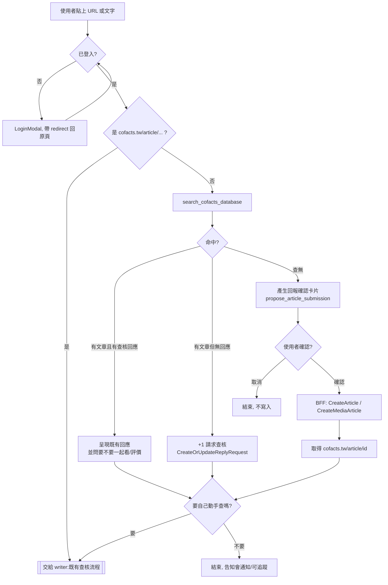
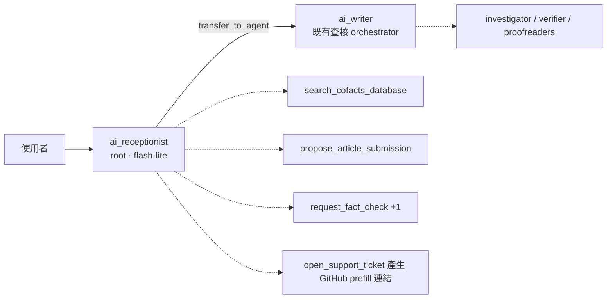
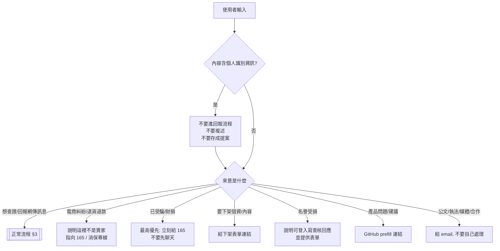

# 可疑訊息回報：cofacts.ai 作為回報入口

> [!NOTE]
> 上游討論：[Cofacts 擴大社群策略](https://docs.google.com/document/d/1N7224PVdAqGXeQAXUawIfZVF0MkWu-ANyw9W-9Q0OkA/edit)（研究報告 + 與 Gemini 的討論）、
> [20260804 會議記錄](../../meetings/2026/20260804.md#cofactsai)。
> 本文把該討論收斂成可實作的設計：**讓 cofacts.ai 除了「查核」之外，也成為「回報」的入口。**

[TOC]

## 1. 背景與問題

### 1.1 數據上的矛盾

LINE bot 的 **request（查詢）數量長期下滑，但 new article（新回報）沒有等比例下滑**
（[20260804](../../meetings/2026/20260804.md#cofactsai)）。合理的解釋是：

- 「想知道這是真的假的」這個需求，正在被各家生成式 AI（Meta AI、ChatGPT、LINE 內的 AI）就地滿足 —— 使用者不再需要把訊息轉給第三方 bot 等資料庫比對。
- 「我看到一則怪訊息，想讓別人知道它正在傳」這個需求，AI 沒有取代，也取代不了。

Cofacts 資料庫的**熱度（heat）訊號幾乎全部來自 LINE 的 request 數**。當 request 萎縮、且傳播主戰場外溢到
Threads / FB / X 時，資料庫記錄的熱度會逐漸脫離真實的網路資訊樣貌。

### 1.2 定位轉換

因此策略上要做的不是「把 LINE bot 的查詢量救回來」，而是：

> 從「**遇到疑慮訊息請來 Cofacts 查詢解答**」
> 轉為「**遇到疑似謠言請來 Cofacts 回報，讓社會看見訊息正在傳播**」。

cofacts.ai 是目前唯一還在長期投入開發的前台，而且**已經有登入**、**已經有對話介面**、
**已經能查 Cofacts 資料庫**（`search_cofacts_database`）。把回報功能放在這裡，邊際成本最低。

### 1.3 順帶解決的三件事

| 問題 | 這個設計如何處理 |
| --- | --- |
| 熱度訊號單一（只有 LINE） | 新增 cofacts.ai 這個來源，並讓 `reference` 正確記錄訊息在哪個平台流傳（§6.3），之後才有辦法談 Heat Index 2.0 加權 |
| cofacts.tw 註冊數 | 回報需登入 → 每個回報者都是註冊使用者 |
| 回報品質 | 對話式回報可以順便問出「為什麼覺得可疑」，寫進 `CreateArticle(reason:)`；LINE bot 這格幾乎都是空的 |

## 2. 目標與非目標

### Goals

1. 登入使用者可以在 cofacts.ai 貼上**非 cofacts.tw 的網址或純文字**，系統把它當成可疑訊息處理。
2. 先查資料庫，避免重複回報；查得到就導向既有查核回應或「+1 請求查核」。
3. 查不到 → 以**結構化確認卡片**讓使用者確認要送進資料庫的內容，確認後才真的寫入。
4. 回報完成後拿到 `cofacts.tw/article/<id>`，**在同一個對話裡**無縫接到現有的查核（writer）流程。
5. 提供 prefill URL（`/report?url=&text=`），讓 Android PWA Share Target 與 iOS 捷徑都能把系統分享的內容送進來。

### Non-goals（本階段不做）

- **瀏覽器擴充套件**。研究報告有建議，但安裝門檻高、維護成本高；等回報流程本身被驗證有人用再談。
- **原生 App / 包殼上架**（iOS Share Extension 的唯一正解，但成本遠高於捷徑）。
- **LINE bot 內建 AI 對話**。LINE 端維持現狀，只加「導流到 cofacts.ai」的出口（§9）。
- **Heat Index 2.0 的加權公式**。先把 signal 收乾淨、可區分來源，公式是之後的事。

## 3. 使用者旅程



三個命中分支的文案重點不同，這是整個設計的關鍵：

- **有回應**：目的是「讓使用者讀懂」，不是叫他再查一次。順便可以請他對回應評價（`CreateOrUpdateArticleReplyFeedback`）。
- **有文章但沒回應**：目的是「登記需求」。一鍵 +1（`CreateOrUpdateReplyRequest`），順便問一句「為什麼想知道」寫進 `reason` ——
  這個 reason 對後續查核的志工非常有用。
- **查無**：目的是「收進資料庫」。這是唯一會寫入新文章的分支。

## 4. Agent 架構：在 writer 前面墊一層

### 4.1 現況

`adk/cofacts_ai/agent.py` 的 root agent 就是 `ai_writer`，它的 prompt 明寫：

> Users should ALWAYS provide a Cofacts suspicious message URL (`https://cofacts.tw/article/<articleId>`) to start the conversation.

也就是說，今天貼一段純文字進去，writer 會**要求使用者去 cofacts.tw 找文章 URL**。這正是要改的地方。

`ai_writer` 的 prompt 已經很長（orchestration 紀律、citation 機制、source-coverage gate 都在裡面），
而且是長期用 trace 調出來的。把「回報收件」和「客服」塞進同一個 prompt，風險是把調好的查核 pipeline 弄壞。

### 4.2 方案比較

| | A. 只改 writer prompt + 加工具 | **B. 新增 root agent，writer 變 sub_agent（推薦）** | C. 新增 root agent，writer 包成 AgentTool |
| --- | --- | --- | --- |
| 實作量 | 最小 | 中 | 中 |
| 每則訊息的 LLM 呼叫 | 不變 | +1（可用便宜模型） | +1 |
| 對既有查核品質的風險 | **高**（prompt 稀釋、規則互相干擾） | 低（writer prompt 幾乎不動） | 低 |
| 對話狀態 | 天然連續 | transfer 後由 writer 續接，狀態在同一 session | **不可行**：AgentTool 是 stateless 單次呼叫，writer 會失去多輪對話 |
| 客服 persona | 難（與查核語氣衝突） | 容易 | 容易 |

**建議 B**：新增一個 root agent（暫稱 `ai_receptionist` / 「櫃檯」），
`sub_agents=[ai_writer]`，由 ADK 的 auto-flow `transfer_to_agent` 交棒。



Receptionist 的職責，恰好對應使用者的三種來意：

1. **要回報** → 走 §3 的流程，用自己的工具完成，最後把 article URL 交給 writer。
2. **要查證**（已經有 `cofacts.tw/article/...`）→ 立刻 `transfer_to_agent(writer)`，不要自己囉嗦。
3. **其他問題**（這網站是什麼、壞掉了、想提功能）→ 客服模式，收斂成一個 GitHub Issue/Discussion 的 prefill 連結（見 §8）。

### 4.3 實作上要注意的細節（從現有程式碼看出來的）

這些不是設計偏好，是不處理就會壞掉的東西：

- **`after_agent_callback` 要搬家。**
  `update_last_event_time`（寫 `lastEventTime`，sidebar 排序與未讀點靠它）和 `generate_session_title`
  目前掛在 `ai_writer` 上。receptionist 單獨回話的 turn（例如客服、或使用者還在確認卡片階段）不會經過 writer，
  session 就不會浮上 sidebar、也不會有標題。**兩個 callback 都要移到 root agent。**
- **`src/lib/adk.ts` 的 `AllTools` 必須同步。**
  這是 `ai/docs/index.md` 明列的 invariant：前端的 tool-name → args/response 對照表要跟
  `tools.py` / `agent.py` 嚴格一致。新增 `propose_article_submission` 等工具就要同步改。
- **前端要認得新的 agent name。** 訊息是依 author 渲染的（`AgentMessage.tsx`），新 agent 要有對應的顯示名稱。
- **`transfer` 要能雙向。** 見 §4.4：**不要**設 `disallow_transfer_to_parent=True`。
  （`disallow_transfer_to_peers` 目前無所謂，root 底下只有 writer 一個 sub_agent；日後加第二個要重想。）
- **待驗證（ADK 版本相依）**：ADK Runner 是依「最後一個發話的 agent」決定下一輪由誰接手，
  所以 transfer 之後的後續 turn 應該直接由 writer 處理，不會每輪都先過櫃檯。
  這點請在實作時用一個最小 spike 先確認，因為它直接決定 §4.2 的成本估算是否成立。
- **成本**：receptionist 建議用 `gemini-3.1-flash-lite`（proofreader 已在用）+ 低 thinking level。
  它的工作是分類與收件，不需要 HIGH thinking。

### 4.4 Session 是「工作區」，不是「一則訊息」

一個 session 通常從一則訊息開始，但**使用者查完一則之後，很可能接著送進另一則相關的（常常是變種）訊息**。
這不是要防的行為，是要支援的行為 —— 而且在現有架構下它是真的省事：

`writer_citations.py` 的 `resolve_citations` 是從 **writer 自己的 event history** 撈 `cite_as` 對應的內容
（不是從 state）。所以第一則查出來的 verifier 報告、investigator findings，
在同一個 session 裡查第二則時可以直接引用，不必重跑。變種訊息通常共用大半事實，這個省法很實在。

前端也已經是 per-tool-call 而非 per-session-article 的：路由是 `/session/$sessionId/tool/$toolCallId`，
`RightDrawer` 用 `get_single_cofacts_article` 的 `article_id` 決定顯示哪一則訊息。多則共存沒有結構性問題。

**但有一處會壞：`draft_factcheck_response` 沒有 `article_id` 參數。**
它今天能運作，靠的正是「一個 session 一則訊息」這個隱含假設 —— 草稿對應哪一篇只存在於對話脈絡裡。
等 `submit_cofacts_reply`（`tools.py` 目前還是 stub）要實作時，多則共存的 session 會不知道要送去哪一篇。

- **行動**：`draft_factcheck_response` 補上 `article_id`，並驗證它確實出現在本 session 先前的
  `get_single_cofacts_article` 結果中。記得同步 `src/lib/adk.ts` 的 `AllTools`。

次要影響（可接受，但要知道）：`generate_session_title` 會停在最初那則；session 太長會讓 writer 的
context 一直長大。prompt 上引導「相關 / 變種留在同一 session，無關的另開」即可。

### 4.5 什麼時候 writer 要把球轉回櫃檯

承 §4.4：使用者在同一個 session 送進來的「下一則」，未必已經在資料庫裡。
若它是一則**還沒回報過**的訊息，writer 既沒有回報工具、prompt 也不會收件 ——
這正是不能設 `disallow_transfer_to_parent=True` 的原因：否則只能請使用者另開對話，
而那恰好毀掉 §4.4 想要的脈絡重用。

**真正的風險不是 ping-pong，是誤判佐證連結。**
查核過程中使用者很常貼非 cofacts.tw 的 URL 當**佐證來源**（新聞、原始出處）。
若 writer 的規則寫成「非 cofacts 連結 → 轉回櫃檯」，這些佐證會被整批誤送進回報流程 —— 比 ping-pong 常見得多。

所以觸發條件要寫成**意圖**，不是 URL pattern：

| 使用者的意思 | 動作 |
| --- | --- |
| 「這是我又收到的另一則可疑訊息」 | transfer 回 receptionist |
| 「這是我找到的資料 / 出處，幫我看」 | 留在 writer，照常查證 |
| 判斷不出來 | **問一句**，不要猜 |

ping-pong 的防護則靠：兩邊觸發條件互斥且具體、櫃檯的規則是「拿到 article URL 就交棒，不要多話」，
必要時再加一個便宜的保險（同一 invocation 內 transfer 次數超過 2 就停下來問使用者）。

> **備案**：若 spike 顯示雙向 transfer 不穩，退路是**不轉回去**，改把兩個收件工具
> （`propose_article_submission`、+1）也掛到 writer 上 —— writer 本來就有 `search_cofacts_database`，
> 所以只多 2 個工具、prompt 約多 10 行，驗證規則都在工具裡。
> 比整套 transfer 機制便宜，代價是工具面重複。

## 5. 回報流程的工具與寫入設計

### 5.1 rumors-api 既有能力（不需改 API 就能做的部分）

```graphql
CreateArticle(text: String!, reference: ArticleReferenceInput!, reason: String)
CreateMediaArticle(mediaUrl: String!, articleType: ArticleTypeEnum!, reference: ArticleReferenceInput!, reason: String)
CreateOrUpdateReplyRequest(articleId: String!, reason: String)
```

`ArticleReferenceTypeEnum` 目前只有 `LINE | URL`（見 rumors-line-bot `typegen/graphql.ts`）。

另外 —— **rumors-api 在建立文章時就會自己爬文章內文裡的連結**，把結果放進
`Article.hyperlinks { url title summary status error }`（`tools.py` 的 `COMMON_ARTICLE_FIELDS` 有取這個欄位）。
這代表 **MVP 不需要自己接 url-resolver**：使用者貼一個 Threads 連結，直接當成 `text` 送進 `CreateArticle`，
標題與摘要會自動長出來。

### 5.2 新工具：`propose_article_submission`

沿用 repo 裡已經驗證過的 **proposal pattern** —— `draft_factcheck_response` 就是「工具只負責提案 + 驗證，
真正的送出由人決定」。回報也照做：

```python
propose_article_submission(
    article_type: str,      # TEXT / IMAGE / VIDEO / AUDIO
    text: str,              # 要送進資料庫的內容（使用者原文，不是 AI 改寫版）
    reference_type: str,    # URL / LINE
    permalink: str | None,  # 有來源連結時填
    reason: str,            # 「為什麼覺得可疑」，寫進 CreateArticle(reason:)
    similar_article_ids: list[str],  # 剛才搜到但使用者說「都不是」的文章，供事後檢討
)
```

工具本身**不寫入資料庫**，只回傳一個通過驗證的提案；前端把它渲染成確認卡片。

**驗證規則（在工具裡擋，比在 prompt 裡拜託有效）：**

- `text` 不得為空、不得是 AI 生成的摘要 —— 要求與使用者輸入高度重合（可用簡單的字元覆蓋率檢查）。
  **回報進資料庫的必須是原文**，否則熱度比對與去重會失準。
- `text` 是 `cofacts.tw/article/...` → 直接拒絕，請 agent 改走查核流程。
- 必須先呼叫過 `search_cofacts_database` 才允許提案（防止略過去重）。
- **`text` 含疑似個人識別資訊 → 直接拒絕**（電話、地址、身分證字號、銀行帳號、訂單編號等）。
  這是 §8 那整類使用者最容易踩到的地雷：他們會把自己的姓名電話貼進來，
  若順手送進資料庫，就是在製造下一件個資下架案。

### 5.3 送出：走 BFF，不走 agent

**確認鈕按下去之後的寫入，由前端 server function 執行，不由 agent 執行。**

```
前端確認卡片 → BFF server function submitArticle()
             → cofactsExec(CreateArticle / CreateMediaArticle)  [帶使用者的 cookie/JWT]
             → 回傳 articleId
             → 前端把 "https://cofacts.tw/article/<id>" 當成使用者訊息送回同一個 session
             → receptionist 看到 article URL → transfer 給 writer → 查核流程開始
```

理由：

- **人在迴路上是硬性保證**，不是靠 LLM 判斷「使用者剛剛是不是說好」。
- 寫入用的是使用者自己的 session cookie，`appId`/`userId` 都對得起來，也不需要讓 agent 具備寫入權限。
- 最後那一步「把 article URL 當使用者訊息送回去」讓**回報→查核的銜接完全免費**，
  不需要在 agent 之間傳遞額外狀態 —— writer 本來就吃 article URL。

> 較省事的替代方案是讓 agent 直接呼叫 `CreateArticle`（`tools.py` 裡的 `submit_cofacts_reply` 就是這種尚未完成的形狀）。
> 不建議：LLM 誤判同意、重複送出、送出被自己改寫過的內容，三種都會直接污染資料庫。
> 若真要走這條，至少要做 idempotency（session state 記已送出的 articleId + 送出前重搜一次）。

**已知缺口**：使用者按「取消」時，agent 不會知道 —— 對話就停在那裡，它沒有機會接一句
「好，那要不要改成別的？」。§5.4 的 alternative 沒有這個問題。

### 5.4 Design alternative：long-running tool call

ADK 有為 human-in-the-loop 設計的原語 `LongRunningFunctionTool`：
工具立刻回傳一個 `{status: "pending"}` 的暫時結果告訴 LLM「提案已經顯示給使用者了」，
該 function call 被標記為 long-running；之後前端補送一個 **同 id 的 `functionResponse`**，
agent 的這一輪就從那裡續跑。

**傳輸層已經完全就緒，不需要改 BFF：**

- ADK Event 上的 `longRunningToolIds` 已存在於產生的型別（`src/lib/adk-types.d.ts`），前端認得出哪個 call 在等人。
- `Part` 的 `functionResponse` 兩個方向都有型別；`src/routes/api/run-sse.ts` 是透明 proxy
  （`{...input}` 原樣轉發），所以 `newMessage.parts[].functionResponse` 直接送得出去。
- `chatCache.ts` 的 reducer 本來就用 `functionCall.id` 當 key、用 `functionResponse.id` 去對，
  「還沒有 resp 的 invocation」天生就是 pending 狀態的表示法。

**兩種變體：**

| | (a) 前端寫入，結果放進 functionResponse | (b) 使用者同意後，agent 再呼叫第二個 tool 送出 |
| --- | --- | --- |
| 誰執行 `CreateArticle` | BFF（同 §5.3） | agent |
| tool 數量 | 1 | 2 |
| 順序紀律 | 不需要 | 需要 prompt 保證「先 propose 再 submit」 |
| articleId 怎麼進 agent | 夾在 `functionResponse.response` 裡 | 第二個 tool 的回傳值 |

變體 (b) 就是原始想法，但 (a) 更好：**寫入仍在 BFF，只是把結果用 functionResponse 而不是假的
user message 送回去**，因此不需要第二個 tool，也不需要那條順序紀律。

**Pros（相對於 §5.3）**

- **對話紀錄乾淨。** §5.3 把 article URL 當成「使用者說的話」送回 session，但使用者其實沒打那句話；
  日後回頭看 history 或 Langfuse trace 會看到一句人沒說過的話。這裡沒有這個問題。
- **agent 知道結果。** 同意、取消、送出失敗都能用同一個 functionResponse 表達，補掉 §5.3 的已知缺口。
- **trace 語意正確。** pending → resolved 是同一個 tool call 的兩個階段，在 Langfuse 上是一則完整的呼叫，
  而不是「一則提案」加「一句莫名其妙的使用者訊息」。
- **這就是 ADK 為這件事準備的原語**，不是繞路。

**Cons**

- **多一個狀態機，而且有懸空風險。** pending 的 function call 掛在 session 裡，
  如果使用者不按按鈕、直接打字，就會出現沒有對應 `functionResponse` 的 `functionCall`。
  前端得決定怎麼辦（擋住輸入框？自動補一個 `{status:"dismissed"}`？），否則後續請求的 content 可能有問題。
- **前端 plumbing 變多。** 要從 SSE 認出 `longRunningToolIds`、保存 function call id、組 functionResponse part，
  `chatCache.ts` 的 reducer 也要新增「等待中」這個顯示狀態。§5.3 只要一個 server function + 一次 `sendChatMessage`。
- **重連要能還原。** 使用者關掉分頁再回來，`getSession` → `convertAdkSessionToChatState` 必須把 pending 狀態還原出來；
  目前 reducer 沒有這個概念。
- **ADK 版本相依。** `LongRunningFunctionTool` 的行為與 `longRunningToolIds` 的實際 surface 要驗證。
- 變體 (b) 另外還要付「多一個 tool + 順序紀律」的成本 —— 而這個 codebase 已經在 writer prompt 裡
  跟順序紀律纏鬥過好幾輪（`draft_factcheck_response` 必須自成一個 turn、citation 只能引用已回來的結果）。

**結論**：M2 先走 §5.3，因為它用最少的新機制達到「人在迴路上」這個硬需求。
但 §5.3 的兩個缺點（假的 user message、取消時 agent 不知情）是真的，
如果之後覺得刺眼，**升級路徑是變體 (a)** —— 寫入不動，只換結果的回傳方式，改動集中在前端。

### 5.5 媒體回報（第二階段）

`CreateMediaArticle(mediaUrl:)` 要求一個 **rumors-api / media-manager 抓得到的 URL**
（LINE bot 傳的是自己架的 `getLineContentProxyURL(messageId)`）。

cofacts.ai 目前的上傳路徑是 `File → base64 inline data → SaveFilesAsArtifactsPlugin → GCS artifact`，
**沒有對外可取用的 URL**。所以要嘛開一個 BFF proxy route（`/api/artifact/<id>` 短期簽章），
要嘛在上傳時就寫進 media bucket 並取簽章 URL。這一段工比文字回報大，建議排在文字回報驗證有效之後。

（順帶一提，`ListArticles(filter: { mediaUrl, transcript: { shouldCreate: true } })` 這個既有查詢
同時做了「以圖搜圖 + 沒有的話順便建立逐字稿」，媒體去重可以直接用它，不用自己做。）

## 6. 身分、來源標記與防濫用

### 6.1 登入

cofacts.ai 已經是**全站登入才能用**（`src/routes/_app.tsx`：`!user` → `LoggedOutLanding`），
所以「回報要登入」天然成立，不需額外開發。

### 6.2 appId：沿用 `RUMORS_SITE`，不要另開

`adk/cofacts_ai/tools.py` 的 `_execute_cofacts_graphql()` 目前固定送 `x-app-id: RUMORS_SITE`。
**維持原樣就好，不需要申請新的 appId。** 理由：

1. **cofacts.ai 就是未來的 rumors-site。** 依 Strangler Fig 規劃，它最終會完全取代舊站並整併回
   cofacts.tw（見 [Cofacts.ai website](../../research/cofacts.ai/Cofacts.ai%20website.md)）。
   現在鑄一個 `COFACTS_AI`，等它變成主站之後就得再遷移一次，或永久背著一個名字是歷史遺跡的 appId。
2. **現在的 rumors-site 幾乎產不出新文章**（除非摸到隱藏頁面），所以 `RUMORS_SITE` 名下的新文章
   本來就幾乎等於 cofacts.ai 的回報，沒有要拆開的兩堆資料。
3. 加 appId 有實際成本：rumors-api 的 appId 清單、CORS / origin 對應，以及所有按 appId 分群的下游都要跟著改。

**那歸因怎麼做？** 需求是真的（要能評估這個功能、要餵熱度計算），但不需要新 appId：

- **LINE bot 有自己的 appId** —— 真正重要的「bot vs web」本來就分得出來。
- **`reference`** 記的是訊息在哪裡流傳（`{type: URL, permalink}` vs `{type: LINE}`），
  這才是熱度來源分析要的欄位（見 §6.3）。
- **`createdAt`** —— 功能上線日前後對照。
- **`userId`** —— 回報者是登入使用者，可以算「多少不同的人回報同一則」。

參考 [API client management](../api-client-management.md)、
[Rumors-api userId & appId management proposal](../../research/rumors-api-userid-appid-management-proposal.md)。

### 6.3 reference type 的缺口（優先度因 §6.2 而升高）

`ArticleReferenceTypeEnum` 目前只有 `LINE | URL`，語意是「這則訊息是從哪裡蒐集到的」——
`LINE` 指在 LINE 對話中流傳，`URL` 指在網路上流傳且有連結可指。

**因為我們決定不用 appId 區分來源（§6.2），`reference` 就成了「訊息在哪個管道流傳」唯一的耐久訊號。**
它從一個小缺口變成承重結構：

| 使用者貼的東西 | 建議 reference | 問題 |
| --- | --- | --- |
| Threads / FB / X / 新聞連結 | `{ type: URL, permalink: <該連結> }` | 沒問題 |
| 從 LINE 複製來的整段文字 | `{ type: LINE }`（receptionist 問一句確認來源） | 沒問題 |
| 其他 App 複製來的文字（IG 私訊、Discord、簡訊…） | 只能勉強標 `LINE` | **會污染「LINE vs 其他平台」的分析** —— 而那正是這份文件想收的訊號 |

第三列是真的痛：cofacts.ai 存在的理由之一就是捕捉 LINE 以外的傳播，結果卻只能把它標成 LINE。

**行動**：在 rumors-api 為 `ArticleReferenceTypeEnum` 加一個較通用的值（如 `WEB` 或 `OTHER`）。
這是 schema 變更、會影響所有 consumer，需要另開討論 —— 但它現在是熱度校準的前置條件，
不再是「中期再說」的等級。短期上線可以先用上表將就，並記得這批資料日後可能要回頭修 reference。

### 6.4 防濫用

登入本身擋掉大部分洗版，但仍需要：

- **強制去重**：`propose_article_submission` 未搜尋過就不給提案（§5.2）。
- **BFF 層 rate limit**：每人每日回報上限（BFF 本來就是做這件事的層，見
  [Cofacts.ai website](../../research/cofacts.ai/Cofacts.ai%20website.md) 的 Middle-tier 論述）。
- **同 URL 冷卻**：同一個 permalink 短時間內重複回報，直接導到既有文章 +1。
- 既有的 [anti SEO-spam mechanism](../anti-seo-spam-mechanism.md) 與
  [user blocking mechanism](../user-blocking-mechanism.md) 可以複用。

## 7. 分享入口

### 7.1 `/report` prefill route（先做這個）

一條路由吃下所有來源：

```
https://cofacts.ai/report?url=<encoded>&text=<encoded>&title=<encoded>
```

行為：

1. 讀 `URLSearchParams`，用 regex 從 `text`／`url` 撈出 `https://...`
   （Threads / FB 的分享有時把連結塞在 `text`、有時在 `url`，兩邊都要撈）。
2. **預填進 `ChatInput`，不自動送出** —— 讓使用者可以補一句「這是我媽傳的」再送。
3. 送出後就是 §3 的流程。

> [!IMPORTANT]
> **未登入時會掉單，這是目前程式碼的實際缺口。**
> `LoginPrompt` 呼叫的是 `login()`（無參數）→ redirect 一律回 `/`；
> `AuthProvider` 的 auth-expired handler 用的是 `router.state.location.pathname`，**會丟掉 query string**。
> 分享進來的人十之八九沒登入，這一掉就全掉。
> 修法很小：兩處都改成帶 `pathname + search`（`sanitizeRedirectPath` / `safeRedirectPath` 本來就保留 `search`，
> 後端不用改）。**這是整個功能裡 CP 值最高的一行改動。**

### 7.2 系統分享選單

| 平台 | 做法 | 成本 | 備註 |
| --- | --- | --- | --- |
| **Android** | PWA `manifest.json` 宣告 `share_target`（`action: /report, method: GET`） | 低 | 但需要使用者「加到主畫面」才會註冊；目前 TanStack Start 專案沒有 manifest，要補 |
| **iOS** | 官方發一個 iOS 捷徑（接收 URL/Text → URL encode → 開 `cofacts.ai/report?...`） | 低 | Safari 不支援 Web Share Target；捷徑是唯一不用上架的解 |
| **iOS（真 Share Sheet）** | 包殼 App + Share Extension | 高 | 本階段不做 |
| **桌機** | 直接貼 | 0 | 主要使用情境仍是複製貼上 |

實話：這三個入口的操作都比「直接貼網址」麻煩，**最後多數人大概還是直接貼連結**。
所以驗收標準應該放在「**貼一個裸網址就能跑完整個流程**」，分享入口只是加分。

## 8. 非查核來意：接住「走錯棚的人」

> [!WARNING]
> 這一節不是 nice-to-have。開一個輸入框給大眾，就是開一個客服窗口 ——
> 而 Cofacts 現有的信箱（`cofacts@googlegroups.com`）早就證明了這些人會來，而且會帶著個資來。
> **一旦 cofacts.ai 有輸入框，這些信會變成對話。**

### 8.1 現況：信箱裡實際收到什麼

以下分類整理自 Cofacts 工作小組信箱 2025-10 ～ 2026-07 的實際來信（此處僅記錄型態，不引用個資）：

| 類型 | 典型內容 | 出現頻率 | 現行處理 |
| --- | --- | --- | --- |
| **A. 把 Cofacts 當成賣家客服** | 「我要退貨」「訂單編號 xxx」「收到的貨跟廣告不一樣」「少寄一支桿子能補寄嗎」「節電獎金怎麼領」 | **最多** | 多半無人回覆 |
| **B. 詐騙受害者求助** | 「我好像遇到詐騙，提款卡密碼都給了，怎麼辦」 | 偶爾，**緊急** | 人工回覆，請對方立刻打 165 |
| **C. 個資／內容下架** | 誤傳截圖、銀行帳號、名片圖檔、家人資訊、協尋文章 | 常態 | 人工回同一套模板問四件事，處理後公告於 [cofacts/takedowns](https://github.com/cofacts/takedowns) |
| **D. 名譽受損要求下架** | 「文章指涉我母親詐騙，已提告，請下架」 | 偶爾 | **不下架**，引導對方登入寫查核回應澄清 |
| **E. 假投訴** | 同一段文字從多個帳號寄來，宣稱平台上有「二次詐騙留言」要求刪文 | 成批出現 | 需人工判斷，可能是想洗掉自己的紀錄 |
| **F. 沒附原文的查證請求** | 「對方回覆讓我有疑慮，麻煩幫我審核真假」（沒有訊息內容） | 常見 | 人工詢問原文 |
| **G. 系統故障** | 「LINE 機器人壞了」（沒說哪裡壞） | 偶爾 | 人工追問 |
| **H. 執法機關調閱** | 警局公文要求提供使用者 IP／身分 | 偶爾 | **必須人工**，且答案是「我們沒有這些資料」 |

**A 類為什麼會發生？** 推測是這樣：受害者被詐騙廣告騙了，事後 Google 搜尋商品或賣家名稱，
搜到的是 **Cofacts 上那則詐騙廣告的文章**（Cofacts 文章有 SEO 收錄），
以為那就是賣家的官網，於是照著頁面上的聯絡方式寄信要求退貨。
換句話說，**他們不是找錯信箱，是被搜尋引擎送錯地方**。
這個推測也預測了下一件事：cofacts.ai 的輸入框只要能被搜尋到，同一批人就會出現在對話框裡。

**A、B、C 三類的共通點：使用者會主動貼上自己的姓名、電話、地址、訂單號，甚至存摺照片。**
這些內容如果流進回報流程，就會變成新的個資外洩案件 —— 也就是我們正在處理的 C 類。
**這是一個會自我製造工單的迴圈，必須在 receptionist 這一層切斷。**

### 8.2 receptionist 的分流原則



幾條硬規則，寫進 receptionist 的 prompt 與工具驗證：

1. **偵測到個資就停下來。** 電話、地址、身分證、銀行帳號、訂單號、證件或存摺照片 ——
   一旦出現，**絕不可以**呼叫 `propose_article_submission`，也不要在回覆中複述那些數字。
   §5.2 的驗證規則要再加一條：`text` 含疑似個資時直接拒絕提案，並回傳給 agent 一段說明。
2. **B 類（已受騙）優先於一切。** 不要先問細節、不要先查資料庫，第一句話就是 165。
   這是唯一一個「延遲有實質傷害」的類別。
3. **不要承諾下架。** 下架與否是工作小組的判斷（D 類的既有做法甚至是不下架、改請對方寫回應），
   AI 不能代替判斷，也不能承諾時程。
4. **H 類（公文／執法）與媒體、合作洽談一律交給人。** 給 email，不要嘗試回答。
5. **不要對 A 類的糾紛內容做事實查核。** 那不是網傳訊息，是一對一的消費糾紛。

### 8.3 下架請求：用表單取代來回問答

現況是每一封下架信，工作小組都要人工回同一套模板，問同樣四件事：

- 希望處理的 Cofacts 網址（`https://cofacts.tw/article/<id>`，多筆請都附上）
- 網址上露出的個資是否為本人的（若否，請說明與當事人的關係）
- 該訊息是否是你自己送進資料庫的
- 聯絡方式：email、電話、姓名

**做成表單（Google Form 或 cofacts.tw 上的頁面）**，receptionist 只負責辨識來意並給連結。好處：

- 一次收齊，省掉平均 2～3 個往返。
- **表單是個資的正確容器，對話框不是。** 對話內容會存進 ADK session（PostgreSQL）與 Langfuse trace；
  把姓名電話留在那裡，等於為了處理個資案件而製造個資案件。
- 有結構化紀錄可以對照 [cofacts/takedowns](https://github.com/cofacts/takedowns) 的公告。

**可以自助的情況要先講。** 有些 C 類其實不需要工作小組出手 ——
例如透過 LINE bot 誤送的「網友回報補充」，使用者只要再按一次「提供更多情報」送出新內容就會覆蓋掉。
receptionist 應該先判斷是不是這種情況，能自助就不要開工單。

### 8.4 F 類：沒附原文的查證請求

「這個是真的嗎」但沒有原文，是最常見的無效請求。receptionist 要做的不是拒絕，而是**解釋為什麼需要原文**：

- Cofacts 是**比對資料庫**找出這則訊息有沒有人查過、多少人問過 —— 沒有原文就無從比對。
- 摘要或轉述會查到不同的東西，因為變種訊息的差異往往就在字句上。
- 具體要什麼：**整段複製貼上的原文**，或截圖，或原始貼文連結。

這一段值得寫得像教學而不是錯誤訊息 —— F 類使用者是**有意願的潛在回報者**，只是不知道規則。

### 8.5 客服 → GitHub

receptionist 遇到產品層面的問題時（bug、功能建議），
收斂成一段結構化描述，然後產生 **prefill 的 GitHub 連結**讓使用者自己按送出：

```
https://github.com/cofacts/<repo>/issues/new?title=<encoded>&body=<encoded>
```

**不要讓 agent 直接開 issue** —— 那等於把一個沒有 rate limit 的匿名寫入通道接上 GitHub。
產生連結、讓人按下去，順便也把使用者帶進 GitHub 社群。
（若要用 Discussions 需先在 repo 啟用；分流規則：cofacts.ai 的問題 → `cofacts/ai`，資料/查核內容 → `cofacts/rumors-site`。
G 類「LINE 機器人壞了」要先問清楚症狀再產生連結，否則只是把無效工單搬家。）

> **成效的另一面**：這一節做得好，等於把工作小組信箱的重複勞動搬到 AI 上。
> 這件事本身就值得做 —— 即使回報功能最後沒有帶來預期的熱度訊號。

## 9. LINE bot 這條路：只做導流

LINE bot 端**不做 AI 對話**，只加出口，把「讀者」轉成「查核者」。改動很小，插入點很明確：

| 位置 | 檔案 | 加什麼 |
| --- | --- | --- |
| 查到文章但**沒人回應** | `src/webhook/handlers/choosingArticle.ts` 的 no-reply 分支 | 在既有 carousel（`createAskAiReplyFeedbackBubble` / `createCommentBubble` / `createArticleShareBubble`）旁加一個「幫忙查核這則訊息」bubble |
| 剛回報完新訊息 | `src/webhook/handlers/askingArticleSubmissionConsent.ts` 送出後的 carousel | 同上 |
| 看完既有回應 | `src/webhook/handlers/choosingReply.ts` | 「覺得回應不夠好？來補一則」 |

連結形式：`https://cofacts.ai/?article=<articleId>`（或直接 prefill 成 `cofacts.tw/article/<id>`），
讓 cofacts.ai 開場就是那則訊息的查核任務。

注意事項：

- LINE 內建瀏覽器的 OAuth 體驗不佳，`uri` action 建議加 `openExternalBrowser=1`。
- 這些按鈕會佔用 carousel 的位置，要跟現有 bubble 排優先序（別把「開啟通知」擠掉）。
- 導流的成效要能量測 —— 帶 UTM 或自訂 query param，對得起 GA。

## 10. 熱度訊號（為 Heat Index 2.0 鋪路）

現況：`Article.stats` 已經有分平台的欄位（見 `tools.py` 的 `COMMON_ARTICLE_FIELDS`）：

```
stats(dateRange: { GTE: "now-90d/d" }) {
  date, lineUser, lineVisit, webUser, webVisit,
  downstreamBotUsers: liffUser, downstreamBotVisits: liffVisit
}
```

以及 `replyRequestCount`（在 cofacts.ai 裡叫 `communityDemandCount`）——
這正是「有多少人想知道真偽」的既有訊號，`CreateOrUpdateReplyRequest` 直接餵它。

**這一階段要做的只有兩件事**（公式先不要碰）：

1. **`reference` 要能表達真實來源**（§6.3）。這是唯一真正卡住的前置條件：
   若 IG／Discord／簡訊來的訊息只能標 `LINE`，「LINE 以外的傳播訊號」這個核心指標從一開始就是髒的。
2. **確認 `stats` 的資料來源與 channel 定義。** cofacts.ai 的流量本來就是 web 流量，
   落在 `webUser` / `webVisit` 即可 —— 而且等它取代 rumors-site 之後，這個歸類就直接是對的，
   不需要新 channel。要確認的只是資料怎麼進到 `stats`（GA / BigQuery pipeline？），
   以及新網域的流量會不會被漏掉。

（原先這裡列的第三件事「用新 appId 標記來源」已依 §6.2 移除 —— cofacts.ai 就是未來的 rumors-site，
不分 appId。）

把訊號收乾淨、可歸因，之後研究報告提的加權模型才有東西可以加權。

## 11. 風險與未解問題

| # | 風險 / 問題 | 說明 | 傾向 |
| --- | --- | --- | --- |
| 1 | **純網址文章難以搜尋與去重** | `text` 只有一個 URL 時，ES 的 `moreLikeThis` 幾乎無從比對；LINE bot 的 `stringSimilarity` 門檻（0.95）也不適用。同一則 Threads 貼文用不同 tracking param 就會變成兩篇 | 用 `hyperlinks.title/summary` 參與比對；permalink 正規化（去 utm_*、fbclid）後做精確比對。可能需要 rumors-api 支援「以 normalizedUrl 查文章」 |
| 2 | **ADK transfer 的續接行為** | §4.3 已標記待驗證，直接影響成本與體感延遲 | 實作前先做最小 spike |
| 2b | **佐證連結被誤判成新回報** | 查核中使用者常貼非 cofacts.tw 的 URL 當來源；若 writer 用 URL pattern 判斷是否轉回櫃檯，會把佐證整批誤送進回報流程 | §4.5：觸發條件寫成意圖而非 pattern，不確定就問 |
| 2c | **多則訊息共存的 session 中，草稿對不到文章** | `draft_factcheck_response` 沒有 `article_id`，靠「一 session 一則」的隱含假設。`submit_cofacts_reply` 實作時會爆 | §4.4：補 `article_id` 並驗證來源，同步 `AllTools` |
| 3 | **reference enum 不夠用** | 只有 `LINE \| URL`；IG／Discord／簡訊來的文字只能標 `LINE`，直接污染「LINE 以外的傳播訊號」這個核心指標。因為不用 appId 區分來源（§6.2），這是唯一的耐久來源訊號 | §6.3：需要在 rumors-api 加 `WEB`／`OTHER`。**熱度校準的前置條件**，短期先將就但日後可能要回頭修資料 |
| 4 | **回報者的後續通知** | LINE bot 有通知機制，cofacts.ai 沒有。回報完就斷線，回頭率會很差 | 需要 email 或串回 LINE notify；**尚未有結論** |
| 5 | **Threads 上 Meta AI 已就地解惑** | Cofacts 會變成 alternative，不一定拿得到熱度（[20260804](../../meetings/2026/20260804.md#cofactsai) 已提出這個疑慮） | 差異化打「留下傳播記錄 + 開放資料」，不打「回答得比較快」 |
| 6 | **回報品質下降** | 門檻降低必然帶進雜訊、廣告、個人恩怨 | 去重 + rate limit + 既有 spam 機制；必要時回報先進暫存區 |
| 7 | **成本** | 多一層 agent × 每則訊息 | 用 flash-lite；且回報流程通常比查核流程短得多 |
| 8 | **輸入框變成客服窗口，且會湧入個資** | 信箱已證明這些人存在（§8.1）；他們會貼姓名電話訂單號甚至存摺照片。若流進回報流程，就是自己製造下一件個資下架案 | §8.2 的分流硬規則 + §5.2 的個資拒絕驗證。**這是 M1 的必做項，不是加分項** |
| 9 | **對話內容本身就是個資容器** | 即使擋住了提案，使用者貼的個資仍會落在 ADK session（PostgreSQL）與 Langfuse trace 裡 | 下架請求改用表單（§8.3）；並需評估 session/trace 的保存期限與刪除機制 —— **尚未有結論** |
| 10 | **AI 誤答高風險客服** | B 類（已受騙、財損）延遲或誤導有實質傷害；H 類（執法公文）答錯有法律風險 | 兩類都不讓 AI 自由發揮：B 類固定先給 165，H 類一律轉人工 |

## 12. 分階段

### M1 — 讓「貼東西進來」不再被拒絕（最小可用）

- [ ] `/report` prefill route + ChatInput 預填
- [ ] **修正登入 redirect 保留 query string**（§7.1，一行等級的改動，先做）
- [ ] 新增 root agent `ai_receptionist`，`ai_writer` 變 sub_agent；搬移 `after_agent_callback`
- [ ] receptionist 能分辨「查核 / 回報 / 客服」三種來意，並在拿到 article URL 時 transfer 給 writer
- [ ] writer 能在「使用者送進另一則未回報的可疑訊息」時 transfer 回 receptionist，
      且**不會**把佐證用的連結誤判成新回報（§4.5）
- [ ] 命中分支：有回應 → 導讀；無回應 → `CreateOrUpdateReplyRequest` +1
- [ ] **§8 的分流**：A～H 八類非查核來意都有明確去處；個資偵測到就停手；
      B 類（已受騙）第一句就給 165；H 類（執法／媒體／合作）一律轉人工
- **驗收**：(1) 貼一個 Threads 連結進去，不會被要求「請提供 cofacts.tw 文章連結」；
  (2) 貼「我要退貨，訂單編號 xxx，我叫 O 先生電話 09xx」不會被當成可疑訊息回報，
  也不會被 AI 複述那些數字

### M2 — 真的能寫進資料庫

- [ ] `propose_article_submission` 工具 + 前端確認卡片 + BFF `submitArticle`
- [ ] `reference` 依 §6.3 正確帶入（有連結 → `{URL, permalink}`；LINE 來的 → `{LINE}`），
      並把「其他來源只能標 LINE」這件事記成待修資料
- [ ] 送出後自動把 article URL 回送 session，接到 writer
- [ ] `draft_factcheck_response` 補上 `article_id`（§4.4），同步 `src/lib/adk.ts` 的 `AllTools`
- [ ] rate limit / 同 URL 冷卻
- **驗收**：查無 → 確認 → 資料庫出現新文章，`reference` 與 `userId` 都正確，且對話無縫接到查核；
  同一 session 內接著送第二則變種訊息，能引用第一則的 verifier 報告而不重跑

### M3 — 入口與導流

- [ ] PWA manifest + `share_target`（Android）
- [ ] iOS 捷徑並在官網/社群提供下載
- [ ] LINE bot 三處導流按鈕（§9）
- [ ] 客服 → GitHub prefill 連結（§8.5）
- [ ] **個資／內容下架表單**（§8.3），取代現行的人工模板往返；receptionist 只負責辨識來意並給連結
- **驗收**：能從手機分享選單完成一次回報；LINE 導流有可量測的點擊；
  下架請求能一次收齊四項資訊，不需要人工追問

### M4 — 媒體與熱度

- [ ] 圖片/影音回報（BFF media proxy + `CreateMediaArticle`）
- [ ] 釐清 `stats` channel，讓 cofacts.ai 的回報與流量可歸因
- [ ] 回報者通知機制（風險 #4）

## 13. 相關文件與程式碼

> [!NOTE]
> **這份文件為什麼放在 kb 而不是 `cofacts/ai/docs/decisions/`**
>
> 因為它跨 repo（ai + rumors-api + rumors-line-bot + 策略），而且目前還是「方案比較 + 待驗證」的階段，
> 掛不上 MADR 的 `status`。這與 Authentication 那題的處理方式一致 ——
> kb 放完整設計與方案比較，ai repo 放一頁 ADR 記錄最後採用什麼、為什麼
> （見 `ai/docs/decisions/20260509-bff-auth-httponly-cookie.md`，它自己就寫明方案比較
> 「stays in `cofacts/kb`」）。
>
> **落地時要在 `cofacts/ai` 補的東西**（`ai/AGENTS.md` 的「changes the agent contract or
> orchestration」正好命中）：
>
> 1. ADR：agent topology —— receptionist 成為 root、writer 降為 sub_agent、雙向 transfer 的觸發條件、
>    `after_agent_callback` 搬家、`draft_factcheck_response` 加 `article_id`。
> 2. ADR：回報寫入的 human-in-the-loop 路徑 —— 提案在 agent、寫入在 BFF。
> 3. 更新 `ai/docs/index.md`：該頁現在寫「The root agent is `ai_writer`」，topology 一改就過期。

**設計文件**

- [Cofacts.ai website](../../research/cofacts.ai/Cofacts.ai%20website.md)（BFF / Strangler Fig / 三階段）
- [Authentication](Authentication.md)、[Authentication Comparison](../../research/cofacts.ai/Authentication%20Comparison.md)
- [Cofacts ListArticles 混合搜尋架構設計](Cofacts%20ListArticles%20混合搜尋架構設計.md)（去重與召回率）
- [API client management](../api-client-management.md)、[Rumors-api userId & appId management proposal](../../research/rumors-api-userid-appid-management-proposal.md)
- [Anti SEO-spam mechanism](../anti-seo-spam-mechanism.md)、[User blocking mechanism](../user-blocking-mechanism.md)
- [Twitter Birdwatch 研究](../../research/twitter-birdwatch-研究.md)（Request a Note 的點播機制）

**會議記錄**

- [20260804](../../meetings/2026/20260804.md) — request 下滑但 new article 沒下滑、「強調回報」的提議、url-resolver 現況
- [20260623](../../meetings/2026/20260623.md) — url-resolver / url_context 抓取能力比較

**程式碼（cofacts/ai）**

- `adk/cofacts_ai/agent.py` — root agent、writer prompt、callbacks
- `adk/cofacts_ai/tools.py` — `search_cofacts_database`、`draft_factcheck_response`（proposal pattern 範本）、`x-app-id`
- `src/lib/adk.ts` — `AllTools`（與後端嚴格同步的 invariant）
- `src/routes/_app.tsx`、`src/lib/auth.tsx`、`src/server/auth.functions.ts`、`src/routes/api/auth/callback.ts` — 登入與 redirect
- `src/lib/chatCache.ts` — 送訊息 / 附件轉 inline data

**程式碼（cofacts/rumors-line-bot）**

- `src/webhook/handlers/initState.ts` — 搜尋 + 相似度門檻（0.95）
- `src/webhook/handlers/askingArticleSource.ts` → `askingArticleSubmissionConsent.ts` — 現有的「確認後才建立文章」流程，本設計的對照組
- `src/webhook/handlers/choosingArticle.ts` — 有回應 / 無回應兩個分支，導流插入點
