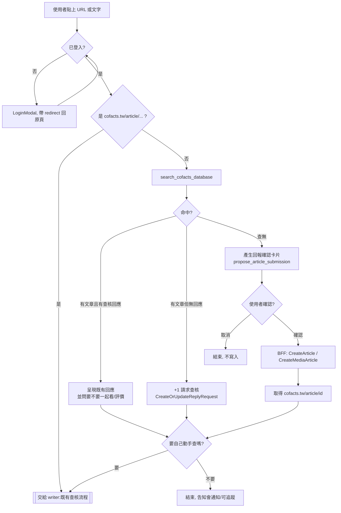
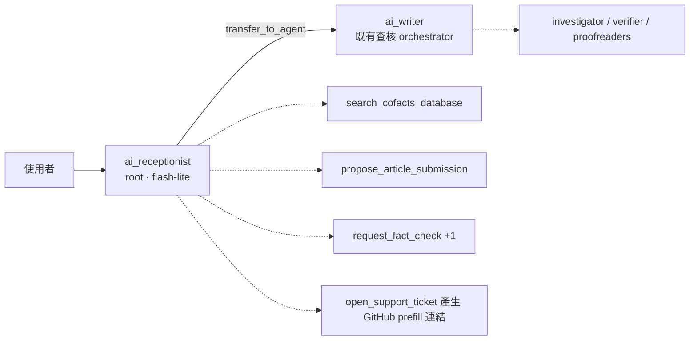

# 可疑訊息回報：cofacts.ai 作為回報入口

> [!NOTE]
> 上游討論：[Cofacts 擴大社群策略](https://docs.google.com/document/d/1N7224PVdAqGXeQAXUawIfZVF0MkWu-ANyw9W-9Q0OkA/edit)（研究報告 + 與 Gemini 的討論）、
> [20260804 會議記錄](../../meetings/2026/20260804.md#cofactsai)。
> 本文把該討論收斂成可實作的設計：**讓 cofacts.ai 除了「查核」之外，也成為「回報」的入口。**

[TOC]

## 1. 背景與問題

### 1.1 數據上的矛盾

LINE bot 的 **request（查詢）數量長期下滑，但 new article（新回報）沒有等比例下滑**
（[20260804](../../meetings/2026/20260804.md#cofactsai)）。合理的解釋是：

- 「想知道這是真的假的」這個需求，正在被各家生成式 AI（Meta AI、ChatGPT、LINE 內的 AI）就地滿足 —— 使用者不再需要把訊息轉給第三方 bot 等資料庫比對。
- 「我看到一則怪訊息，想讓別人知道它正在傳」這個需求，AI 沒有取代，也取代不了。

Cofacts 資料庫的**熱度（heat）訊號幾乎全部來自 LINE 的 request 數**。當 request 萎縮、且傳播主戰場外溢到
Threads / FB / X 時，資料庫記錄的熱度會逐漸脫離真實的網路資訊樣貌。

### 1.2 定位轉換

因此策略上要做的不是「把 LINE bot 的查詢量救回來」，而是：

> 從「**遇到疑慮訊息請來 Cofacts 查詢解答**」
> 轉為「**遇到疑似謠言請來 Cofacts 回報，讓社會看見訊息正在傳播**」。

cofacts.ai 是目前唯一還在長期投入開發的前台，而且**已經有登入**、**已經有對話介面**、
**已經能查 Cofacts 資料庫**（`search_cofacts_database`）。把回報功能放在這裡，邊際成本最低。

### 1.3 順帶解決的三件事

| 問題 | 這個設計如何處理 |
| --- | --- |
| 熱度訊號單一（只有 LINE） | 新增 cofacts.ai 這個來源，並用 `appId` 區分，之後才有辦法談 Heat Index 2.0 加權 |
| cofacts.tw 註冊數 | 回報需登入 → 每個回報者都是註冊使用者 |
| 回報品質 | 對話式回報可以順便問出「為什麼覺得可疑」，寫進 `CreateArticle(reason:)`；LINE bot 這格幾乎都是空的 |

## 2. 目標與非目標

### Goals

1. 登入使用者可以在 cofacts.ai 貼上**非 cofacts.tw 的網址或純文字**，系統把它當成可疑訊息處理。
2. 先查資料庫，避免重複回報；查得到就導向既有查核回應或「+1 請求查核」。
3. 查不到 → 以**結構化確認卡片**讓使用者確認要送進資料庫的內容，確認後才真的寫入。
4. 回報完成後拿到 `cofacts.tw/article/<id>`，**在同一個對話裡**無縫接到現有的查核（writer）流程。
5. 提供 prefill URL（`/report?url=&text=`），讓 Android PWA Share Target 與 iOS 捷徑都能把系統分享的內容送進來。

### Non-goals（本階段不做）

- **瀏覽器擴充套件**。研究報告有建議，但安裝門檻高、維護成本高；等回報流程本身被驗證有人用再談。
- **原生 App / 包殼上架**（iOS Share Extension 的唯一正解，但成本遠高於捷徑）。
- **LINE bot 內建 AI 對話**。LINE 端維持現狀，只加「導流到 cofacts.ai」的出口（§8）。
- **Heat Index 2.0 的加權公式**。先把 signal 收乾淨、可區分來源，公式是之後的事。

## 3. 使用者旅程



三個命中分支的文案重點不同，這是整個設計的關鍵：

- **有回應**：目的是「讓使用者讀懂」，不是叫他再查一次。順便可以請他對回應評價（`CreateOrUpdateArticleReplyFeedback`）。
- **有文章但沒回應**：目的是「登記需求」。一鍵 +1（`CreateOrUpdateReplyRequest`），順便問一句「為什麼想知道」寫進 `reason` ——
  這個 reason 對後續查核的志工非常有用。
- **查無**：目的是「收進資料庫」。這是唯一會寫入新文章的分支。

## 4. Agent 架構：在 writer 前面墊一層

### 4.1 現況

`adk/cofacts_ai/agent.py` 的 root agent 就是 `ai_writer`，它的 prompt 明寫：

> Users should ALWAYS provide a Cofacts suspicious message URL (`https://cofacts.tw/article/<articleId>`) to start the conversation.

也就是說，今天貼一段純文字進去，writer 會**要求使用者去 cofacts.tw 找文章 URL**。這正是要改的地方。

`ai_writer` 的 prompt 已經很長（orchestration 紀律、citation 機制、source-coverage gate 都在裡面），
而且是長期用 trace 調出來的。把「回報收件」和「客服」塞進同一個 prompt，風險是把調好的查核 pipeline 弄壞。

### 4.2 方案比較

| | A. 只改 writer prompt + 加工具 | **B. 新增 root agent，writer 變 sub_agent（推薦）** | C. 新增 root agent，writer 包成 AgentTool |
| --- | --- | --- | --- |
| 實作量 | 最小 | 中 | 中 |
| 每則訊息的 LLM 呼叫 | 不變 | +1（可用便宜模型） | +1 |
| 對既有查核品質的風險 | **高**（prompt 稀釋、規則互相干擾） | 低（writer prompt 幾乎不動） | 低 |
| 對話狀態 | 天然連續 | transfer 後由 writer 續接，狀態在同一 session | **不可行**：AgentTool 是 stateless 單次呼叫，writer 會失去多輪對話 |
| 客服 persona | 難（與查核語氣衝突） | 容易 | 容易 |

**建議 B**：新增一個 root agent（暫稱 `ai_receptionist` / 「櫃檯」），
`sub_agents=[ai_writer]`，由 ADK 的 auto-flow `transfer_to_agent` 交棒。



Receptionist 的職責，恰好對應使用者的三種來意：

1. **要回報** → 走 §3 的流程，用自己的工具完成，最後把 article URL 交給 writer。
2. **要查證**（已經有 `cofacts.tw/article/...`）→ 立刻 `transfer_to_agent(writer)`，不要自己囉嗦。
3. **其他問題**（這網站是什麼、壞掉了、想提功能）→ 客服模式，收斂成一個 GitHub Issue/Discussion 的 prefill 連結（§7.3）。

### 4.3 實作上要注意的細節（從現有程式碼看出來的）

這些不是設計偏好，是不處理就會壞掉的東西：

- **`after_agent_callback` 要搬家。**
  `update_last_event_time`（寫 `lastEventTime`，sidebar 排序與未讀點靠它）和 `generate_session_title`
  目前掛在 `ai_writer` 上。receptionist 單獨回話的 turn（例如客服、或使用者還在確認卡片階段）不會經過 writer，
  session 就不會浮上 sidebar、也不會有標題。**兩個 callback 都要移到 root agent。**
- **`src/lib/adk.ts` 的 `AllTools` 必須同步。**
  這是 `ai/docs/index.md` 明列的 invariant：前端的 tool-name → args/response 對照表要跟
  `tools.py` / `agent.py` 嚴格一致。新增 `propose_article_submission` 等工具就要同步改。
- **前端要認得新的 agent name。** 訊息是依 author 渲染的（`AgentMessage.tsx`），新 agent 要有對應的顯示名稱。
- **`transfer` 的回彈要管好。** 建議 `ai_writer` 設 `disallow_transfer_to_parent=True`，
  避免 writer 在查核中途把使用者丟回櫃檯，造成 ping-pong。同一 session 的定位是「一則訊息一個 session」。
- **待驗證（ADK 版本相依）**：ADK Runner 是依「最後一個發話的 agent」決定下一輪由誰接手，
  所以 transfer 之後的後續 turn 應該直接由 writer 處理，不會每輪都先過櫃檯。
  這點請在實作時用一個最小 spike 先確認，因為它直接決定 §4.2 的成本估算是否成立。
- **成本**：receptionist 建議用 `gemini-3.1-flash-lite`（proofreader 已在用）+ 低 thinking level。
  它的工作是分類與收件，不需要 HIGH thinking。

## 5. 回報流程的工具與寫入設計

### 5.1 rumors-api 既有能力（不需改 API 就能做的部分）

```graphql
CreateArticle(text: String!, reference: ArticleReferenceInput!, reason: String)
CreateMediaArticle(mediaUrl: String!, articleType: ArticleTypeEnum!, reference: ArticleReferenceInput!, reason: String)
CreateOrUpdateReplyRequest(articleId: String!, reason: String)
```

`ArticleReferenceTypeEnum` 目前只有 `LINE | URL`（見 rumors-line-bot `typegen/graphql.ts`）。

另外 —— **rumors-api 在建立文章時就會自己爬文章內文裡的連結**，把結果放進
`Article.hyperlinks { url title summary status error }`（`tools.py` 的 `COMMON_ARTICLE_FIELDS` 有取這個欄位）。
這代表 **MVP 不需要自己接 url-resolver**：使用者貼一個 Threads 連結，直接當成 `text` 送進 `CreateArticle`，
標題與摘要會自動長出來。

### 5.2 新工具：`propose_article_submission`

沿用 repo 裡已經驗證過的 **proposal pattern** —— `draft_factcheck_response` 就是「工具只負責提案 + 驗證，
真正的送出由人決定」。回報也照做：

```python
propose_article_submission(
    article_type: str,      # TEXT / IMAGE / VIDEO / AUDIO
    text: str,              # 要送進資料庫的內容（使用者原文，不是 AI 改寫版）
    reference_type: str,    # URL / LINE
    permalink: str | None,  # 有來源連結時填
    reason: str,            # 「為什麼覺得可疑」，寫進 CreateArticle(reason:)
    similar_article_ids: list[str],  # 剛才搜到但使用者說「都不是」的文章，供事後檢討
)
```

工具本身**不寫入資料庫**，只回傳一個通過驗證的提案；前端把它渲染成確認卡片。

**驗證規則（在工具裡擋，比在 prompt 裡拜託有效）：**

- `text` 不得為空、不得是 AI 生成的摘要 —— 要求與使用者輸入高度重合（可用簡單的字元覆蓋率檢查）。
  **回報進資料庫的必須是原文**，否則熱度比對與去重會失準。
- `text` 是 `cofacts.tw/article/...` → 直接拒絕，請 agent 改走查核流程。
- 必須先呼叫過 `search_cofacts_database` 才允許提案（防止略過去重）。

### 5.3 送出：走 BFF，不走 agent

**確認鈕按下去之後的寫入，由前端 server function 執行，不由 agent 執行。**

```
前端確認卡片 → BFF server function submitArticle()
             → cofactsExec(CreateArticle / CreateMediaArticle)  [帶使用者的 cookie/JWT]
             → 回傳 articleId
             → 前端把 "https://cofacts.tw/article/<id>" 當成使用者訊息送回同一個 session
             → receptionist 看到 article URL → transfer 給 writer → 查核流程開始
```

理由：

- **人在迴路上是硬性保證**，不是靠 LLM 判斷「使用者剛剛是不是說好」。
- 寫入用的是使用者自己的 session cookie，`appId`/`userId` 都對得起來，也不需要讓 agent 具備寫入權限。
- 最後那一步「把 article URL 當使用者訊息送回去」讓**回報→查核的銜接完全免費**，
  不需要在 agent 之間傳遞額外狀態 —— writer 本來就吃 article URL。

> 較省事的替代方案是讓 agent 直接呼叫 `CreateArticle`（`tools.py` 裡的 `submit_cofacts_reply` 就是這種尚未完成的形狀）。
> 不建議：LLM 誤判同意、重複送出、送出被自己改寫過的內容，三種都會直接污染資料庫。
> 若真要走這條，至少要做 idempotency（session state 記已送出的 articleId + 送出前重搜一次）。

### 5.4 媒體回報（第二階段）

`CreateMediaArticle(mediaUrl:)` 要求一個 **rumors-api / media-manager 抓得到的 URL**
（LINE bot 傳的是自己架的 `getLineContentProxyURL(messageId)`）。

cofacts.ai 目前的上傳路徑是 `File → base64 inline data → SaveFilesAsArtifactsPlugin → GCS artifact`，
**沒有對外可取用的 URL**。所以要嘛開一個 BFF proxy route（`/api/artifact/<id>` 短期簽章），
要嘛在上傳時就寫進 media bucket 並取簽章 URL。這一段工比文字回報大，建議排在文字回報驗證有效之後。

（順帶一提，`ListArticles(filter: { mediaUrl, transcript: { shouldCreate: true } })` 這個既有查詢
同時做了「以圖搜圖 + 沒有的話順便建立逐字稿」，媒體去重可以直接用它，不用自己做。）

## 6. 身分、來源標記與防濫用

### 6.1 登入

cofacts.ai 已經是**全站登入才能用**（`src/routes/_app.tsx`：`!user` → `LoggedOutLanding`），
所以「回報要登入」天然成立，不需額外開發。

### 6.2 appId：**這件事一定要先處理**

`adk/cofacts_ai/tools.py` 的 `_execute_cofacts_graphql()` 目前固定送 `x-app-id: RUMORS_SITE`。
如果 cofacts.ai 的回報全部掛在 `RUMORS_SITE` 名下：

- 無法在資料上區分「網站編輯建立的」與「cofacts.ai 回報的」
- 無法評估這個功能有沒有用
- 之後的 Heat Index 加權沒有依據

**行動**：向 rumors-api 申請新的 appId（例如 `COFACTS_AI`），並在 rumors-api 的 appId / CORS 白名單註冊。
參考 [API client management](../api-client-management.md)、
[Rumors-api userId & appId management proposal](../../research/rumors-api-userid-appid-management-proposal.md)。

### 6.3 reference type 的缺口

| 使用者貼的東西 | 建議 reference |
| --- | --- |
| Threads / FB / X / 新聞連結 | `{ type: URL, permalink: <該連結> }` |
| 從 LINE 複製來的整段文字 | `{ type: LINE }`（可由 receptionist 問一句確認來源） |
| 其他 App 複製來的文字（IG 私訊、Discord…） | **沒有合適的 enum** |

短期先用上表將就。中期建議在 rumors-api 加一個較通用的值（如 `WEB` 或 `OTHER`）——
注意這是 schema 變更，會影響所有 consumer，需要另開討論。

### 6.4 防濫用

登入本身擋掉大部分洗版，但仍需要：

- **強制去重**：`propose_article_submission` 未搜尋過就不給提案（§5.2）。
- **BFF 層 rate limit**：每人每日回報上限（BFF 本來就是做這件事的層，見
  [Cofacts.ai website](../../research/cofacts.ai/Cofacts.ai%20website.md) 的 Middle-tier 論述）。
- **同 URL 冷卻**：同一個 permalink 短時間內重複回報，直接導到既有文章 +1。
- 既有的 [anti SEO-spam mechanism](../anti-seo-spam-mechanism.md) 與
  [user blocking mechanism](../user-blocking-mechanism.md) 可以複用。

## 7. 分享入口

### 7.1 `/report` prefill route（先做這個）

一條路由吃下所有來源：

```
https://cofacts.ai/report?url=<encoded>&text=<encoded>&title=<encoded>
```

行為：

1. 讀 `URLSearchParams`，用 regex 從 `text`／`url` 撈出 `https://...`
   （Threads / FB 的分享有時把連結塞在 `text`、有時在 `url`，兩邊都要撈）。
2. **預填進 `ChatInput`，不自動送出** —— 讓使用者可以補一句「這是我媽傳的」再送。
3. 送出後就是 §3 的流程。

> [!IMPORTANT]
> **未登入時會掉單，這是目前程式碼的實際缺口。**
> `LoginPrompt` 呼叫的是 `login()`（無參數）→ redirect 一律回 `/`；
> `AuthProvider` 的 auth-expired handler 用的是 `router.state.location.pathname`，**會丟掉 query string**。
> 分享進來的人十之八九沒登入，這一掉就全掉。
> 修法很小：兩處都改成帶 `pathname + search`（`sanitizeRedirectPath` / `safeRedirectPath` 本來就保留 `search`，
> 後端不用改）。**這是整個功能裡 CP 值最高的一行改動。**

### 7.2 系統分享選單

| 平台 | 做法 | 成本 | 備註 |
| --- | --- | --- | --- |
| **Android** | PWA `manifest.json` 宣告 `share_target`（`action: /report, method: GET`） | 低 | 但需要使用者「加到主畫面」才會註冊；目前 TanStack Start 專案沒有 manifest，要補 |
| **iOS** | 官方發一個 iOS 捷徑（接收 URL/Text → URL encode → 開 `cofacts.ai/report?...`） | 低 | Safari 不支援 Web Share Target；捷徑是唯一不用上架的解 |
| **iOS（真 Share Sheet）** | 包殼 App + Share Extension | 高 | 本階段不做 |
| **桌機** | 直接貼 | 0 | 主要使用情境仍是複製貼上 |

實話：這三個入口的操作都比「直接貼網址」麻煩，**最後多數人大概還是直接貼連結**。
所以驗收標準應該放在「**貼一個裸網址就能跑完整個流程**」，分享入口只是加分。

### 7.3 客服 → GitHub

receptionist 遇到「不是問訊息真假」的問題時（bug、功能建議、合作洽談），
收斂成一段結構化描述，然後產生 **prefill 的 GitHub 連結**讓使用者自己按送出：

```
https://github.com/cofacts/<repo>/issues/new?title=<encoded>&body=<encoded>
```

**不要讓 agent 直接開 issue** —— 那等於把一個沒有 rate limit 的匿名寫入通道接上 GitHub。
產生連結、讓人按下去，順便也把使用者帶進 GitHub 社群。
（若要用 Discussions 需先在 repo 啟用；分流規則：cofacts.ai 的問題 → `cofacts/ai`，資料/查核內容 → `cofacts/rumors-site`。）

## 8. LINE bot 這條路：只做導流

LINE bot 端**不做 AI 對話**，只加出口，把「讀者」轉成「查核者」。改動很小，插入點很明確：

| 位置 | 檔案 | 加什麼 |
| --- | --- | --- |
| 查到文章但**沒人回應** | `src/webhook/handlers/choosingArticle.ts` 的 no-reply 分支 | 在既有 carousel（`createAskAiReplyFeedbackBubble` / `createCommentBubble` / `createArticleShareBubble`）旁加一個「幫忙查核這則訊息」bubble |
| 剛回報完新訊息 | `src/webhook/handlers/askingArticleSubmissionConsent.ts` 送出後的 carousel | 同上 |
| 看完既有回應 | `src/webhook/handlers/choosingReply.ts` | 「覺得回應不夠好？來補一則」 |

連結形式：`https://cofacts.ai/?article=<articleId>`（或直接 prefill 成 `cofacts.tw/article/<id>`），
讓 cofacts.ai 開場就是那則訊息的查核任務。

注意事項：

- LINE 內建瀏覽器的 OAuth 體驗不佳，`uri` action 建議加 `openExternalBrowser=1`。
- 這些按鈕會佔用 carousel 的位置，要跟現有 bubble 排優先序（別把「開啟通知」擠掉）。
- 導流的成效要能量測 —— 帶 UTM 或自訂 query param，對得起 GA。

## 9. 熱度訊號（為 Heat Index 2.0 鋪路）

現況：`Article.stats` 已經有分平台的欄位（見 `tools.py` 的 `COMMON_ARTICLE_FIELDS`）：

```
stats(dateRange: { GTE: "now-90d/d" }) {
  date, lineUser, lineVisit, webUser, webVisit,
  downstreamBotUsers: liffUser, downstreamBotVisits: liffVisit
}
```

以及 `replyRequestCount`（在 cofacts.ai 裡叫 `communityDemandCount`）——
這正是「有多少人想知道真偽」的既有訊號，`CreateOrUpdateReplyRequest` 直接餵它。

**這一階段要做的只有兩件事**（公式先不要碰）：

1. 確認 `stats` 的資料來源與 channel 列舉方式，決定 cofacts.ai 的流量與回報要落在哪個 channel（可能要新增）。
2. 用 §6.2 的新 appId，讓「哪些文章是從 cofacts.ai 進來的」在資料上查得到。

把訊號收乾淨、可歸因，之後研究報告提的加權模型才有東西可以加權。

## 10. 風險與未解問題

| # | 風險 / 問題 | 說明 | 傾向 |
| --- | --- | --- | --- |
| 1 | **純網址文章難以搜尋與去重** | `text` 只有一個 URL 時，ES 的 `moreLikeThis` 幾乎無從比對；LINE bot 的 `stringSimilarity` 門檻（0.95）也不適用。同一則 Threads 貼文用不同 tracking param 就會變成兩篇 | 用 `hyperlinks.title/summary` 參與比對；permalink 正規化（去 utm_*、fbclid）後做精確比對。可能需要 rumors-api 支援「以 normalizedUrl 查文章」 |
| 2 | **ADK transfer 的續接行為** | §4.3 已標記待驗證，直接影響成本與體感延遲 | 實作前先做最小 spike |
| 3 | **reference enum 不夠用** | §6.3 | 短期將就，中期提 schema 變更討論 |
| 4 | **回報者的後續通知** | LINE bot 有通知機制，cofacts.ai 沒有。回報完就斷線，回頭率會很差 | 需要 email 或串回 LINE notify；**尚未有結論** |
| 5 | **Threads 上 Meta AI 已就地解惑** | Cofacts 會變成 alternative，不一定拿得到熱度（[20260804](../../meetings/2026/20260804.md#cofactsai) 已提出這個疑慮） | 差異化打「留下傳播記錄 + 開放資料」，不打「回答得比較快」 |
| 6 | **回報品質下降** | 門檻降低必然帶進雜訊、廣告、個人恩怨 | 去重 + rate limit + 既有 spam 機制；必要時回報先進暫存區 |
| 7 | **成本** | 多一層 agent × 每則訊息 | 用 flash-lite；且回報流程通常比查核流程短得多 |

## 11. 分階段

### M1 — 讓「貼東西進來」不再被拒絕（最小可用）

- [ ] `/report` prefill route + ChatInput 預填
- [ ] **修正登入 redirect 保留 query string**（§7.1，一行等級的改動，先做）
- [ ] 新增 root agent `ai_receptionist`，`ai_writer` 變 sub_agent；搬移 `after_agent_callback`
- [ ] receptionist 能分辨「查核 / 回報 / 客服」三種來意，並在拿到 article URL 時 transfer 給 writer
- [ ] 命中分支：有回應 → 導讀；無回應 → `CreateOrUpdateReplyRequest` +1
- **驗收**：貼一個 Threads 連結進去，不會被要求「請提供 cofacts.tw 文章連結」

### M2 — 真的能寫進資料庫

- [ ] 申請並接上新的 `appId`
- [ ] `propose_article_submission` 工具 + 前端確認卡片 + BFF `submitArticle`
- [ ] 送出後自動把 article URL 回送 session，接到 writer
- [ ] rate limit / 同 URL 冷卻
- **驗收**：查無 → 確認 → 資料庫出現新文章，`appId` 正確，且對話無縫接到查核

### M3 — 入口與導流

- [ ] PWA manifest + `share_target`（Android）
- [ ] iOS 捷徑並在官網/社群提供下載
- [ ] LINE bot 三處導流按鈕（§8）
- [ ] 客服 → GitHub prefill 連結
- **驗收**：能從手機分享選單完成一次回報；LINE 導流有可量測的點擊

### M4 — 媒體與熱度

- [ ] 圖片/影音回報（BFF media proxy + `CreateMediaArticle`）
- [ ] 釐清 `stats` channel，讓 cofacts.ai 的回報與流量可歸因
- [ ] 回報者通知機制（風險 #4）

## 12. 相關文件與程式碼

**設計文件**

- [Cofacts.ai website](../../research/cofacts.ai/Cofacts.ai%20website.md)（BFF / Strangler Fig / 三階段）
- [Authentication](Authentication.md)、[Authentication Comparison](../../research/cofacts.ai/Authentication%20Comparison.md)
- [Cofacts ListArticles 混合搜尋架構設計](Cofacts%20ListArticles%20混合搜尋架構設計.md)（去重與召回率）
- [API client management](../api-client-management.md)、[Rumors-api userId & appId management proposal](../../research/rumors-api-userid-appid-management-proposal.md)
- [Anti SEO-spam mechanism](../anti-seo-spam-mechanism.md)、[User blocking mechanism](../user-blocking-mechanism.md)
- [Twitter Birdwatch 研究](../../research/twitter-birdwatch-研究.md)（Request a Note 的點播機制）

**會議記錄**

- [20260804](../../meetings/2026/20260804.md) — request 下滑但 new article 沒下滑、「強調回報」的提議、url-resolver 現況
- [20260623](../../meetings/2026/20260623.md) — url-resolver / url_context 抓取能力比較

**程式碼（cofacts/ai）**

- `adk/cofacts_ai/agent.py` — root agent、writer prompt、callbacks
- `adk/cofacts_ai/tools.py` — `search_cofacts_database`、`draft_factcheck_response`（proposal pattern 範本）、`x-app-id`
- `src/lib/adk.ts` — `AllTools`（與後端嚴格同步的 invariant）
- `src/routes/_app.tsx`、`src/lib/auth.tsx`、`src/server/auth.functions.ts`、`src/routes/api/auth/callback.ts` — 登入與 redirect
- `src/lib/chatCache.ts` — 送訊息 / 附件轉 inline data

**程式碼（cofacts/rumors-line-bot）**

- `src/webhook/handlers/initState.ts` — 搜尋 + 相似度門檻（0.95）
- `src/webhook/handlers/askingArticleSource.ts` → `askingArticleSubmissionConsent.ts` — 現有的「確認後才建立文章」流程，本設計的對照組
- `src/webhook/handlers/choosingArticle.ts` — 有回應 / 無回應兩個分支，導流插入點
